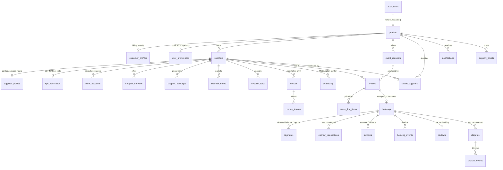

# EVENTARA - PROJECT HANDOUT

> **Single source of truth for the Eventara prototype.**
> If you are an AI coding assistant (Claude, ChatGPT, Cursor, Windsurf, Copilot) or a new
> developer: **read this document fully before changing any code.** It is written to give
> you complete context without needing to read every file first.

| | |
|---|---|
| **Project** | Eventara - event marketplace prototype |
| **Type** | Academic prototype (IIM Udaipur, PSM course, Group 10) |
| **Live URL** | https://the-eventara.vercel.app |
| **Repository** | https://github.com/kraniket93-ronin/eventara |
| **Doc version** | 2.14 (see §18 Change Log) |
| **Last verified against code** | 2026-07-29 |

> ⚠️ **CRITICAL REPO LAYOUT NOTE - read before pushing anything.**
> The **GitHub repo root == the contents of the local `prototype/` folder.**
> `index.html` sits at the *repo* root; there is **no `prototype/` folder in the repo**.
> So local `prototype/api/chat.js` → repo `api/chat.js`.
>
> **This file exists in two places, and they must be kept identical:**
> | Copy | Path | Goes to GitHub? |
> |---|---|---|
> | Master | `Project B Prototype/PROJECT_HANDOUT.md` (local root) | ❌ No - local only |
> | Deployed | `Project B Prototype/prototype/PROJECT_HANDOUT.md` | ✅ Yes - lands at repo root |
>
> **You are reading the deployed copy.** When you update this document, update **both**
> copies in the same change (edit one, then copy it over the other). A divergence means
> collaborators on GitHub and anyone working locally are reading different documentation.
>
> Markdown in the repo root is served as a static file, not rendered as a page - it does not
> affect the site.

---

## TABLE OF CONTENTS

1. [Project Overview](#1-project-overview)
2. [Product Vision](#2-product-vision)
3. [Tech Stack](#3-tech-stack)
4. [Folder Structure](#4-folder-structure)
5. [Page Documentation](#5-page-documentation)
6. [Navigation Flow](#6-navigation-flow)
7. [Customer Journey](#7-customer-journey)
8. [Supplier Journey](#8-supplier-journey)
9. [Authentication Flow](#9-authentication-flow)
10. [Features Documentation](#10-features-documentation)
11. [Business Rules](#11-business-rules)
12. [UI Components](#12-ui-components)
13. [Styling Guidelines](#13-styling-guidelines)
14. [Chatbot Knowledge Base](#14-chatbot-knowledge-base)
15. [Known Limitations](#15-known-limitations)
16. [Future Roadmap](#16-future-roadmap)
17. [AI Agent Instructions](#17-ai-agent-instructions)
19. [Backend Architecture (Supabase)](#19-backend-architecture-supabase--added-v22)
20. [Data Model, Security Matrix & Test Plan](#20-data-model-security-matrix--test-plan--added-v212)
21. [Authentication & Onboarding](#21-authentication--onboarding--added-v213)
18. [Change Log](#18-change-log)

---

## 1. PROJECT OVERVIEW

### What Eventara is

Eventara is a **trust-first, two-sided online marketplace for events in Udaipur, Rajasthan**.
It connects people planning events (companies and institutions) with verified venues, hotels
and event planners. Customers submit one request, receive itemised quotes from several matched
suppliers within 48 hours, compare them side by side, and book with their payment held safely
until the event is delivered.

**Tagline:** *Every Occasion, One Platform.*

### Business objective

Replace the fragmented, WhatsApp-and-phone-call way events are currently booked in Udaipur with
a single accountable platform that offers price transparency, verified suppliers, protected
payments and proper GST invoicing.

### Target users

| Side | Who |
|---|---|
| **Customers** | Companies (offsites, conferences, product launches, award nights) and institutions (schools, colleges, universities - fests, convocations, annual days) |
| **Suppliers / Businesses** | Banquet hotels, resorts, lake-view venues, event management firms, catering/hospitality firms in Udaipur |

### Marketplace model

- **Free for customers** - browsing, requesting quotes and comparing cost nothing.
- **Free for suppliers to list** - no listing, subscription or upfront fees.
- **Revenue = commission on confirmed bookings only**, deducted from the supplier payout.
- Money is held by Eventara (deposit ≈30%) and released to the supplier only after delivery.

### Current phase scope (Phase 1)

**LIVE NOW - bookable categories:**
- **Corporate Events & Conferences** - typically from ₹5 lakh
- **Institutional Events & Fests** - typically from ₹2.5 lakh

**COMING SOON - visible but NOT bookable:**
- **Weddings & Related Celebrations** - shown on the homepage with a "Coming Soon" badge,
  rendered as a non-clickable card. No wedding browsing or booking anywhere in the product.

**REMOVED - do not reintroduce:**
- Birthdays & Celebrations (was a homepage category; deliberately deleted in Phase 1)

**Geography:** Udaipur only. No other city is supported or implied.

### Future roadmap

See [§16 Future Roadmap](#16-future-roadmap).

---

## 2. PRODUCT VISION

### Why the platform exists

Booking a corporate offsite or a college fest in Udaipur today means calling a dozen venues,
chasing quotes over WhatsApp, comparing inconsistent inclusion lists, and paying advances by
bank transfer with no recourse if the event underdelivers. Nothing is standardised, nothing is
protected, and nothing is auditable for a finance team.

### Problems it solves

| Problem | Eventara's answer |
|---|---|
| Quotes arrive in different formats, hard to compare | One structured request → itemised quotes on a **common inclusion list**, side by side |
| No price transparency | "Typically from" prices on every listing; itemised quotes before booking |
| Advance paid with no protection | Deposit **held by Eventara**, released only after delivery |
| Unverified suppliers | Identity, GST and licence checks before a supplier can list; **verified badge** |
| No paper trail for finance | Proper **GST invoice** + complete booking record for every confirmed booking |
| Fake reviews | Only customers who **actually booked through Eventara** can review |

### Customer value proposition

> One request. A few verified suppliers. Clear quotes in 48 hours. Payment protected until the
> event is done, with a proper invoice for your records.

### Supplier value proposition

> Genuine, qualified enquiries with no listing fee. Quote in minutes from a dashboard. Get paid
> on time, with commission taken only on confirmed bookings.

### Long-term vision

Become the default booking layer for events in tier-2 Indian cities: start with corporate and
institutional events in Udaipur, prove trust and repeat usage, expand into weddings (the largest
segment by value), then replicate the city-by-city playbook.

---

## 3. TECH STACK

**Deliberately dependency-free on the front end.** No framework, no build step, no bundler.
Every page is a standalone HTML file that a browser can open directly.

| Layer | Technology | Notes |
|---|---|---|
| **Markup** | HTML5, semantic | 14 standalone pages, no templating |
| **Styling** | Vanilla CSS, one file | `styles.css` (2,394 lines) - CSS custom properties design system |
| **Fonts** | Inter via Google Fonts | `@import` at the top of `styles.css` |
| **Scripting** | Vanilla JavaScript (ES5-style, no transpiling) | `app.js`, `auth.js`, `chatbot.js` |
| **Build** | **None** | No npm build, no bundler, no transpiler for the front end |
| **Auth** | Custom, client-side | `auth.js` + `localStorage` (prototype-grade - see §9) |
| **State** | `localStorage` (session) + `sessionStorage` (chat) | No database |
| **Backend** | 1 Vercel serverless function | `api/chat.js` (Node, ESM) |
| **AI** | Google Gemini free tier | `@google/genai` ^2.3.0, model `gemini-3.5-flash` |
| **Hosting** | Vercel, auto-deploy from GitHub `main` | https://the-eventara.vercel.app |
| **Icons** | Inline SVG | No icon library; SVGs written directly in markup |
| **Images** | Hotlinked from supplier CDNs + 5 local PNGs | See §15 for the fragility caveat |

**The only npm dependency in the entire project** is `@google/genai` (declared in
`prototype/package.json`), used solely by the serverless function. The front end installs nothing.

### Cache-busting convention

There is no build hash, so assets are versioned by **query string**, bumped manually whenever the
file changes:

```html
<link rel="stylesheet" href="styles.css?v=19">
<script src="auth.js?v=3"></script>
<script src="app.js?v=4"></script>
<script src="chatbot.js?v=9"></script>
```

> **RULE:** if you edit `styles.css`, `app.js`, `auth.js` or `chatbot.js`, you **must** bump its
> `?v=` number in **all 12 HTML files**, or returning users get a stale cached copy.

---

## 4. FOLDER STRUCTURE

```
Project B Prototype/                  ← LOCAL project root (NOT the repo root)
│
├── PROJECT_HANDOUT.md                ← THIS FILE (local only, not deployed)
├── DESIGN-airbnb.md                  ← Design-system reference the UI was derived from
├── poc.txt / product_idea.txt / psm_report.txt   ← Extracted text of the source .docx files
├── Eventara_*.docx                   ← Original academic documents (PoC, Product Idea, Report)
├── airbnb_ref/ · design_ref/ · stripe_ref/       ← Visual reference material (not shipped)
│
└── prototype/                        ← ★ THIS FOLDER'S CONTENTS == THE GITHUB REPO ROOT ★
    │
    ├── index.html                    Homepage / landing
    ├── search.html                   Find Suppliers - listing + filters
    ├── provider.html                 Legacy - redirects to supplier.html?slug=paandora-grand-udaipur
    ├── supplier.html                 ★ Dynamic Supplier Detail Page - one template, all suppliers
    ├── brief.html                    Get Free Quotes - multi-step request form
    ├── compare.html                  Quote comparison table
    ├── booking.html                  Booking confirmation + deposit payment
    ├── invoice.html                  GST invoice + booking record
    ├── faq.html                      FAQ - 50 self-service Q&As
    ├── help.html                     Help Centre - contact support / raise a complaint
    ├── signin.html                   Sign In + Register (both roles)
    ├── customer-dashboard.html       Customer account (PROTECTED)
    ├── supplier-dashboard.html                Supplier/business portal (PROTECTED)
    ├── ops.html                      Internal operations console (staff-facing)
    │
    ├── styles.css                    ★ Entire design system (2,394 lines)
    ├── app.js                        Shared UI behaviours (navbar, forms, tabs, lightbox)
    ├── auth.js                       ★ Session/auth module - window.Auth
    ├── chatbot.js                    ★ Assistant widget + offline knowledge base (50 intents)
    ├── logo.svg                      Brand logo (gold arc + blue "eventara" wordmark)
    ├── logo-light.svg                ★ White-wordmark variant for dark/photographic surfaces
    │
    ├── api/
    │   └── chat.js                   ★ Vercel serverless fn - Gemini-backed assistant
    │
    ├── images/                       Local images
    │   ├── corporate.png  fest.png  hotel.png  wedding1.png  wedding2.png
    │   ├── events-value-framework.png ★ EVENTS artwork, foreground layer (1024x894, RGBA, 301KB)
    │   ├── events-value-framework-bg.png ★ Full-bleed photo backdrop behind it (1672x941, RGB, 1.65MB)
    │   ├── events-value-framework-with-bg.png  UNUSED pre-composited variant (1672x941, RGB, 1.5MB) - see §5.1
    │   ├── login-bg.jpg              ★ Sign In desktop artwork (228KB, optimised)
    │   ├── login-bg-mobile.jpg       ★ Sign In mobile artwork  (228KB, optimised)
    │   ├── Login page image bg.png   2MB source for login-bg.jpg (not referenced at runtime)
    │   ├── Sign-in-page-ui-mobile-bg.png     1.9MB source for login-bg-mobile.jpg
    │   └── Sign-in-page-ui-*-idea.png        Design references (not referenced at runtime)
    │
    ├── package.json                  Declares @google/genai (for the serverless fn only)
    ├── check_mojibake.py             Dev utility - scans for UTF-8 corruption
    └── fix_encoding.py               Dev utility - repairs mojibake
```

### Directory purposes

| Path | Purpose |
|---|---|
| `prototype/` | **The deployable product.** Everything here goes to the repo root and is served by Vercel. |
| `prototype/api/` | Serverless functions. Vercel auto-routes `api/chat.js` → `/api/chat`. Any new file here becomes an endpoint. |
| `prototype/images/` | Locally hosted images. Most supplier photos are hotlinked instead (see §15). |
| `airbnb_ref/`, `design_ref/`, `stripe_ref/` | Visual references used while designing. **Not deployed.** |
| `*.docx`, `*.txt` (root) | Source academic documents. The product requirements originate here. |

**There is no `components/`, `css/`, or `js/` subfolder** - all CSS is in one file and all JS is
flat in the root. This is intentional for a no-build prototype. Do not reorganise without reason.

---

## 5. PAGE DOCUMENTATION

There are **14 pages**. Every page includes, in `<head>` or before `</body>`:
`styles.css?v=19` · `auth-supabase.js?v=1` · `app.js?v=4` · `chatbot.js?v=9` (plus the Supabase SDK
+ `supabase-config.js` + `supabase-client.js`, loaded before `auth-supabase.js` on every page since
v2.3). `supplier.html` additionally loads `data-api.js?v=1` - the first and so far only page to.

---

### 5.1 `index.html` - Homepage

| Field | Detail |
|---|---|
| **Purpose** | Explain the platform, present Phase 1 categories, drive to quote request or supplier browsing |
| **URL** | `/` or `/index.html` |
| **Auth** | Public |
| **Connected pages** | `search.html`, `brief.html`, `compare.html`, `signin.html`, `faq.html`, `provider.html` |

**Sections (in order):** Navbar → Hero (headline, subtitle, event-type search bar, 3 trust items)
→ **EVENTS Value Framework graphic** (added v2.7) → Categories (3 cards) → How It Works (3 steps)
→ Featured suppliers (3 cards) → Trust (4 cards) → Stats row (animated counters) →
Testimonials (3) → CTA band (supplier acquisition) → Footer.

#### Homepage Enhancement - EVENTS Value Framework (added v2.7)

**Purpose.** A marketing/brand section sitting directly between the hero's search bar and "What We
Cover", communicating Eventara's value proposition at a glance (Experience · Venue · Engage ·
Networking · Theme · Strategy) before the visitor reaches the category cards.

**Implementation.** `<section class="events-framework fade-in" id="events-framework">` wrapping the
standard `.container`, with a centred `.events-framework-media` box whose width is capped in
**`vh` units** (see "Sizing" below). CSS lives in `index.html`'s existing page-scoped `<style>` block (the
established convention for page-specific styling here) - **`styles.css` is untouched, so no `?v=`
bump was needed across the other 13 pages.** Deliberately **no** background utility class on the
section: it inherits the body canvas (`--canvas`) and therefore flows continuously out of the hero
above, with the white block still starting at `#categories` below - no new colour band. Per the
brief, no border, card, shadow or coloured background is applied; the artwork carries its own
visual weight.

**Asset.** `images/events-value-framework.png` (1024x894, RGBA/transparent, 301KB). The supplied
file arrived as `prototype/Events term value.png`; it was copied into `images/` under a hyphenated
name to follow the folder convention **and** to avoid the percent-encoding fragility that spaces in
image filenames caused before (same reasoning already recorded for the Sign In artwork in §5.9).

**Backdrop (added v2.7.4).** `images/events-value-framework-bg.png` (1672x941, RGB/no-alpha,
1.65MB) - a heavily faded photographic collage of event scenes, **containing no text of its own**.
It is applied as a CSS `background-image` on the `<section>`, which is already viewport-width, so
the backdrop runs **edge to edge** while the transparent artwork stays inset inside `.container` -
two layers, no extra wrapper markup. `background-size: cover` + `background-position: center`.

> **`background-attachment` is left at the default `scroll`, not `fixed`.** A fixed/parallax
> backdrop is a well-known rendering failure on iOS Safari and several Android WebViews (it
> jitters, or the image detaches and jumps on scroll), which would directly contradict the "renders
> perfectly across all devices" requirement.

> **A third asset, `images/events-value-framework-with-bg.png`, sits in `images/` but is NOT used.**
> It is a 1672x941 RGB 1.5MB variant with the artwork *already composited* onto the backdrop. It
> was trialled in v2.7.2/v2.7.3 and reverted - see the change log. **If it is ever swapped in,
> three things must change together:** the `src`, the intrinsic `width`/`height` attributes, and
> the CSS `aspect-ratio` (1.145 vs 1.777 - very different). Changing only `src` renders it visibly
> squashed, because under `height: auto` it is `aspect-ratio`, not the file, that drives box height.

**Contrast scrim - a measured accessibility requirement, not decoration.** A
`::before` overlay of `rgba(255,255,255,0.30)` sits between the backdrop and the artwork
(`.container` is given `position: relative; z-index: 1` to ride above it). Reason, measured from
the backdrop's actual pixels against the artwork's navy label colour:

| Scrim | Worst-case contrast behind the labels | WCAG AA (4.5:1) |
|---|---|---|
| none | **3.38:1** | ✗ fails |
| 0.25 | 4.81:1 | ✓ |
| **0.30 (used)** | **~5.1:1** | ✓ |

This matters *more* than a one-off measurement suggests: because `background-size: cover` crops
differently at every viewport ratio, **which part of the photo sits behind the labels changes from
screen to screen** - so without a fixed scrim the contrast is non-deterministic and would pass on
some devices and fail on others. Pinning it makes the worst case constant. Same measured-scrim
approach already recorded for the Sign In glass card in §5.9.

**"Covers the window pane".** At ≥768px the section takes `min-height: calc(100vh - 80px)` (80px =
the fixed navbar), so scrolled into view the backdrop fills the visible pane, with the artwork
flex-centred inside it. Deliberately **not** applied below 768px, where forcing a ~100vh block
would wrap a small graphic in mostly empty space - phones keep the natural content height instead
(measured 342px at 360x740, vs a 740px viewport).

**Sizing - why the width cap is in `vh`, not `px` (v2.7.1).** The artwork is 1024x894, so its
rendered **height is always ~0.873x its width**. A width-only cap therefore can't guarantee it fits
on screen: the original 1000px cap rendered **873px tall**, taller than a typical laptop viewport,
so the graphic was cut off and needed scrolling. The fix expresses the cap in **viewport-height
units** - `max-width: min(720px, 76vh)` - so a 76vh-wide box derives a ~66vh-tall image and the
whole graphic always lands in one screen view. `min()` keeps a px ceiling so it doesn't grow
absurdly on very tall windows. This is a *sizing* mechanism only: aspect ratio, colours,
transparency and sharpness are all untouched.

**Responsive behaviour.** Explicit breakpoints, each pairing a px ceiling with a vh cap:

| Breakpoint | `max-width` | Measured render |
|---|---|---|
| Desktop ≥1200px | `min(760px, 76vh)` | 684x597 @1440x900 (222px headroom under the navbar) |
| Laptop 992-1199px | `min(660px, 74vh)` | 592x517 @1100x800 |
| Tablet 768-991px | `min(600px, 70vh)` | 600x524 @820x1024 |
| Mobile <768px | `100%` | 328x286 @360x740, symmetric 16px gutters |

Because the vh term binds on short screens, the graphic **auto-shrinks rather than overflowing** -
e.g. at a short 1366x700 laptop it renders 532x464 with 155px of headroom still under the navbar.
Mobile deliberately drops the vh cap and uses the container's own gutters, so a phone's
collapsing/expanding browser toolbar (which changes `vh`) can't resize the graphic mid-scroll.
Section padding tightens to `--space-32`/`--space-24` below 768px to avoid excess whitespace.
`width: 100%; height: auto` throughout - never cropped, stretched or distorted at any width.

> **Known trade-off - label legibility on phones.** Measured from the source pixels: the label
> glyphs ("Networking" etc.) are ~42px tall in the 1672px-wide banner, which at a 328px mobile
> render scales to **~8.2px** - below comfortable reading size. The retained 1024x894 transparent
> asset scores **~12.2px** at the same 328px width, because its labels occupy a larger fraction of
> a narrower canvas. This is inherent to putting a 16:9 banner on a narrow screen, not a CSS fault,
> and cannot be fixed by resizing without cropping the artwork. The clean fix, if wanted, is
> **art direction via `<picture>`**: serve the taller transparent asset below 768px and the banner
> above it. Not implemented - flagged as a deliberate open item.

**Accessibility.** Descriptive `alt` naming all six framework terms, so a screen reader conveys the
same information a sighted user gets from the graphic. The section carries `aria-labelledby`
pointing at a `.visually-hidden` `<h2>` ("What goes into a great event"), giving the section a
proper accessible name and a landmark in the heading outline without adding a visible heading the
design doesn't call for.

**Performance / CLS.** `loading="lazy"` + `decoding="async"`, plus intrinsic `width="1024"
height="894"` attributes **and** a CSS `aspect-ratio: 1024 / 894`. The box is therefore fully
reserved before the image decodes - measured at 1440x900: **597px reserved pre-load, 597px rendered
post-load = zero layout shift**. At the current desktop size the image renders at a **1.50x
downscale** from its natural 1024px width, so it is never upscaled and has headroom on
Retina/high-DPI displays.

> **Open performance item - the backdrop is a 1.65MB PNG and, being a CSS `background-image`,
> canNOT be lazy-loaded** the way the foreground `` is; it is fetched as soon as the section's
> styles apply. It is RGB with **no alpha**, so nothing depends on PNG: re-encoding to progressive
> JPEG measures **q80 -> 121KB (-93%)** / q85 -> 145KB (-91%). That is the same conversion, for the
> same reason, that §5.9 records for the Sign In artwork (2.0MB PNG -> 228KB JPEG). **Not applied**
> - it substitutes a different file than the one supplied - but strongly recommended before any
> real deployment, since this section currently costs ~1.95MB (backdrop + artwork) on first paint.

**Animation.** Reuses the sitewide `.fade-in` class (opacity + `translateY(24px)`, 0.6s
`--ease-out`), driven by `app.js`'s existing `IntersectionObserver` - identical entrance to every
other homepage section. Safe here because the element is present in the static HTML at
`DOMContentLoaded`, so the observer picks it up (unlike JS-injected nodes - the documented pitfall
noted elsewhere in this file). It also inherits the existing `prefers-reduced-motion` handling.

**Files modified:** `index.html` only (one `<style>` addition + one `<section>`), plus the
`images/events-value-framework.png` (foreground) and `images/events-value-framework-bg.png`
(backdrop) assets. The unused `-with-bg` variant also sits in `images/` - see the asset note above.

**Future enhancements (not built):** make each of the six terms a clickable anchor into the
relevant page section; replace the PNG with an inline SVG for crisper scaling, per-term hover
states and animatable paths; a staggered term-by-term reveal on scroll; localised variants.

**Category cards - the Phase 1 rule made visual:**

| Card | State | Behaviour |
|---|---|---|
| Corporate Events & Conferences | Active | `<a href="search.html">`, "Typically from ₹5 lakh" |
| Institutional Events & Fests | Active | `<a href="search.html">`, "Typically from ₹2.5 lakh" |
| Weddings & Related Celebrations | **Coming Soon** | `<div class="category-card is-soon" aria-disabled="true">` - **not a link**, carries `.cat-badge` "Coming Soon", label "Launching soon" |

**Featured suppliers:** Paandora Grand Udaipur, Sterling Balicha, Blossom Events (3 cards, all
with real photos - chosen so no card has an empty image).

**Hero event-type dropdown:** Corporate Event · Conference · College/University Fest ·
Convocation/Annual Day · Product Launch/Award Night · *Weddings - coming soon* (`disabled` option).

**Hero search bar (`.search-bar`, in `styles.css`; only used on this page):** a pill-shaped
flex row of four fields - Event Type, City, Event Date, Guest Count - separated by
`.search-divider` lines, ending in a circular `.search-btn` (an `<a href="search.html">`,
not a submit). Refined in v1.7:

| Fix | How |
|---|---|
| **Guest Count placeholder no longer clips** | `.search-field { min-width: 0 }` lets all four fields share width equally (the Event Type `<select>` was keeping its wide min-content size and squeezing Guest Count to ~134px, 1px short of the placeholder); the number spinner is also removed so it reserves no right-hand space |
| **Search button integrated, not floating** | `margin-left: var(--space-6)` gives a balanced 6px gap on both sides of the button (it was flush - 0px - against the Guest field). It was already vertically centred and the icon already centred |
| **Mobile fields full-width** | The stacked column now uses `align-items: stretch`, so every field fills the width (they were uneven - Event Type wide, Guest Count clipped) with a 44px+ touch height; the button's desktop `margin-left` is reset to 0 |
| **Date field placeholder + icon (v2.1, mobile)** | The native `<input type="date">` showed a blank field with a centred picker chevron on some Android builds. Fixed **mobile-only** (≤768px): `placeholder="dd-mm-yyyy"`, `::-webkit-datetime-edit { flex: 1 1 auto; text-align: left }` (fills the row, greyed empty format text reads as the placeholder), and `::-webkit-calendar-picker-indicator { margin-left: auto }` pins the calendar icon hard-right - matching the other fields. Desktop untouched. |

Verified equal field widths and a fitting placeholder at 1440 / 768 / 390px, the button
still routing to `search.html`, and no horizontal overflow from the search component at
320 / 360 / 375 / 390 / 412 / 430px.

**Data flow:** Static. Counters animate via `IntersectionObserver` in `app.js`.

**Future improvements:** Real search submission (currently the hero search links to `search.html`
without passing filters); dynamic featured suppliers.

---

### 5.2 `search.html` - Find Suppliers

| Field | Detail |
|---|---|
| **Purpose** | Browse and filter the 7 confirmed suppliers |
| **URL** | `/search.html` |
| **Auth** | Public |
| **Connected pages** | `provider.html` (card click), `brief.html` (CTA), `compare.html` |

**Filter toolbar:** Event Type · Guest Count · Budget · Supplier Type (segmented: All / Event
Managers / Banquet Hotels) · Sort By (Reputation / Rating / Price asc / Price desc) · Clear filters.

**The 7 confirmed suppliers (the ONLY vendors anywhere in the product):**

| # | Name | Type | `data-ptype` | Capacity | From | Cover image |
|---|---|---|---|---|---|---|
| 1 | Paandora Grand Udaipur | Banquet Hotel | `hotel` | 800 | ₹25,00,000 | Real photo |
| 2 | Sterling Balicha | Resort & Banquets | `hotel` | 400 | ₹12,00,000 | Real photo (rooftop pool) |
| 3 | Hotel Aloka | Boutique Hotel | `hotel` | 200 | ₹4,00,000 | Initials cover "HA" |
| 4 | Lakeside Leisure | Lake-View Reception Venue | `hotel` | 150 | ₹6,00,000 | Real photo (exterior) |
| 5 | Bluspring | Food & Hospitality | `manager` | 9999 | ₹5,00,000 | Initials cover "BS" |
| 6 | Indicraft Communications | Events & Promotions | `manager` | 9999 | ₹6,00,000 | Initials cover "IC" |
| 7 | Blossom Events | Event Management | `manager` | 9999 | ₹8,00,000 | Real photo |

**Filtering mechanism (important for anyone editing this page):**
The filter JS is **fully DOM-driven** - it reads every `.provider-card` live and parses rating,
price and capacity out of the *rendered card content* plus the `data-capacity` / `data-ptype`
attributes. Consequences:

- Adding or removing a card **automatically** updates counts, filters and sort. No JS edit needed.
- But the card markup **must** keep `data-capacity`, `data-ptype`, `.rating`, `.amount`.

**Two count displays** must match the number of cards: `#resultCount` and `#filterCount`.

**Mobile:** filters collapse behind a "Filters & Sort" toggle so results are visible immediately.

**Future improvements:** Accept filter params from the homepage hero; pagination when >20 suppliers.

---

### 5.3 `provider.html` - Legacy redirect (retired v2.4)

| Field | Detail |
|---|---|
| **Purpose** | Backward-compatibility stub only. Was the single hard-coded Paandora Grand profile page (documented as limitation L6); replaced platform-wide by `supplier.html` in v2.4. |
| **URL** | `/provider.html` |
| **Auth** | Public |
| **Behaviour** | An inline `<script>` fires `window.location.replace('supplier.html?slug=paandora-grand-udaipur')` on load (`.replace()`, so it never enters browser history); a `<noscript>` meta-refresh and a plain visible link cover the no-JS case. |

Kept on disk (not deleted) so old bookmarks or external links to `provider.html` still land
somewhere correct instead of a dead page. No page in the product links to it any more - every
supplier card now points directly at `supplier.html?slug=...` (see §5.13).

---

### 5.4 `brief.html` - Get Free Quotes

| Field | Detail |
|---|---|
| **Purpose** | Capture a structured event request and send it to matched suppliers |
| **URL** | `/brief.html` |
| **Auth** | Public (no sign-in required to request quotes) |
| **Connected pages** | `compare.html` (after submit) |

**Multi-step form** (driven by `initMultiStepForm()` in `app.js`):

1. **Event basics** - type, date, city (Udaipur, locked), guest count
2. **Requirements** - venue/catering/décor/AV needs, style preferences
3. **Budget** - band selection (incl. "Under ₹3L")
4. **Your details** - name/organisation, contact person, email, phone, GSTIN (optional),
   reference/PO (optional), consent

**Sidebar:** "Your Request Goes To" - shows the 3 matched suppliers (Paandora Grand, Sterling
Balicha, Blossom Events) + how-it-works mini steps + trust badges.

**On submit:** `showSubmitConfirmation()` in `app.js` replaces the final step with a success
panel: *"Request Sent!"* → names the 3 suppliers → "quotes within 48 hours" → CTA to `compare.html`.

**Data flow:** ⚠️ **Nothing is persisted.** The form does not POST anywhere; submission is a
UI simulation. See §15.

---

### 5.5 `compare.html` - Compare Quotes

| Field | Detail |
|---|---|
| **Purpose** | Show 3 quotes side by side against a common inclusion list |
| **URL** | `/compare.html` |
| **Auth** | Public |
| **Connected pages** | `booking.html` (accept a quote), `brief.html` |

**Demo scenario (consistent across the whole app):** a corporate offsite for **Secure Meters**,
140 guests, Sat 22 Aug 2026, budget ₹5L-₹10L.

**The three quotes:** Paandora Grand Udaipur (tagged *"Best value for your budget"*) ·
Sterling Balicha · Blossom Events.

**Comparison rows:** venue & conference hall, F&B per plate, rooms, AV/staging, décor,
event manager, deposit to confirm (30%), totals - with over-budget rows flagged
*"Above your ₹10L budget (before GST)"*.

**Also on page:** "Message this venue (contact stays private)" buttons · "Download / Share PDF" ·
a "Why book on Eventara" note (deposit protection, saved messages, GST invoice, support recourse).

---

### 5.6 `booking.html` - Confirm Booking

| Field | Detail |
|---|---|
| **Purpose** | Explain how payment protection works and take the deposit |
| **URL** | `/booking.html` |
| **Auth** | Public in the prototype (would be customer-only in production) |
| **Connected pages** | `invoice.html` (after payment) |

**Money flow shown as 4 steps:** Deposit Paid → *(held safely)* → Your Event Happens → Venue Is Paid.

**The canonical demo numbers - keep these consistent if you edit any of them:**

| Item | Value |
|---|---|
| Quote (before GST) | ₹8,50,000 |
| Total incl. GST | ₹10,03,000 |
| Deposit due now (30%) | **₹3,00,900** |
| Balance | ₹7,02,100 |
| Booking fee | Free (commission is supplier-side) |

**Payment methods:** UPI (recommended) · Net Banking.
**Cancellation terms shown before paying:** full refund 30+ days · 50% refund 15-30 days ·
no refund under 15 days (but balance never collected).

---

### 5.7 `invoice.html` - GST Invoice & Booking Record

| Field | Detail |
|---|---|
| **Purpose** | Downloadable GST invoice + complete audit trail of the booking |
| **URL** | `/invoice.html` |
| **Auth** | Public in the prototype |

Contains a **genuine GST invoice layout** - supplier & customer GSTIN, SAC codes, CGST/SGST
split, amount in words, "DEPOSIT - HELD SAFELY" stamp. Sample registration numbers are marked
`(sample)`.

**Booking record panel:** Chosen Quote · Payment Ref · Request Sent · Deposit Paid · Payment
Status (*Held safely - released after your event*) · Support Window (72h) · Messages Saved.

> **Terminology note:** GST/GSTIN/SAC/CGST/SGST are **correct and intentional here** - it is a
> real tax document. Do not "simplify" them the way customer-facing marketing copy was simplified.

---

### 5.8 `faq.html` - Help Centre / FAQ

| Field | Detail |
|---|---|
| **Purpose** | Self-service help centre for both audiences |
| **URL** | `/faq.html` |
| **Auth** | Public |
| **Reached from** | Footer → Support → "Help Centre" and "FAQ" (both link here) |

**50 FAQs across 8 categories:** General (4) · Booking & Events (8) · Payments (6) ·
Account & Profile (5) · Vendors & Event Planners (9) · Hotels & Venues (6) · Trust & Safety (6) ·
Support (6).

**Features:** live search (filters items + hides empty categories + empty state) · accordion
(animated `max-height`, one-at-a-time not enforced) · sticky sidebar category nav with
scroll-spy (`IntersectionObserver`) · breadcrumb (Home → Support → FAQ) · "Still need help?" CTA.

**Accessibility:** `aria-expanded` / `aria-controls` on every accordion button,
`role="region"` + `aria-labelledby` on panels, `aria-current="page"` breadcrumb, visible
`:focus-visible` outlines, semantic `h1`/`h2`/`h3`.

**Mobile:** sidebar becomes a horizontally scrolling chip row.

**Two-way link with the Help Centre:** the "Still need help?" section's primary button reads
**"Still need help? Contact Support"** and goes to `help.html`. `help.html` links back via its
"Browse FAQs" band. Keep both directions intact.

---

### 5.8b `help.html` - Help Centre (contact support)

| Field | Detail |
|---|---|
| **Purpose** | The **contact channel**. Lets customers and suppliers raise a support request or a complaint. Distinct from `faq.html`, which is self-service answers. |
| **URL** | `/help.html` |
| **Auth** | Public - open to signed-out visitors, customers and suppliers |
| **Reached from** | Footer -> Support -> **Help Centre** (all pages) - mobile menu - FAQ page CTA |
| **Connected pages** | `faq.html` (both directions), `index.html` |

**Page order:** Breadcrumb (Home -> Support -> Help Centre) -> Hero -> **FAQ deflection band**
("Looking for a quick answer?" + Browse FAQs) -> **Support-type choice** (2 cards) -> **Form** ->
Success panel -> Contact strip (email - hours - payment-protection reassurance).

**Two request types** - selecting one rewrites the form:

| Type | Covers | Shown expectation |
|---|---|---|
| **Support Request** (default) | Account - Login - Profile - Payment failures - Technical - Booking questions - Quote queries - Dashboard - General | "Typical response: 24-48 business hours" |
| **Complaint** | Supplier/customer disputes - Booking issues - Service quality - Payment disputes - Refunds - Unprofessional conduct - Policy violations - Trust & safety | "Higher priority" |

**Form fields:** User Role (Customer / Supplier) - Request Type - Full name* - Organisation
(optional for customers, expected for suppliers) - Email* - Mobile* - Booking reference
(optional, with helper text) - **Category*** (options swap by type) - Subject* -
Detailed description* - Attachments (UI only) - Preferred contact (Email / Phone) -
Consent checkbox* - Submit button (label follows type).

**Dynamic behaviour (inline `<script>`):**
- Request type -> rebuilds the Category `<select>`, changes the submit-button label, and swaps
  the description hint.
- User role -> changes the Organisation label ("(optional)" for customers) and its hint.
- Attachments -> lists chosen filenames (max 5). **Nothing is uploaded.**
- Submit -> manual validation producing **one friendly sentence** listing what is missing;
  on success hides the form and shows the confirmation panel.

**Success panel:** generated reference (**`SUP-YYYY-NNNN`** or **`CMP-YYYY-NNNN`**), request
type, category, expected response time, reply-by method, a reminder to watch email/phone, plus
Browse FAQs / Back to Home / Submit another request.

> WARNING - **reset gotcha (already handled):** the request-type and role radios sit **outside**
> `<form>`, so `form.reset()` does not clear them. "Submit another request" resets them
> explicitly. If you restructure this form, keep that behaviour.

**Data flow:** WARNING - **nothing is submitted or stored.** No POST, no ticketing system, no
file upload. The confirmation is a UI simulation and the reference number is generated
client-side.

**Future improvements:** real ticket creation + email confirmation - authenticated pre-fill of
name/email/booking - genuine file upload - status tracking.

---

### 5.9 `signin.html` - Sign In / Register

| Field | Detail |
|---|---|
| **Purpose** | Authenticate existing users; register new customers or businesses |
| **URL** | `/signin.html` (params: `?mode=register`, `?type=business`, `?next=`, `?role=`) |
| **Auth** | Public (this is the auth entry point) |

**Two tabs:** Sign In · Register. Register has a Customer / Business toggle.

#### Layout - full-bleed artwork + one floating card (redesigned v1.4)

**The headline, supporting copy and the three gold feature icons are baked into the
background artwork as pixels.** They are deliberately NOT recreated in HTML. The page
renders the background plus exactly **one** element: the glass card.

> **Do not add a hero section to this page.** An earlier revision rendered the headline,
> subtitle and icons in HTML on top of artwork that already contained them, so every
> element appeared twice. If you need to change that copy, edit the image.

| Breakpoint | Artwork | Card placement |
|---|---|---|
| ≥ 861px | `images/login-bg.jpg` (landscape, copy on the left) | Right-aligned, vertically centred |
| ≤ 860px | `images/login-bg-mobile.jpg` (portrait) | **Below the full hero** - page scrolls (see the mobile note below) |
| Landscape phone | back to the landscape artwork | Right-aligned, centred |

`background-position` is **`left center`** on desktop. With `cover`, a viewport narrower
than the artwork's 16:9 crops horizontally - anchoring left guarantees the baked-in
headline is never cut off.

Geometry is matched to `images/Sign-in-page-ui-web-idea.png` (measured off the reference,
not eyeballed) - card **34vw wide** with a **5.8% right gutter**, vertically centred.
Mobile matches `Sign-in-page-ui-mobile-idea.png` - **90% wide**, 4.9% gutters, sitting
~39% down the screen.

> `width` uses **vw, not %**. A percentage resolves against `.auth-shell`'s content box
> (viewport minus its own 5.8vw padding), which made the card ~4% too narrow.

#### Glassmorphism (`.auth-card`)

| Property | Value | Why |
|---|---|---|
| `background` | `rgba(38, 28, 52, 0.46)` | A **dark violet scrim**, carrying white text |
| `backdrop-filter` | `blur(26px) saturate(150%)` | The frost; saturation stops the bokeh going grey |
| `border` | `1px solid rgba(255,255,255,0.28)` | Catches light like a glass edge |
| `box-shadow` | `0 28px 70px rgba(0,0,0,0.45)` + inset white top highlight | Lifts the card off the photo |
| `border-radius` | `var(--radius-3xl)` (20px) | Design-system token |

> **Why dark glass, when the mock-up looks pale?** The reference card is a light lavender
> tint. Measured against the actual photograph, white text on that tint falls to
> **2.6:1 over the bright chandelier bokeh** - well under WCAG AA. The violet scrim holds
> **6.1:1** while keeping the same frosted character. Every secondary text colour is
> pinned at **α ≥ 0.82**, the measured floor for 4.5:1 on this glass.

Because the card is dark, the standard blue wordmark in `logo.svg` would sit at **1.4:1**.
The card therefore uses **`logo-light.svg`** - identical gold arc, white wordmark.

Fallback: `@supports not (backdrop-filter…)` raises the card to `rgba(28,20,40,0.92)`;
without the blur a translucent card looks muddy rather than glassy.

#### Card sizing (refined v1.4)

The card was reduced by **~10% on both axes** (490x590 → 441x531 at 1440px) to give the
artwork more breathing room. It was scaled *proportionally* - the aspect ratio moved only
1.204 → 1.206 - by trimming padding, the logo, tab and field spacing together, not by
shrinking the width alone.

Controls are still **≥44px** everywhere; `.btn-lg` is explicitly held at 14px padding to
keep the submit button at exactly 44px after the trim.

#### Frosted scrollbar

On desktop the card is capped at `calc(100dvh - var(--space-80))` and **`.auth-body`
scrolls internally** - the Business registration form is taller than most viewports. The
native scrollbar rendered as an opaque grey slab that broke the glass, so it is styled:

| Engine | Mechanism |
|---|---|
| Chrome · Edge · Safari · Opera | `::-webkit-scrollbar`, `-track`, `-thumb`, `-corner` |
| Firefox (and any engine with the standard properties) | `scrollbar-width: thin` + `scrollbar-color` |
| Anything else | Falls back to the native control - still fully usable |

The thumb is `rgba(255,255,255,0.26)` (→ 0.42 hover, 0.52 active) on a
`rgba(255,255,255,0.07)` track, pill-radius, with a **2px transparent border +
`background-clip: padding-box`** so it reads as a slim floating bar rather than a slab
wedged against the card edge.

**`scrollbar-gutter: stable`** reserves the track width up-front, so the form does not
jump sideways when switching between the short Sign In view and the tall Register view
(verified: 0px shift).

#### Back navigation button (added v1.6)

A glassmorphic **Back** button sits at the **top-left** of the page (`.auth-back`), outside
the card, over the artwork's dark chandelier zone - clear of the baked-in headline and of
the right/low-placed card at every breakpoint.

| Aspect | Detail |
|---|---|
| Markup | `<a href="index.html" aria-label="Go back to the previous page" onclick="return authGoBack(event)">` with a white arrow SVG (`aria-hidden`) |
| Style | Same glass recipe as the card - `rgba(38,28,52,0.46)`, `blur(26px) saturate(150%)`, white border, soft shadow; **44x44** circle with hover (`translateX(-2px)`), active (scale 0.94) and `:focus-visible` (2px white outline) states |
| Position | `position: absolute` at `top/left: 20px + safe-area` insets. **Absolute, not fixed**, so it scrolls away with the hero on mobile instead of drifting over the card once the page scrolls |
| Fallback | The `@supports not (backdrop-filter)` block raises it to `rgba(28,20,40,0.9)` |

**Navigation logic (`authGoBack`)** - progressive enhancement:

- The anchor's `href="index.html"` is the **no-JS / fallback** destination.
- `authGoBack()` checks `document.referrer`: if it is **same-origin** *and* `history.length > 1`,
  it `preventDefault()`s and calls `history.back()` - returning the user to the exact Eventara
  page they came from (Home → Search → Supplier → Sign In → **back to Supplier**).
- Otherwise (direct hit, refresh with no prior entry, or an **external** referrer) it does
  nothing and lets the `href` carry the user to **`index.html`**.

Accessibility: it is a real `<a>` (keyboard-focusable, Enter-activatable, **first in the tab
order**), carries an `aria-label`, hides the decorative SVG from assistive tech, and shows a
visible `:focus-visible` ring. It respects `prefers-reduced-motion`.

This is navigation-only - it touches no auth, session, form or layout code.

#### Background image loading

Both artworks are referenced by **relative path** - `url("images/login-bg.jpg")` - so they
resolve identically in local dev, the GitHub repo and Vercel. Not Base64, not absolute,
not hotlinked. The desktop artwork is `preload`ed as the page's LCP element.

> **Asset note.** The supplied sources are `images/Login page image bg.png` (2.0MB) and
> `images/Sign-in-page-ui-mobile-bg.png` (1.9MB). Multi-megabyte PNGs of photographs would
> dominate page weight - and the desktop filename's **spaces** would need percent-encoding
> in every URL. Each was converted once to a **228KB progressive JPEG**
> (`login-bg.jpg`, `login-bg-mobile.jpg`), a **-89%** saving, and those are what the page
> loads. **The originals are retained** - to switch back, change the `url()` values.
> The four `Sign-in-page-ui-*` files are design references, not runtime assets.

#### Responsive behaviour

| Width | Layout |
|---|---|
| ≥ 1101px | Landscape artwork; card 34vw, right gutter 5.8%, vertically centred |
| 861-1100px | Same hierarchy, scaled: card 38vw (max 390px), gutter 4.5% |
| ≤ 860px | **Hero shown in full at the top, card scrolls in below it** - see the note below |
| ≤ 480px | Tighter internal padding; two-up form rows collapse to one column |
| Landscape phone | Reverts to the landscape artwork (portrait art suits a short wide screen badly), card centred |

#### Mobile layout - hero first, then the card (reworked v1.5)

The portrait artwork `login-bg-mobile.jpg` bakes the headline, subtitle and the three
feature icons into its **top ~37%**; the rest is decorative photography. So on mobile the
hero is shown **in full first**, and the card sits **below** the icons - never over them.

```
   Hero artwork (headline + subtitle + 3 icons, fully visible)
        |
        v   ~4% gap
   Glass authentication card  (overlaps only the decorative lower photo)
        |
        v
   page scrolls if the form is taller than the viewport
```

How it holds on every device without magic numbers:

| Mechanism | Effect |
|---|---|
| `body { background-size: 100% auto }` | The artwork renders at full viewport **width**, so its height is a **fixed multiple** of that width (its 2.16 aspect) |
| `.auth-shell { display: block; padding-top: 86vw }` | Because the artwork height scales with width, a **`vw`** top spacer lands at the same fraction of it on **every** screen - 86vw clears the icons (which end ~80vw down) with a ~40px gap |
| `.auth-shell` natural document flow | The page grows and **scrolls**; the hero is never compressed to fit |
| `padding-bottom: calc(116px + safe-area)` | Reserves space so the fixed chatbot FAB (bottom-right) never covers the Sign In / Create Account button at full scroll (verified ~33px clearance) |
| `background-color: #140f18` | Fills below the artwork if a tall form scrolls past the image |

This replaced a flexbox `margin-top: auto` approach that bottom-aligned the card **within a
single viewport**, so on tall phones it floated up over the baked-in headline and icons -
the exact overlap the reference forbids.

**Desktop, tablet and landscape-phone layouts were not touched** - the change lives entirely
inside the `≤860px` portrait media query (plus a longhand tweak at `≤480px` so it no longer
resets `padding-top`).

**Demo credentials (hard-coded in `signin.html`, deliberately NOT shown in the UI):**

| Role | Email | Password |
|---|---|---|
| Supplier | `hotel@eventara.in` | `udaipur@2026` |
| Customer | `customer@eventara.in` | `udaipur@2026` |

**Customer registration fields:** Your Name or Organisation · Email · Mobile · Event City
(Udaipur) · Password.
**Business registration fields:** Business Name · Business Type · Contact Person · Mobile ·
Email · City · GSTIN · Password.

> **🔒 SECURITY RULE - do not undo.** A "Continue as Customer" button that bypassed
> authentication entirely was **deliberately removed**. Never add any control that reaches a
> dashboard without validating credentials.

> **The v1.3 redesign was presentation-only.** The `<script>` block - tab switching, the
> Customer/Business toggle, `handleSignIn()`, both credential constants, `Auth.login()` calls
> and post-login redirects - is **byte-for-byte identical** to the previous version (verified
> by diffing against the deployed copy). Element IDs, form `onsubmit` handlers and CSS class
> hooks were all preserved. Any future restyle must keep that contract.

---

### 5.10 `customer-dashboard.html` - Customer Account 🔒

| Field | Detail |
|---|---|
| **Purpose** | Customer's home: requests, quotes, bookings, payments, saved suppliers |
| **URL** | `/customer-dashboard.html` |
| **Auth** | **PROTECTED** - `Auth.requireRole('customer', 'signin.html?next=customer&role=customer')` in `<head>` |

**Sidebar sections (9 panels):** Overview · My Profile · Requests & Quotes · My Bookings ·
Invoices & Records · Payments & Mandate · Disputes · Saved Suppliers · **Account Settings**
(added v2.0 - Account, Notification Preferences, Privacy, with toggle switches). All switch via
`showPanel()`; no `href="#"` dead links. A `hashchange` listener lets the account dropdown's
`#profile` / `#settings` deep-links switch panels even when already on the dashboard.

**Header:** date · **Home button** (`<a href="index.html">`, home icon, between the date and
New Request - session preserved, never a logout) · **New Request** (`brief.html`).

**Panels:** metric cards (Active Requests, Deposit Held Safely ₹3.0L, …) · activity timeline ·
requests table (Request / Event / Date / Guests / Budget / Matched / Status / Action) ·
bookings · payment status with the 4-step money flow · saved suppliers (Paandora, Sterling
Balicha, Blossom).

---

### 5.11 `supplier-dashboard.html` - Supplier / Business Portal 🔒

| Field | Detail |
|---|---|
| **Purpose** | Business's home: enquiries, quoting, availability, performance, payouts |
| **URL** | `/supplier-dashboard.html` |
| **Auth** | **PROTECTED** - `Auth.requireRole('supplier', 'signin.html?next=dashboard&role=business')` in `<head>` |

Hard-coded to **Paandora Grand Udaipur** as the logged-in business.

**Architecture (rebuilt v1.8 to full parity with the Customer Account).** Same
**single-page panel-switch** model as `customer-dashboard.html`: a fixed sidebar of nav links
each carrying `data-panel`, and one `.dash-panel` per section that `showPanel(name)` shows/hides
(deep-linkable via `#hash`, syncs the mobile sidebar close and scroll-to-top). **No `href="#"`
dead links remain** - every sidebar item, action button and quick-action either switches a panel,
navigates a page, or fires a `toast()` acknowledgement.

**Sidebar → panels (7):**

| Panel | Contents |
|---|---|
| **Overview** | 4 metric cards (Today's Enquiries, Pending Quotations, Active Bookings, This Month's Earnings) · 3 quick actions · Needs-Attention list · Recent-Activity timeline · Booking Pipeline bar · Revenue Summary · Performance snapshot (response rate, median time to quote, delivery rate, **customer rating 4.6★**) |
| **Enquiries** | Status filter pills (All / New / Under Review / Quote Submitted / Accepted / Rejected / Expired) + select filters (Event Type, Budget, Customer type, Date); table with **Build/Edit Quote, Respond, Save Draft, Archive, View** actions |
| **Bookings** | Status pills (Upcoming / Ongoing / Completed / Cancelled); table with **Invoice, Contact customer, Update status, Payment status** actions |
| **Calendar** | **Month / Week / Day** view toggle; toolbar to **Block dates / Maintenance day / Reopen**; clicking an open day applies the current mode (`cycleDay`); legend for Confirmed / Tentative hold / Enquiry hold / Blocked / Maintenance. **Mobile (v2.1):** the month grid keeps a readable **640px min-width inside a `.cal-scroll` (`overflow-x: auto`) wrapper**, so all seven weekday columns are reachable by horizontal swipe instead of being clipped by the grid's `overflow: hidden` - the page itself never scrolls sideways. Desktop/tablet unchanged. |
| **Disputes & Complaints** *(new module)* | Complaints against the supplier and disputes the supplier raises; status filter (Open / Under Review / Resolved), **priority dots** (Low / Medium / High / Critical), Respond / Upload Evidence / View Timeline actions, and a resolution timeline |
| **Business Profile** | Editable business details, contact & address, **compliance (GSTIN / PAN / FSSAI)**, amenities & pricing, cancellation policy, media **upload zones** (logo / video / gallery) and social links |
| **Settings** | Account (password, email, phone-verified badge) · Business (working hours, availability default, auto-response) · Notifications (Email / SMS / WhatsApp / Push **toggle switches**) · Payment (bank / UPI / GST) · Privacy (public profile, ratings, data prefs) |

**Header:** greeting · date · **Home button** (`<a href="index.html">`, home icon - session is
preserved, it is a plain link, never a logout) · **notification bell** that opens a real
`.notif-panel` (New enquiry, Quote deadline, Booking confirmed, Payment released, New message,
Complaint update, Calendar reminders) with **Mark read / Mark all read / View all** and a live
unread count on the bell (becomes a full-width bottom sheet ≤768px).

**Session:** navigating Home / Dashboard / Search / FAQ / Help never logs the supplier out
(auth lives in `localStorage`, only `signOut()` → `Auth.logout('index.html')` clears it). Verified:
Home → `index.html` keeps the supplier session; returning to `supplier-dashboard.html` passes the gate
without re-login; the Log-out button clears the session and lands on Home.

**Reused design-system components:** `.metric-card`, `.metrics-grid`, `.card-flat`,
`.data-table`, `.status-*`, `.badge-*`, `.calendar-grid`/`.calendar-day`, `.btn-*`, `.input-group`,
`grid grid-2/3`. New page-scoped pieces (in `supplier-dashboard.html`'s `<style>`): notification panel,
filter pills, calendar toolbar/week/day views, toast, toggle switch, upload zone, priority dots.

**Responsive:** verified **zero horizontal overflow on all 7 panels** at 390 / 768 / 1440px;
sidebar collapses behind the hamburger ≤1024px; data tables scroll inside their card; the
notification panel docks to the bottom on phones.

**Audience note:** this is business-facing, so operational vocabulary ("enquiry", "payout",
"commission", "GSTIN ✓ FSSAI ✓") is appropriate - unlike customer pages.

> **Prototype scope:** action buttons that would hit a backend in production (Build Quote,
> Respond, Upload Evidence, Save Settings, etc.) confirm with a `toast()` - there is no server.
> This is the same "no real persistence" limit noted for the rest of the prototype.

---

### 5.12 `ops.html` - Operations Console (internal)

| Field | Detail |
|---|---|
| **Purpose** | Eventara staff tooling: verification queue, concierge booking, disputes, funnel |
| **URL** | `/ops.html` |
| **Auth** | Not role-gated in the prototype (would be staff-only in production) |

**Panels:** Funnel Dashboard (with go/no-go gate metrics) · Verification Queue (pending
applicants with GSTIN/FSSAI/licence doc chips) · Concierge Booking · Disputes.

> **Audience note:** this is an **internal staff tool**. Operational vocabulary (funnel, crux
> metric, mandate acceptance) is **intentional here and must not be "simplified"** the way
> customer-facing copy was. The verification queue uses illustrative prospective-applicant names
> (Mewar Grand Banquets, Aravalli Vista Resort, Utsav Event Studio) - deliberately *not* the 7
> confirmed vendors, since those are already live.

---

### 5.13 `supplier.html` - Supplier Detail Page (dynamic, added v2.4)

| Field | Detail |
|---|---|
| **Purpose** | One reusable, database-driven profile page for every supplier - replaces the old single hard-coded `provider.html`. |
| **URL** | `/supplier.html?slug=<slug>` (preferred, e.g. `?slug=paandora-grand-udaipur`) or `/supplier.html?id=<uuid>` (fallback) |
| **Auth** | Public |
| **Connected pages** | `search.html` (every card), `index.html` (3 featured cards), `brief.html` (Request Quote / package CTAs), `compare.html` |

**Architecture:** a single generic template with no supplier-specific markup or logic anywhere in
the file. On load it reads `slug` (preferred) or `id` from the query string, calls
`EventaraAPI.getSupplierDetail(idOrSlug)`, and renders every section from whatever the query
returns. Adding a new supplier to Supabase (a `suppliers` row + any child rows) makes it fully
browsable with zero front-end changes - the slug is auto-generated by a database trigger
(`trg_set_supplier_slug`, see §19.2) from `business_name` if not supplied.

**Data fetch - one round trip:** `getSupplierDetail()` (`data-api.js`) issues a single PostgREST
query against `suppliers` with nested-resource embedding for `supplier_profiles`, `venues(*,
venue_images(*))`, `supplier_media`, `supplier_services`, `supplier_packages`, `supplier_faqs`
and `reviews` - no N+1 queries. Whether the URL param is a slug or a UUID is decided **client-side
via a regex** before the query is built (`.or('slug.eq.x,id.eq.x')` was deliberately avoided -
Postgres throws trying to cast a non-UUID slug for the `id.eq` branch, regardless of OR
short-circuiting). `reviews` needs no explicit `status='published'` filter in the query - the
existing `reviews_public_read` RLS policy already restricts anonymous reads to published rows.

**Sections rendered (anchored continuous scroll behind a sticky in-page nav, not JS-swapped
tabs):** Hero gallery → Info bar (name, verified badge, rating, location, tagline, quick actions)
→ About → **Portfolio** (dynamic, see below) → Services → Pricing (`supplier_packages`, reusing
the `.package-card` component) → Availability (derived status pill, see below) → Reviews
(aggregate + breakdown + individual cards) → Amenities → Policies → FAQ (accordion) → Similar
Suppliers. **A whole section (heading included) is omitted if its underlying data array is
empty** - e.g. an event-manager supplier with no `venues` rows simply has no "Venue Spaces"
subsection; there is no hardcoded hotel-vs-manager branch anywhere in the markup or JS.

**Dynamic portfolio rendering:** `supplier_media` rows are grouped client-side by whatever
distinct free-text `category` value each row actually has (title-cased for the subheading) - not
a fixed per-supplier-type layout. A supplier with `venues`/`venue_images` rows (only Paandora
Grand today) gets an extra "Venue Spaces" subsection above the media groups. This is how hotels
end up with sections like *Banquet Halls / Rooms / Outdoor Spaces / Facilities* while event
managers end up with *Past Events / Decor & Staging / Corporate Events* - purely from the seeded
category labels, not code branches.

**Gallery + lightbox:** a page-scoped `openGallery(images, startIndex)` function (prev/next
buttons, `ArrowLeft`/`ArrowRight`/`Escape`), separate from `app.js`'s global `openLightbox()`
(single-image only). Kept page-scoped deliberately so this page's added capability doesn't force
a `?v=` bump - and therefore a full revalidation pass - across all 14 HTML files for a feature
only this page needs.

**Availability status:** derived, not stored. Fetches the next 90 days via the existing
`EventaraAPI.availability()` call; the fraction of `blocked`/`maintenance`/`booked`/`held` days
maps to **Available** (< 15%, `--trust-green`) / **Limited Availability** (15-60%, `--warning`) /
**Mostly Booked** (> 60%, `--error`). No calendar widget here - that's the supplier dashboard's
own feature.

**Reviews aggregate vs. individual cards:** the score and count shown are always
`suppliers.rating`/`review_count` (the same authoritative figure shown on every search card
platform-wide), **not** a count of the actual `reviews` rows on file - most suppliers currently
have 0-1 real review records seeded against a stated count in the hundreds, same as any real
marketplace surfacing only a sample of full reviews under a trusted aggregate score. The
star-breakdown bars are an illustrative distribution banded off the real average (see
`estimateBreakdown()` in the page's script) since granular per-star history isn't seeded for six
of the seven suppliers; the individual review list shows a plain "reviews will appear as bookings
complete" note when there are zero rows, rather than fabricating cards.

**Loading / error states:** a shimmer skeleton is visible by default and hidden once data
resolves; a `.notfound-state` ("Supplier Not Found" + a link back to `search.html`) is shown
instead whenever the URL has no `slug`/`id`, the query errors, or no row matches (including a
non-UUID passed as `?id=`, which falls back to a `slug` lookup and simply finds nothing).

**Interactive actions:** Save and Compare are `localStorage`-backed stubs
(`eventara_saved_suppliers` / `eventara_compare_suppliers`) - **Compare is not wired further**;
`compare.html` remains fully static and does not yet read that array, a deliberate scope
boundary, not an oversight. Share uses `navigator.share()` with a copy-link fallback. Call /
WhatsApp / Email build `tel:` / `https://wa.me/...` / `mailto:` links from `supplier_profiles`
contact fields - **this is not an anti-leakage (B19) violation**, since B19 targets outbound links
to a supplier's own website/Instagram/YouTube marketing presence, and contacting a supplier
through an Eventara-listed channel is the same category of action as the existing "Submit Event
Brief" button.

**Similar Suppliers image pipeline (added v2.5).** Each card resolves its photo through a strict
priority chain, computed once in `v_supplier_public.cover_image` and also exposed as raw
candidates (`media_cover_url`, `venue_cover_url`) so the front end can retry on failure:
**1)** `suppliers.hero_image_url`, **2)** the first `supplier_media` row by `is_cover desc, sort`,
**3)** *(banquet-hotel category only)* the first `venue_images` row the same way, **4)** an
illustrated fallback (category icon + initials + soft gradient) - never a blank grey box. The
card renders a real `` (not this project's usual `background-image`
card technique - deliberately, since `background-image` has no `onerror` event and no native
lazy-loading, both required here) whose `onerror` handler walks to the next candidate URL before
finally swapping in the illustrated fallback. `get_similar_suppliers(p_supplier_id, p_limit)`
(new v2.5 RPC) ranks candidates by: same city, same category, verified, featured, closest rating,
closest starting price, then rating desc - one query, so cross-category results fill in
automatically when a category has fewer than `p_limit` other active suppliers, and duplicates are
structurally impossible (single `LIMIT`, no `UNION`).

**Similar Suppliers are discovery cards, not booking cards (product decision, v2.6).** The cards
deliberately do **not** show a starting price or an availability badge. Both were flagged as a
trust problem, not a display bug: `starting_price` is demo/placeholder data with no real
quotation engine behind it yet, and `availability_state` is a 90-day heuristic over the
`availability` table, not a live per-date calendar check against an actual event date - showing
either on a *recommendation* card (as opposed to the supplier's own detail page, where the same
figures sit next to "get a real quote") risks setting an expectation Eventara can't yet back up.
The intended flow is **card → "View Details" → the supplier's own page**, where pricing,
packages, services and availability are shown with proper context, not a bare number floating on
a discovery tile. Both fields are still fetched and computed exactly as before (`starting_price`
via `v_supplier_public`, `availability_state` computed server-side in the same view) - only the
UI output is gated, behind a small config object in `supplier.html`:
```js
var SIMILAR_CARD_FLAGS = { showPrice: false, showAvailability: false };
```
Flipping either to `true` re-enables that field with no further backend or data-fetching change
required - the markup branches were written as `SIMILAR_CARD_FLAGS.showX ? '<markup>' : ''`, not
deleted. Re-enable once a real quotation engine and live per-date calendar exist.

**Not done in v2.4 (explicit scope boundary):** `search.html` and `index.html` themselves were
**not** converted to live `search_suppliers()` queries - only each card's `href` changed, from
`provider.html` to `supplier.html?slug=...`. The listing pages still render static HTML. Making
search/listing itself dynamic is separate future work.

---

## 6. NAVIGATION FLOW

### Global navigation (every page)

**Navbar:** Logo → `index.html` · Find Suppliers → `search.html` · How It Works →
`index.html#how-it-works` · Compare Quotes → `compare.html` · **List Your Business** →
`signin.html?mode=register&type=business` · **Sign In** → `signin.html`

When signed in, `Auth.renderNav()` **replaces the Sign In button** with the **User Profile
Dropdown** (see §12) - avatar + name + chevron that opens a role-aware menu (Dashboard ·
My Profile · Account Settings · Log Out). The standalone Log out button was removed. On mobile
the same four items are injected into the hamburger menu under an account header.

**Footer (4 columns):**

| Column | Links |
|---|---|
| Brand | Logo, tagline, description |
| Plan an Event | Browse Venues & Planners · Get Free Quotes · Compare Quotes · How It Works |
| For Businesses | List Your Business · Business Sign In · Why Eventara |
| Support | **Help Centre → `help.html`** · FAQ → `faq.html` · Privacy Policy (`#`) · Terms of Service (`#`) |

### Primary customer path

```
index.html  (homepage)
    │
    ├──► search.html      (browse & filter 7 suppliers)
    │        │
    │        └──► supplier.html?slug=...   (dynamic profile - each card its own supplier, v2.4)
    │                  │
    └──► brief.html ◄──┘          (Get Free Quotes - multi-step form)
             │
             ▼  submit → "Request Sent!" confirmation
        compare.html                (3 quotes side by side)
             │
             ▼  accept a quote
        booking.html                (deposit ₹3,00,900 + terms)
             │
             ▼  pay
        invoice.html                (GST invoice + booking record)
             │
             ▼
        customer-dashboard.html 🔒  (manage bookings)
```

### Supplier path

```
index.html ──► "List Your Business"
                    │
                    ▼
        signin.html?mode=register&type=business
                    │
                    ▼  register → Auth.login('supplier')
        supplier-dashboard.html 🔒           (enquiries, quotes, availability, payouts)
```

### Auth redirect paths

```
Unauthenticated → customer-dashboard.html
        └──► signin.html?next=customer&role=customer

Unauthenticated → supplier-dashboard.html
        └──► signin.html?next=dashboard&role=business

Successful sign-in  → role's dashboard  (customer-dashboard.html | supplier-dashboard.html)
Log out (any page)  → index.html
```

### Help paths

```
Any page ──► Footer → Support → FAQ ─────────► faq.html    (self-service answers)
Any page ──► Footer → Support → Help Centre ─────► help.html   (contact the team)

        faq.html  ──"Still need help? Contact Support"──►  help.html
        help.html ──────────"Browse FAQs"──────────────►  faq.html
                     (two-way; keep both links intact)

Any page ──► floating chat button (bottom-right) ──► assistant panel (overlay, no navigation)
```

---

## 7. CUSTOMER JOURNEY

```
   Visitor
      │
      ▼
1. Land on homepage          index.html
      │                      Sees Phase 1 categories, trust signals, featured suppliers
      ▼
2. Browse suppliers          search.html
      │                      Filters by event type, guests, budget, supplier type; sorts
      ▼
3. View a supplier           supplier.html?slug=...
      │                      Gallery, packages, services, availability, reviews, FAQ, similar suppliers
      ▼
4. Request quotes            brief.html
      │                      One structured request → matched to 2-3 suppliers
      ▼
5. Receive quotes            (within 48 hours - simulated)
      │
      ▼
6. Compare                   compare.html
      │                      Itemised, common inclusion list, gaps flagged, best-value tag
      ▼
7. Book                      booking.html
      │                      Accept quote → pay ~30% deposit → HELD SAFELY by Eventara
      ▼
8. Get documentation         invoice.html
      │                      GST invoice + full booking record
      ▼
9. Event happens             (offline)
      │
      ▼
10. Confirm delivery         Deposit released to supplier (auto after 72h if nothing flagged)
      │
      ▼
11. Manage & review          customer-dashboard.html 🔒
                             Bookings, payments, saved suppliers, raise an issue, leave a review
```

### Step detail

| Step | What the customer does | What the platform does |
|---|---|---|
| 1 | Reads the value proposition | Shows only Phase 1 categories; weddings visibly "Coming Soon" |
| 2 | Filters listings | Client-side filter/sort over the 7 verified suppliers |
| 3 | Evaluates a supplier | Shows verified badge, real photos, packages, genuine reviews |
| 4 | Fills a 4-step form | Routes one request to 2-3 matched suppliers |
| 5 | Waits | 48-hour SLA on supplier replies |
| 6 | Compares | Normalises quotes onto a common inclusion list; flags omissions and over-budget |
| 7 | Pays a deposit | Holds the money; does **not** pass it to the supplier |
| 8 | Downloads invoice | Issues GST invoice + audit trail |
| 9-10 | Attends, confirms | Releases payout net of commission after delivery |
| 11 | Reviews | Accepts a review **only** from a customer who booked |

---

## 8. SUPPLIER JOURNEY

```
1. Discover                  index.html CTA band / footer "List Your Business"
      │
      ▼
2. Register                  signin.html?mode=register&type=business
      │                      Business name, type, contact, mobile, email, city, GSTIN, password
      ▼
3. Verification              Eventara team checks identity + GSTIN + trade/food-safety licence
      │                      (FSSAI required only if in-house catering)
      ▼
4. Go live                   Verified badge granted → listing visible in search.html
      │
      ▼
5. Build profile             Photos, packages/tiers, capacity, inclusions, pricing
      │
      ▼
6. Receive enquiries         supplier-dashboard.html 🔒 enquiry inbox (customer contact stays MASKED)
      │
      ▼
7. Quote                     Quote builder → itemised quote. 48-hour reply window;
      │                      reminders at 24h and 40h; fast replies protect the rating
      ▼
8. Win the booking           Customer accepts → deposit held by Eventara → booking confirmed
      │
      ▼
9. Manage availability       Calendar - block/open dates so enquiries stay relevant
      │
      ▼
10. Deliver the event        (offline)
      │
      ▼
11. Get paid                 Payout released after delivery, NET OF COMMISSION
      │                      (auto-release 72h after the event if nothing is flagged)
      ▼
12. Build reputation         Rating from genuine post-booking reviews + response-rate metrics
```

### Verification requirements

| Check | Required for |
|---|---|
| Identity | All businesses |
| GSTIN | All businesses (required to verify and go live) |
| Trade licence | Venues / hotels |
| FSSAI licence | Only if in-house catering is offered |

### Supplier performance metrics (`supplier-dashboard.html` → "Your Performance")

48-hour Quote Response Rate · Median Time to Quote · Deposit Setup · Delivery Rate · Average Rating

---

## 9. AUTHENTICATION FLOW

> ⚠️ **PROTOTYPE-GRADE, CLIENT-SIDE ONLY.** There is no server, no password hashing and no
> token verification. It correctly enforces the UX gate in the browser, but a determined user
> can set a session via dev tools. **Do not present this as production security.** See §15.

### The module: `auth.js` → `window.Auth`

| Method | Behaviour |
|---|---|
| `Auth.login(role, info)` | Creates a session `{token, role, name, email, iat, exp}`, writes it, returns it |
| `Auth.getSession()` | Returns the session or `null`; **auto-expires** and clears if `exp` has passed |
| `Auth.isAuthenticated()` | Boolean |
| `Auth.getRole()` | `'customer'` \| `'supplier'` \| `null` |
| `Auth.dashboardUrl(role)` | `'customer-dashboard.html'` \| `'supplier-dashboard.html'` \| `'index.html'` |
| `Auth.requireRole(role, url)` | **Guard.** If no session or role mismatch → `window.location.replace(url)` |
| `Auth.logout(redirectTo)` | Clears session, re-renders nav, redirects (default `index.html`) |
| `Auth.renderNav()` | Swaps "Sign In" for the **User Profile Dropdown** (role-aware: Dashboard / My Profile / Account Settings / Log Out), in navbar **and** hamburger menu. Idempotent; re-run after any nav change. |

### Storage

| Key | Store | TTL | Contents |
|---|---|---|---|
| `eventara_session` | `localStorage` | **12 hours** (`exp` timestamp) | `{token, role, name, email, iat, exp}` |
| `eventara_auth` | `sessionStorage` | - | **Legacy.** Migrated automatically by `getSession()`, then cleared |
| `eventara_chat` | `sessionStorage` | tab lifetime | Chat transcript (see §14) |

`token` is an opaque random string (`evt_…`) standing in for a server-issued session id.
It is **not** verified anywhere.

### Sign-in flow

```
signin.html
    │  handleSignIn(event)
    ▼
Compare email+password against SUPPLIER_LOGIN / CUSTOMER_LOGIN
    │
    ├── match (supplier) ──► Auth.login('supplier', …) ──► supplier-dashboard.html
    ├── match (customer) ──► Auth.login('customer', …) ──► customer-dashboard.html
    └── no match ─────────► inline error "Incorrect email or password. Please try again."
                             (no navigation)
```

### Protected-route flow

```
Browser requests customer-dashboard.html
    │
    ▼
<head> runs auth.js, then IMMEDIATELY:
Auth.requireRole('customer', 'signin.html?next=customer&role=customer')
    │
    ├── valid customer session ──► return true → page renders
    └── no session / wrong role ─► window.location.replace(signin.html?…)
                                   ↑ runs BEFORE <body> renders,
                                     so there is NO flash of protected content
```

**Why `<head>`:** the guard must execute before any protected markup paints. If you add a new
protected page, put the `requireRole` call in `<head>`, directly after the `auth.js` include -
**not** at the end of the body.

### Session expiry

`getSession()` checks `exp` on every call. An expired session is cleared and treated as signed
out - so the next `requireRole` bounces the user to sign-in gracefully.

---

## 10. FEATURES DOCUMENTATION

### 10.1 Supplier Search & Filtering

| | |
|---|---|
| **Purpose** | Let customers narrow 7 suppliers to relevant ones |
| **Location** | `search.html` (inline `<script>`) |
| **Inputs** | Event Type, Guest Count, Budget, Supplier Type (segmented), Sort By |
| **Outputs** | Filtered/sorted `.provider-card` set; live counts; empty state |
| **Mechanism** | **DOM-driven** - reads cards live, parses rating/price from rendered content, capacity/type from `data-*` |
| **Sorting** | Reputation (original order) · Rating desc · Price asc · Price desc |
| **Business rules** | Only the 7 confirmed suppliers exist; event managers have `data-capacity="9999"` so they never fail a guest-count filter |
| **Dependencies** | None beyond the DOM |

**Empty state:** "No suppliers match those filters yet" + CTA to submit a request anyway.

---

### 10.2 Quote Request (Brief)

| | |
|---|---|
| **Purpose** | Capture one structured request and fan it out to matched suppliers |
| **Location** | `brief.html` + `initMultiStepForm()` in `app.js` |
| **Inputs** | Event type, date, guests, requirements, budget band, contact details, optional GSTIN/PO |
| **Outputs** | Confirmation panel naming the 3 matched suppliers |
| **Business rules** | No sign-in required; 48-hour quote SLA; Udaipur locked; weddings option `disabled` |
| **Limitation** | **Not persisted** - no POST, no storage |

---

### 10.3 Quote Comparison

| | |
|---|---|
| **Purpose** | Make 3 quotes objectively comparable |
| **Location** | `compare.html` |
| **Mechanism** | Static table: rows = common inclusion list, columns = suppliers |
| **Business rules** | Gaps flagged; over-budget rows flagged; one quote tagged "Best value for your budget"; deposit row shows 30%; contact details stay private |

---

### 10.4 Booking & Payment Protection

| | |
|---|---|
| **Purpose** | Confirm a booking while protecting the customer's money |
| **Location** | `booking.html` |
| **Flow** | Deposit Paid → held safely → Your Event Happens → Venue Is Paid |
| **Rules** | ~30% deposit · held by Eventara, never passed straight to the supplier · released after delivery or auto after 72h · free for customers (commission is supplier-side) · cancellation tiers (30+ / 15-30 / <15 days) |
| **Limitation** | No real payment gateway - UI simulation |

---

### 10.5 Invoicing

| | |
|---|---|
| **Purpose** | Give finance teams a filable document |
| **Location** | `invoice.html` |
| **Outputs** | GST invoice (GSTIN, SAC, CGST/SGST, amount in words) + booking audit record |
| **Rule** | Issued automatically on every confirmed booking |

---

### 10.6 Authentication

Covered fully in [§9](#9-authentication-flow).

---

### 10.7 FAQ / Help Centre

| | |
|---|---|
| **Purpose** | Deflect support load with self-service answers |
| **Location** | `faq.html` |
| **Inputs** | Free-text search; category nav |
| **Outputs** | Filtered accordion; empty state; "Still need help?" CTA |
| **Content** | 50 FAQs / 8 categories, covering both audiences |
| **A11y** | Full ARIA accordion semantics, keyboard-navigable |

---

### 10.7b Support Requests & Complaints (Help Centre)

| | |
|---|---|
| **Purpose** | Give customers and suppliers a single channel to ask for help or raise a complaint |
| **Location** | `help.html` (inline `<script>`) |
| **Inputs** | Role - request type - name - organisation - email - mobile - booking ref (optional) - category - subject - description - attachments (UI only) - preferred contact - consent |
| **Outputs** | Confirmation panel with a generated reference (`SUP-`/`CMP-YYYY-NNNN`), type, category, expected response time, reply method |
| **Workflow** | Choose type -> form adapts (categories + button label) -> validate -> confirm |
| **Business rules** | Support = 24-48 business hours - Complaints = higher priority - users with an active/completed booking are handled sooner (described in plain terms, **never exposing internal prioritisation logic**) - no live chat or ticket tracking is implied |
| **Dependencies** | None - self-contained; no backend |
| **Limitation** | Nothing is submitted, stored or uploaded (see §15 L20) |

---

### 10.8 AI Assistant (Chatbot)

| | |
|---|---|
| **Purpose** | Context-aware help on every page, for both audiences |
| **Location** | `chatbot.js` (widget + offline brain) · `api/chat.js` (Gemini brain) |
| **Availability** | **Every page**, floating button bottom-right |
| **Architecture** | **Two brains with automatic fallback** (see below) |
| **State** | `sessionStorage['eventara_chat']` - conversation survives page navigation within a tab |

**Two-brain design:**

```
User sends a message
        │
        ▼
Is this a deterministic multi-turn flow (e.g. "find suppliers" wizard)?
        │
        ├── YES ──► Offline engine (instant, scripted, predictable)
        │
        └── NO ───► POST /api/chat  (Gemini, grounded on the KB)
                          │
                          ├── 200 + text ──► show it
                          │
                          └── 404 / 405 / 501 / 503 / error / timeout(20s)
                                    │
                                    └──► Offline engine  (apiState='off', stop retrying)
```

This means **the assistant always works** - on a static host, with no API key, or if Gemini is
down, it silently degrades to the scripted engine rather than erroring.

**Full knowledge details in [§14](#14-chatbot-knowledge-base).**

---

### 10.9 Supplier Dashboard

| | |
|---|---|
| **Purpose** | Let a business run their Eventara presence |
| **Location** | `supplier-dashboard.html` 🔒 |
| **Capabilities** | Enquiry inbox · quote builder · availability calendar · portfolio/packages · performance metrics · payouts ledger |
| **Rules** | Supplier role only; customer contacts masked until booking; 48-hour reply window with 24h/40h reminders |

---

### 10.10 Customer Dashboard

| | |
|---|---|
| **Purpose** | Let a customer track everything in one place |
| **Location** | `customer-dashboard.html` 🔒 |
| **Capabilities** | Requests & quotes · bookings · payments · saved suppliers (max 5 compared) · profile · raise an issue |
| **Rules** | Customer role only |

---

## 11. BUSINESS RULES

These encode product decisions. **Do not change them without an explicit instruction.**

### Scope & catalogue

| # | Rule |
|---|---|
| B1 | **Phase 1 = Corporate Events & Conferences + Institutional Events & Fests only.** |
| B2 | **Weddings are "Coming Soon"** - visible as a disabled card, never bookable, never browsable. |
| B3 | **Birthdays are NOT a category** - removed in Phase 1. Do not reintroduce. |
| B4 | **Udaipur only.** No other city is served or implied. |
| B5 | **Only the 7 confirmed vendors** may appear anywhere (see §5.2). Removed vendors (The Ananta, Radisson Blu, Aurika, Ramada, Labh Garh, Weddings by Neeraj Kamra, Skyline, Event Gurus, Kallakriti) **must not reappear**. |

### Money

| # | Rule |
|---|---|
| B6 | Free for customers - browsing, quotes and comparison cost nothing. |
| B7 | Free for suppliers to list; **commission on confirmed bookings only**, deducted from payout. |
| B8 | Deposit ≈**30%** confirms a booking. |
| B9 | The deposit is **held by Eventara**, never paid straight to the supplier. |
| B10 | Payout is released **after delivery** (or auto 72h post-event if nothing is flagged), net of commission. |
| B11 | Cancellation: full refund 30+ days · 50% 15-30 days · none under 15 days (balance never collected). |
| B12 | Every confirmed booking gets a **proper GST invoice**. |

### Trust & access

| # | Rule |
|---|---|
| B13 | **Only authenticated users reach dashboards** - enforced by `Auth.requireRole` in `<head>`. |
| B14 | **Role separation** - customers → `customer-dashboard.html`; suppliers → `supplier-dashboard.html`. Cross-role access redirects to sign-in. |
| B15 | **No auth bypass may exist.** (A "Continue as Customer" bypass was deliberately removed.) |
| B16 | Suppliers are **verified before listing** (identity + GST + licences) and carry a verified badge. |
| B17 | **Customer contact details stay private** until a booking is confirmed. |
| B18 | **Only customers who booked through Eventara can review.** |
| B19 | **Anti-leakage:** no outbound links to supplier websites/Instagram/YouTube. Keep users on-platform. |

### Copy & tone

| # | Rule |
|---|---|
| B20 | Customer-facing pages use **plain, warm, jargon-free language**. Banned: "brief" (→ request), "advance/bank mandate/escrow" (→ deposit, held safely), "SLA" (→ within 48 hours), "budget band" (→ budget), "reputation score" (→ rating), "PoC"/"pilot"/"B2B". |
| B21 | **Exception - `supplier-dashboard.html`** is business-facing: operational vocabulary is fine. |
| B22 | **Exception - `ops.html`** is internal staff tooling: funnel/crux/mandate terminology is intentional. |
| B23 | **Exception - `invoice.html`** and business verification: GST/GSTIN/SAC/FSSAI are correct and must stay. |
| B24 | Two-sided messaging: copy must address **both** customers and businesses, never assume one. |
| B25 | **FAQ and Help Centre are distinct.** `faq.html` = self-service answers; `help.html` = contacting the team. Footer "FAQ" → `faq.html`, "Help Centre" → `help.html`. Keep the two-way links. |
| B26 | **Never expose internal escalation or prioritisation logic.** Complaint priority is described to users in plain terms ("higher priority", "we look at those first") - never as rules, scores or queues. |
| B27 | **Do not imply capabilities that do not exist** - no live chat, no ticket tracking, no real file upload, no backend integration. |
| B28 | **Every page must be usable on a 360px-wide phone.** No horizontal page scroll, touch targets ≥44px, text inputs ≥16px. Wide tables scroll inside their own container, never the page. See §13 Responsive principles. |

---

## 12. UI COMPONENTS

All components are **CSS classes in `styles.css`**, applied to hand-written HTML. There is no
component framework and no partial/include system - **markup is duplicated across pages**.

> ⚠️ **CONSEQUENCE:** changing a shared component (navbar, footer, chat widget) means editing
> **all 12 HTML files**. There is no single place to change it. Use a scripted find/replace and
> verify every page.

| Component | Class(es) | Where used | Purpose |
|---|---|---|---|
| **Navbar** | `.navbar`, `.navbar-inner`, `.navbar-logo`, `.navbar-nav`, `.navbar-actions` | 10 navbar pages | Fixed top nav; `Auth.renderNav()` injects the User Profile Dropdown |
| **User Profile Dropdown** | `.account-menu` > `.account-trigger` (`.account-avatar` + `.account-name` + `.account-chevron`) + `.account-dropdown` (`.account-dd-head`, `.account-dd-item`, `.account-dd-logout`) | Every authenticated navbar page (desktop); `.mobile-account-*` inside `.mobile-menu` on phones | **The** authenticated nav pattern. Built once in `auth.js`, styled in `styles.css`. Role-aware destinations from the session (`dashboardUrl()` + `#profile`/`#settings`). Click / hover / outside-click / ESC / arrow-key + full ARIA (`role=menu`, `aria-haspopup`, `aria-expanded`). |
| **Logo** | `.logo-img` (→ `logo.svg`) | Navbar, footer, auth card, sidebars | Brand mark. Sizes: 40px nav / 44px footer / 54px auth / 34px sidebar |
| **Mobile menu** | `.mobile-menu`, `.hamburger` | All pages | Slide-in nav; toggled by `initMobileMenu()` |
| **Footer** | `.footer`, `.footer-grid`, `.footer-brand`, `.footer-col`, `.footer-tagline`, `.footer-bottom` | All pages | 4-column footer; tagline in royal blue |
| **Supplier card** | `.provider-card`, `.card-image`, `.card-content`, `.provider-name`, `.provider-meta`, `.price-row` | `search.html`, `index.html`, `supplier.html` (Similar Suppliers) | Listing tile. Needs `data-capacity` + `data-ptype` on search |
| **Verified badge** | `.badge-verified` | Supplier cards & profile | Blue tick + "Verified" |
| **Initials cover** | `.card-image` with flex-centred text | Suppliers without a photo (HA, BS, IC, LL) | The design's official no-photo treatment - **not** a placeholder |
| **Category card** | `.category-card`, `.category-icon`, `.is-soon`, `.cat-badge`, `.cat-soon-label` | `index.html` | Phase 1 categories; `.is-soon` = non-clickable "Coming Soon" |
| **Button** | `.btn` + `.btn-primary` / `.btn-secondary` / `.btn-ghost` / `.btn-sm` / `.btn-lg` | Everywhere | Primary = royal blue fill |
| **Filter toolbar** | `.filter-bar`, `.filter-toolbar`, `.filter-field`, `.filter-select`, `.seg`, `.filter-toggle` | `search.html` | Filters; collapses on mobile |
| **Multi-step form** | `.multi-step-form`, `.form-step`, `.step-dot`, `.step-line`, `.step-label` | `brief.html` | Driven by `initMultiStepForm()` |
| **Input** | `.input-group`, `.input-field` | Forms | Label + control |
| **Sidebar** | `.sidebar`, `.sidebar-logo`, `.sidebar-nav` | Both dashboards | Vertical nav; `toggleSidebar()` on mobile |
| **Metric card** | `.metric-card`, `.metric-label`, `.metric-value`, `.metric-change` | Dashboards | KPI tiles |
| **Data table** | `.data-table` | Dashboards, ops | Rows of requests/bookings/disputes |
| **Status badge** | `.status`, `.status-new`, `.status-quoted`, … | Dashboards, ops | Coloured state pills |
| **Money-flow steps** | `.escrow-timeline`, `.escrow-step`, `.escrow-dot` | `booking.html`, `customer-dashboard.html` | 4-step deposit → payout visual (class name is legacy; the UX says "held safely") |
| **FAQ accordion** | `.faq-item`, `.faq-q`, `.faq-a`, `.faq-chevron` | `faq.html` | ARIA-complete accordion |
| **FAQ sidebar** | `.faq-sidebar`, `.faq-navlink` | `faq.html` | Sticky category nav with scroll-spy |
| **Breadcrumb** | `.breadcrumb` | `faq.html` | Home → Support → FAQ |
| **Chat widget** | `.evb-fab`, `.evb-panel`, `.evb-row`, `.evb-msg`, `.evb-chip`, `.evb-typing`, `.evb-form` | All pages (injected by `chatbot.js`) | Floating assistant |
| **Lightbox** | created by `openLightbox()` | legacy `provider.html` reference only (page is now a redirect stub) | Single-image full-screen overlay, no prev/next |
| **Gallery** | page-scoped `openGallery(images, startIndex)` | `supplier.html` | Multi-image overlay with prev/next + arrow-key/Escape support; deliberately separate from `openLightbox()` (see §5.13) |
| **Testimonial** | `.testimonial-card`, `.stars`, `.avatar-placeholder` | `index.html` | Social proof |
| **Stat counter** | `.stat-item`, `.stat-value[data-count]` | `index.html` | Animated count-up on scroll |

### Responsive utilities (`styles.css` §14)

Reusable rules introduced by the mobile pass - prefer these over new one-off media queries:

| Rule | What it does |
|---|---|
| `.grid > *`, `.faq-layout > *`, `.brief-layout > *`, `.dashboard-layout > *` `{ min-width: 0 }` | Stops grid/flex children widening the page |
| `body { overflow-x: hidden }` | Last-resort guard against stray overflow |
| `html { -webkit-text-size-adjust: 100% }` | Stops iOS inflating text in landscape |
| `img, svg, video { max-width: 100% }` | Media never exceeds its box |
| `.card-flat { overflow-x: auto }` + `.data-table { width: max-content; min-width: 100% }` | Data tables scroll inside their card instead of clipping |
| 44px `min-height` on `.btn`, `.input-field`, `.filter-select`, `.seg button`, `.faq-navlink`, footer/breadcrumb links, radio/checkbox labels | Touch-target compliance |
| 16px `font-size` on all text inputs | Prevents iOS zoom-on-focus |
| `@media (prefers-reduced-motion: reduce)` | Near-disables animation/transition globally |

### Sign In page classes (`signin.html`, page-scoped)

Defined in that page's inline `<style>`, not in `styles.css`, because nothing else uses them.
Reuse the **pattern** rather than the class names if another immersive page is ever added.

| Class | Role |
|---|---|
| `body.auth-page` | Carries the full-bleed artwork; swaps to the portrait image ≤860px |
| `.auth-back` | Glassmorphic top-left back button; `authGoBack()` = history-back with an `index.html` fallback |
| `.auth-shell` | Full-viewport flex wrapper that positions the card (right/centred, or low on mobile) |
| `.auth-card` | **The glass panel** - frosted, bordered, shadowed |
| `.auth-body` | Scroll container for the form; owns the frosted scrollbar |
| `.checkbox-row` / `.link-subtle` / `.form-error` / `.legal-note` | Light-on-glass text treatments |
| `@keyframes authCardIn` | Transform-only entrance (see the AI rules - never animate opacity here) |
| `.sr-only` | Visually-hidden `<h1>`, because the real headline exists only as pixels |
| `.auth-header` `.auth-logo` `.auth-tabs` `.auth-tab` `.auth-body` `.auth-view` `.type-toggle` `.type-toggle-btn` | Pre-existing card internals, retained unchanged |

### Shared behaviours - `app.js`

| Function | Purpose |
|---|---|
| `initNavbar()` | Adds `.scrolled` to the navbar past 40px |
| `initScrollAnimations()` | Reveals `.fade-in` / `.scale-in` via `IntersectionObserver`; respects `prefers-reduced-motion` |
| `initCounters()` | Animates `[data-count]` stat values |
| `initMultiStepForm()` | Step navigation + progress dots + submit confirmation |
| `initMobileMenu()` | Hamburger toggle, close on link/outside click |
| `initTabs()` | Generic `[data-tabs]` tab switching |
| `initSmoothScroll()` | Smooth-scrolls `a[href^="#"]` |
| `openLightbox(src)` | Image lightbox |
| `toggleSidebar()` | Mobile dashboard sidebar |

---

## 13. STYLING GUIDELINES

Design language derived from `DESIGN-airbnb.md`: **white canvas, ink text, one strong accent,
generous whitespace, flat surfaces.**

### Design tokens (`:root` in `styles.css`)

**Always use tokens. Never hard-code a hex value in page markup.**

#### Colour

| Token | Value | Use |
|---|---|---|
| `--coral` | `#1E40AF` | **Royal Blue - the primary brand colour.** ⚠️ The variable is named `--coral` for legacy reasons (it used to hold Airbnb's Rausch red). It is blue. Do not rename without updating every usage. |
| `--coral-hover` | `#17318A` | Pressed/hover |
| `--coral-light` | `#E7ECFB` | Pale blue tint (badges, active nav) |
| `--gold` | `#CBA135` | Stars, ratings, premium accents |
| `--gold-light` / `--gold-deep` | `#F8F1D9` / `#8A6A12` | Gold tint / legible gold text |
| `--ink` | `#222222` | Primary text |
| `--ink-secondary` / `--ink-muted` / `--ink-faint` | `#3f3f3f` / `#6a6a6a` / `#929292` | Text hierarchy |
| `--canvas` / `--canvas-alt` | `#ffffff` / `#f7f7f7` | Page / soft surface |
| `--surface` | `#ffffff` | Cards |
| `--hairline` / `--hairline-strong` | `#dddddd` / `#c1c1c1` | Borders |
| `--trust-green` | `#2D9F6F` | Success, protected-payment signals |
| `--error` / `--warning` / `--info` | `#c13515` / `#F59E0B` / `#428bff` | Semantic states |

#### Typography

- **One family:** `--font-display` = `--font-body` = **Inter** (Google Fonts).
- Scale: `--text-display-xxl` 48px → `--text-display-lg` 28px → `--text-heading-lg` 22px →
  `--text-heading-sm` 18px → `--text-body` 16px → `--text-body-sm` 14px →
  `--text-caption` 13px → `--text-micro` 12px.
- Headings 600-700 weight, `letter-spacing: -0.5px` on large display sizes.
- Body `line-height` ≈ 1.6-1.7.

#### Spacing

4px-based scale: `--space-2` … `--space-120`
(`4, 6, 8, 12, 16, 20, 24, 32, 40, 48, 56, 64, 80, 96, 120`). **Use these, not raw px.**

#### Radius

`--radius-sm/md/lg` 8px (buttons, inputs) · `--radius-xl`/`--radius-2xl` 14px (cards) ·
`--radius-3xl` 20px (large surfaces) · `--radius-pill` 9999px.

#### Shadows

Deliberately **one tier** - `--shadow-sm` … `--shadow-xl` all resolve to the same subtle Airbnb-style
stack. Flat or this. Nothing else.

#### Motion

`--duration-fast/base/slow` + `--ease-out` / `--ease-in-out`.
Scroll reveals respect `prefers-reduced-motion`.

### Responsive behaviour

Mobile-first-ish. The shared rules live in **`styles.css` §14 "Mobile Responsiveness"** (appended
last so it wins over earlier equal-specificity rules); page-specific tweaks stay in each page's
inline `<style>`.

| Breakpoint | Effect |
|---|---|
| `max-width: 1024px` | Momentum scrolling on scroll containers |
| `max-width: 900px` | FAQ sidebar → horizontal chip row; grids collapse |
| `max-width: 768px` | **Main mobile breakpoint** - mobile menu, 44px touch targets, 16px inputs, tables scroll inside cards, single-column grids, body padding-top 64px, search filters behind a toggle |
| `max-width: 860px` | Sign In page stacks (photo → fixed backdrop, card overlays) |
| `max-width: 640px` | Full-width selects; logo 34px |
| `max-width: 480px` | Stacked full-width buttons; tighter card padding; chat panel goes edge-to-edge |
| `max-height: 480px` + landscape | Navbar becomes static to reclaim vertical space; chat panel shortens |

**Hard rule:** no page may scroll horizontally at any width. Wide content (comparison and data
tables) scrolls **inside its own container** - verified at 360 / 390 / 414 / 768 / 1280px.

### Responsive principles (follow these when adding anything)

1. **Never let a child widen the page.** Grid and flex children default to `min-width: auto` and
   refuse to shrink below their content. `styles.css` sets `min-width: 0` on the known layout
   children; do the same for any new grid/flex layout, or use `minmax(0, 1fr)`.
   *This exact bug shipped once - the FAQ chip row widened the whole page to 1349px.*
2. **Touch targets ≥ 44px** (WCAG 2.5.8 / Apple HIG). If the visible control is smaller, give the
   **wrapping label** the height - for a checkbox or radio, the label is the real tap target.
   Inline links inside a sentence are exempt.
3. **Text inputs must be ≥ 16px on mobile** or iOS Safari zooms the page on focus.
4. **Tables get `width: max-content; min-width: 100%`** inside an `overflow-x: auto` card, so
   columns stay legible and the card scrolls instead of the page.
5. **Use `dvh`, not `vh`, for anything that must survive the on-screen keyboard** (the chat panel
   uses `min(78dvh, 620px)` with a `vh` fallback).
6. **Respect the notch** - `env(safe-area-inset-*)` on fixed bottom UI (chat FAB, footer).
7. **Measure, don't eyeball.** Compare `document.documentElement.scrollWidth` against
   **`clientWidth`** - *not* `innerWidth`, which includes the overflow and hides the very bug you
   are looking for.

### Supported mobile browsers

Verified layout/behaviour targets: **Chrome (Android)**, **Safari (iOS)**, **Samsung Internet**,
**Edge Mobile**, in portrait and landscape.

- Testing was done in a Chromium engine at real device widths (360 / 390 / 414 / 768 px), so
  Chrome, Samsung Internet and Edge Mobile are directly covered.
- Safari/WebKit-specific hazards were handled defensively rather than by live device testing:
  the 16px input rule (zoom-on-focus), `-webkit-text-size-adjust: 100%` (landscape text
  inflation), `-webkit-overflow-scrolling: touch` (momentum), `dvh` units (keyboard resize) and
  `env(safe-area-inset-*)` (notch). **A physical iPhone pass has not been done.**
- `:has()` is used on `help.html` and `brief.html`. Supported in all current target browsers;
  on an older engine the affected card simply does not show its selected-state highlight - the
  form still works.

### Design principles

1. **White canvas, ink text, one accent.** Royal blue for action, gold for rating/premium only.
2. **Flat.** No gradients, no glows, no heavy shadows.
3. **Whitespace over dividers.**
4. **Tokens over literals.**
5. **Trust is visual** - verified badges, protected-payment language, real photos.
6. **Icons are inline SVG**, stroke-based, `currentColor`.

---

## 14. CHATBOT KNOWLEDGE BASE

The assistant exists in **two independent implementations that must be kept in sync.**

| | Offline engine | Gemini endpoint |
|---|---|---|
| **File** | `chatbot.js` | `api/chat.js` |
| **Form** | 50 hand-written intents (keyword + phrase matching) | Natural-language KB in the system prompt |
| **Cost** | Free | Free tier |
| **Behaviour** | Deterministic, never hallucinates | Flexible phrasing, grounded |
| **Runs when** | Endpoint unavailable, or a scripted multi-turn flow is active | Endpoint reachable and configured |

> ⚠️ **SYNC RULE:** when a product fact changes, update **BOTH** `chatbot.js` (the matching
> intent) **AND** the `KB` string in `api/chat.js`. Divergence means users get different answers
> depending on whether the API is up.

### Knowledge coverage (50 offline intents)

| Area | Intent ids |
|---|---|
| **Platform** | `what`, `how`, `scope`, `wedding`, `free`, `cities`, `who` |
| **Discovery** | `find`, `filter`, `compare` |
| **Quotes & booking** | `quote`, `after`, `prices`, `negotiate`, `bookhow`, `instant`, `multi`, `mybookings`, `cancel`, `refund`, `review` |
| **Payments** | `paymethods`, `deposit`, `secure`, `invoice` |
| **Account** | `create`, `login`, `password`, `profile`, `delete` |
| **Supplier** | `become`, `onboard`, `listing`, `availability`, `enquiry`, `portfolio`, `payout`, `commission` |
| **Trust** | `verified`, `fraud`, `privacy` |
| **Support** | `support`, `hours`, `escalate`, `bug`, `faq` |
| **Social** | `hi`, `thanks`, `bye` |

### Context recognition

Both engines receive, and adapt to:

| Signal | Source | Effect |
|---|---|---|
| **Current page** | filename | Suggests page-relevant actions and quick replies |
| **Role** | `Auth.getRole()` | Customer vs supplier phrasing (e.g. "How do I get paid?" answers from the *supplier's* side on the dashboard) |
| **Signed-in state** | `Auth.isAuthenticated()` | Offers sign-in vs account links |
| **Name** | session | Light personalisation |

### Response guidelines (enforced in the Gemini system prompt)

1. **Ground everything.** Answer only from the KB. If it isn't there, say so - never invent
   prices, policies, vendors, dates or features.
2. Weddings = coming soon; birthdays = not supported. Never imply either is bookable.
3. **2-4 short sentences.** Small chat window.
4. Plain text + `<b>` and `<a href="page.html">` only. **No markdown**, no headings, no bullets.
5. Final answer only - no reasoning, no preamble.
6. Escalate to `support@eventara.in` when stuck or asked for a human.
7. British/Indian English; ₹ for money.

### Fallback behaviour

```
Gemini fails / not configured  ──►  offline engine answers
Offline engine has no match    ──►  "I don't have enough information to answer that
                                     confidently, and I'd rather not guess."
                                     + link to Help Centre + support email
```

**Verified in production** (2026-07-17): asked *"Who is the CEO and what was your revenue last
year?"*, the assistant **declined** rather than inventing - which is the intended behaviour.

### Conversation persistence

Stored in `sessionStorage['eventara_chat']`, so the conversation **survives navigation between
pages** in the same tab and is cleared when the tab closes. A reset button clears it manually.

### Serverless endpoint reference (`api/chat.js`)

| Aspect | Detail |
|---|---|
| **Route** | `POST /api/chat` (Vercel auto-routes from `api/chat.js`) |
| **Health check** | `GET /api/chat` → `{ok, configured, model}` - reports **whether** a key exists, never the key |
| **Request** | `{ messages: [{role:'user'\|'assistant', content}], context: {page, role, signedIn, name} }` |
| **Response** | `{ text, model }` |
| **Model** | `gemini-3.5-flash` (override via `GEMINI_MODEL`) |
| **SDK** | `@google/genai`, `ai.interactions.create({...})` → `interaction.output_text` |
| **Config** | `max_output_tokens: 800`, `temperature: 0.3`, `thinking_level: 'low'`, `store: false` |
| **Env var** | **`GEMINI_API_KEY`** - set in Vercel only. **NEVER** put it in client-side files. |
| **History** | Flattened into one string (`buildInput()`) - see the note below |
| **Guards** | Method check · input validation · 2,000 chars/message · 20-turn cap · per-IP rate limit (40 / 5 min) · 20s client timeout |
| **Errors** | 401/403 → 503 `assistant_unconfigured` · 429 → `rate_limited` · else 502 |

> **Why history is flattened:** Gemini's structured multi-turn form requires echoing back the
> model's own step objects verbatim. The widget only stores rendered text, so we send
> `store: false` and pass recent history as one string. **Do not "fix" this to a turns array**
> without first solving step-object persistence.

---

## 15. KNOWN LIMITATIONS

Be honest about these - especially in a stakeholder demo.

### Architectural

| # | Limitation |
|---|---|
| L1 | **No backend or database.** Except `/api/chat`, everything is static. Nothing submitted is stored. |
| L2 | **Auth is client-side only.** No password hashing, no server verification. A user can forge a session via dev tools. The UX gate is correct; the security is not production-grade. |
| L3 | **Hard-coded credentials** live in `signin.html` (visible in page source). |
| L4 | **No component system.** Navbar/footer/widget markup is duplicated across 12 files; a shared change means 12 edits. |
| L5 | **Manual cache-busting.** Forgetting a `?v=` bump ships stale assets to returning users. |

### Functional

| # | Limitation |
|---|---|
| L6 | ~~`provider.html` is one hard-coded profile~~ **RESOLVED in v2.4** - replaced by dynamic `supplier.html?slug=...`, one real page per supplier. `provider.html` is now a redirect stub kept only for old links. |
| L7 | **Forms don't submit.** `brief.html` shows a simulated confirmation; no data leaves the browser. |
| L8 | **No real payments.** `booking.html` is a UI simulation - no gateway, no UPI mandate. |
| L9 | **Static demo data** throughout: one booking (₹10,03,000 / ₹3,00,900 deposit), one customer (Secure Meters), fixed quotes. |
| L10 | **No real search backend** - filtering is client-side over 7 hard-coded cards. |
| L11 | **Reviews, availability calendar, quote builder are display-only** - not interactive. |
| L12 | **Homepage hero search doesn't pass filters** to `search.html`. |
| L20 | **Help Centre submissions go nowhere.** `help.html` does not POST, store, email or upload. The reference number is generated client-side and cannot be looked up. Attachments are listed for show only. |
| L21 | **Mobile verification was engine-based, not device-based.** Layout was measured in a Chromium engine at real device widths; **no physical iPhone/Android device test has been run.** WebKit-specific behaviour (keyboard resize, momentum scrolling, notch insets) is handled defensively but unverified on hardware. |
| L22 | **`ops.html` remains desktop-oriented in density.** It fits and does not overflow on mobile, but was designed for larger screens. (`supplier.html`'s gallery, added v2.4, was built mobile-first from the start - this limitation no longer applies to the supplier profile.) |
| L23 | **`backdrop-filter` is GPU-composited.** On low-end Android the Sign In glass card may repaint slowly while scrolling. The `@supports` fallback covers browsers without it, but not slow ones. |
| L24 | **The Sign In page has been verified by DOM measurement, never by screenshot.** The build environment's renderer does not composite: screenshots time out, CSS animations freeze at frame 0, IntersectionObserver never fires and `window.scrollTo` is a no-op (confirmed against `faq.html` as a control). Geometry, contrast, overflow and touch targets were measured numerically; **no human has visually signed off the rendered page.** |
| L25 | **The glass card is intentionally darker than `Sign-in-page-ui-web-idea.png`.** The mock-up's pale lavender tint measures 2.6:1 for white text over the bright bokeh - below WCAG AA. Accessibility was prioritised over pixel-matching the mock-up. |

### Data & media

| # | Limitation |
|---|---|
| L13 | **Supplier photos are hotlinked** from third-party CDNs (pandorahotels.co.in, sterlingholidays.com, blossomevent.com, media.easemytrip.com). If a host blocks hotlinking or moves a file, images break. Local copies would be more robust. |
| L14 | **3 suppliers have no verified photo** - Hotel Aloka, Bluspring, Indicraft Communications use initials covers. Their ratings/review counts/prices are **illustrative**, not sourced. |
| L15 | **"Hotel Aloka" identity is unconfirmed** - public searches resolve to a different property ("Hotel Alka"). Confirm before publishing. |
| L16 | **Testimonials and sample GST/FSSAI numbers are illustrative** (marked `(sample)` on the invoice). |

### Integrations not present

Payment gateway · email/SMS notifications · real-time messaging · file uploads · calendar sync ·
analytics · admin portal · CRM · database of any kind.

### Content gaps

`Privacy Policy` and `Terms of Service` footer links point to `#` - the pages don't exist.

### Chatbot

| # | Limitation |
|---|---|
| L17 | Gemini's **free tier has per-minute/per-day rate limits**; hitting one degrades to the offline engine mid-demo. |
| L18 | Free-tier data **may be used by Google to improve their models** - fine for prototype data, not for anything sensitive. |
| L19 | The two knowledge bases can **drift apart** if only one is updated (see the sync rule in §14). |

### Known behaviours that are NOT bugs

- Initials covers instead of photos → the design's official no-photo treatment.
- `--coral` holding a blue value → legacy variable name, intentional.
- `.escrow-*` class names → legacy; the visible UX correctly says "held safely".
- Operational jargon on `ops.html` / `supplier-dashboard.html` → intentional, audience-appropriate.

---

## 16. FUTURE ROADMAP

### Phase 2 - Product completeness

| Priority | Item | Notes |
|---|---|---|
| P0 | **Weddings & Related Celebrations marketplace** | The "Coming Soon" card becomes live; largest segment by value |
| P0 | **Convert `search.html`/`index.html` to live queries** | They still render static HTML; only the supplier-card destination is dynamic as of v2.4 (see §5.13) |
| P0 | **Backend + database** | ~~Persist requests, quotes, bookings, users~~ Schema, RLS and RPCs are live (v2.2-v2.4); front-end pages beyond auth + supplier profiles still need binding to `EventaraAPI` (fixes remainder of L1, L7) |
| P0 | **Server-side authentication** | Real accounts, hashed passwords, verified sessions (fixes L2, L3) |
| P1 | **Online payments** | UPI/card gateway with genuine escrow (fixes L8) |
| P1 | **Supplier onboarding portal** | Self-serve document upload + verification workflow |
| P1 | **Real quote builder** | Suppliers compose and send itemised quotes |
| P1 | **Support ticketing backend** | Persist `help.html` submissions, email confirmations, real attachments, status lookup by reference (fixes L20) |
| P1 | **Availability calendar** | Interactive blocking, double-booking prevention |

### Phase 3 - Depth

| Priority | Item |
|---|---|
| P2 | Real-time messaging between customer and supplier (contacts still masked) |
| P2 | Notifications - email + SMS/WhatsApp for enquiries, quotes, reminders |
| P2 | Reviews & ratings - collection flow, moderation, aggregation |
| P2 | Admin portal - productionised `ops.html` with real auth |
| P2 | Analytics dashboard - funnel, conversion, supplier performance |
| P3 | AI recommendations - suggest suppliers from event profile and history |
| P3 | Multi-city expansion - the Udaipur playbook applied to other tier-2 cities |
| P3 | Mobile apps |
| P3 | Contract & e-signature flow |
| P3 | Privacy Policy + Terms pages (fills the `#` links) |

### Technical debt to retire

Componentise shared markup (L4) · automated build with cache-busting (L5) · host images locally
(L13) · replace hard-coded demo data (L9) · consolidate the two chatbot knowledge bases (L19) ·
add automated tests.

---

## 17. AI AGENT INSTRUCTIONS

**If you are an AI coding assistant working on this project, follow these rules.**

### Before you change anything

1. **Read this document.** It is the fastest route to full context.
2. **Verify before trusting.** This doc was accurate on the date at the top. If a detail matters,
   confirm it in the code - files change.
3. **Know the repo layout.** Local `prototype/` contents == GitHub repo root. Local
   `prototype/api/chat.js` → repo `api/chat.js`. This handout lives *outside* `prototype/` and is
   **not deployed**.

### While you work

4. **Respect the business rules in §11.** They are product decisions, not accidents. Never
   reintroduce weddings as bookable, birthdays as a category, other cities, or removed vendors.
5. **Use design tokens** (§13). Never hard-code colours, spacing or font sizes in page markup.
6. **Preserve conventions:**
   - Vanilla JS, ES5-flavoured, no frameworks, no build step.
   - Inline SVG icons, not an icon library.
   - One `styles.css`; flat JS files in the root.
   - Guards go in `<head>`, immediately after the `auth.js` include.
7. **Shared markup lives in 12 files.** Editing the navbar/footer/widget means editing every HTML
   page. Script it, then verify each page.
8. **Bump the `?v=` query** on any edited `styles.css` / `app.js` / `auth.js` / `chatbot.js` -
   in **all** HTML files.
9. **Keep both chatbot brains in sync** (§14): a fact change means editing `chatbot.js` **and**
   the `KB` in `api/chat.js`.
10. **Never put secrets in client-side files.** `GEMINI_API_KEY` belongs only in Vercel env vars.
    The repo is public.
11. **Keep the anti-leakage rule** (B19): no outbound links to supplier sites or social media.
12. **Watch encoding.** These files have had UTF-8 mojibake before. Edit as UTF-8; `check_mojibake.py`
    and `fix_encoding.py` exist for a reason. ₹ and → must survive your edit.
13. **Don't "fix" intentional things:** `--coral` is blue; `.escrow-*` is a legacy class name;
    initials covers are the official no-photo treatment; `ops.html`/`supplier-dashboard.html` jargon is
    audience-appropriate; invoice GST terminology is correct.

### Verify your work

14. **Test in a browser, don't assume.** Serve `prototype/` and check the affected pages.
15. **Check both signed-in states** when touching auth, nav or the chatbot (customer, supplier,
    signed-out).
16. **Never render the Sign In hero copy in HTML.** The headline, subtitle and the three
    feature icons are baked into `login-bg.jpg` / `login-bg-mobile.jpg`. Adding them as
    markup duplicates them on screen - this shipped once already.
17. **Do not lighten the Sign In glass card to match the mock-up.** The dark violet scrim
    is an accessibility decision, measured: the mock-up's pale tint gives white text
    2.6:1 over the chandelier bokeh. Keep secondary text at α ≥ 0.82.
18. **Never gate above-the-fold content behind an opacity animation or `.fade-in`.**
    `.fade-in` starts at `opacity: 0` and waits for app.js's IntersectionObserver; an
    opacity keyframe with `fill-mode: both` pins the element invisible if animations do
    not run. The Sign In card animates **transform only** for exactly this reason.
19. **Never blur a full-size image in CSS to make a backdrop.** CSS blur decodes the
    full image; generate a small pre-blurred asset instead.
20. **Check mobile properly.** Test at **360px** (not just 375px) and compare
    `document.documentElement.scrollWidth` against **`clientWidth`** - using `innerWidth`
    silently hides overflow bugs. Confirm: no horizontal page scroll, touch targets ≥44px,
    text inputs ≥16px, and that any new grid/flex layout has `min-width: 0` on its children.
21. **Check the console** - zero errors.
22. **Test the chatbot's offline path too.** A static server has no `/api`, which is exactly the
    fallback case.

### After you change anything

23. **UPDATE THIS DOCUMENT IN THE SAME CHANGE.** Non-negotiable. If you added a page, feature,
    component, business rule, route, env var or dependency - document it here.
    **This file exists in TWO places** - `PROJECT_HANDOUT.md` (local root, master) and
    `prototype/PROJECT_HANDOUT.md` (deployed to the repo root). Edit one, then copy it over the
    other so they stay byte-identical. Never update only one.
24. **Add a change-log entry** (§18) with a bumped version.
25. **Say plainly what you did and did not verify.** If you couldn't test something, say so.

### Things that need explicit human approval

- Adding a new npm dependency (the front end is deliberately dependency-free)
- Introducing a framework or build step
- Changing any §11 business rule
- Changing the money numbers in the demo flow (they're consistent across 4 pages)
- Anything that would put a secret in a client-side file
- Publishing unverified vendor details as fact

---

## 19. BACKEND ARCHITECTURE (Supabase)  [added v2.2]

The prototype now ships a complete, apply-ready **Supabase backend** as versioned
migrations plus a non-breaking front-end integration layer. It converts the app from a
static/localStorage demo into a real Postgres-backed marketplace. Delivered as code (the
Supabase connector was not available in-session), applied by the team via the SQL editor or
`supabase db push` - see `prototype/supabase/APPLY_GUIDE.md`.

### 19.1 Folder structure
```
prototype/
  supabase/
    migrations/
      0001_schema.sql     35 tables, enums, PK/FK/unique/check/composite keys, indexes
      0002_rls.sql        Row-Level Security enabled + role-aware policies on every table
      0003_functions.sql  RPCs: create_booking, accept/reject_quote, release_escrow,
                          cancel_booking, generate_invoice(+number), calculate_supplier_rating,
                          update_availability, supplier/customer_dashboard_stats, search_suppliers, notify
      0004_triggers.sql   updated_at, ref generators, review->rating, payment sync, verification,
                          audit logging, and auth.users -> profiles (handle_new_user)
      0005_views.sql      v_supplier/customer_dashboard, v_upcoming_bookings, v_pending_quotes,
                          v_revenue_summary, v_monthly_analytics, v_availability_summary,
                          v_disputes_overview, v_notification_feed, v_supplier_public
      0006_storage.sql    8 storage buckets + object policies
      0007_seed.sql       demo data (Paandora Grand, Secure Meters, quote, booking, review, dispute)
      0008_security_hardening.sql  pinned search_path + revoked public EXECUTE on internal triggers
      0009_supplier_detail.sql     [v2.4] slug routing, tagline/hero fields, supplier_media,
                                    supplier_packages, supplier_faqs, reviews.image_urls
      0010_supplier_detail_seed.sql [v2.4] full detail content (packages/media/services/FAQs)
                                    for all 7 confirmed suppliers
      0011_supplier_public_add_slug.sql [v2.4] v_supplier_public was missing the new slug column
      0012_similar_suppliers_recommendations.sql [v2.5] fixes cover_image (now checks
                                    hero_image_url/supplier_media, not just venue_images), fixes
                                    one malformed venue_images.url, adds get_similar_suppliers RPC
      0013_dashboard_backing_tables.sql   [v2.6] saved_suppliers, booking_events, support_tickets
      0014_fix_customer_profile_seed.sql  [v2.6] backfills customer_profiles fields that
                                    handle_new_user had silently pre-empted (ON CONFLICT DO NOTHING)
      0015_set_booking_status_rpc.sql     [v2.7] atomic status + timeline + notification,
                                    forward-only booking lifecycle enforced server-side
      0016_fix_rls_recursion_requests_quotes.sql [v2.7] breaks an event_requests <-> quotes
                                    policy cycle (Postgres 42P17) with SECURITY DEFINER helpers
      0017_supplier_can_read_booked_customer.sql [v2.7] supplier may read the customer profile
                                    of a confirmed booking only (business rule B17)
      0018_disputes_dashboard.sql         [v2.12] closes a missing INSERT policy on
                                    dispute_events, adds raise_dispute / add_dispute_event /
                                    get_my_disputes / disputable_bookings, seeds 2 more cases
      0019_quote_line_items.sql           [v2.12] save_quote_line_items / submit_quote /
                                    withdraw_quote - totals computed server-side, atomically
      0020_dashboard_overview_stats.sql   [v2.12] supplier_overview_stats, customer_overview_stats,
                                    my_payments; backfills the completed booking's money trail
      0021_seed_timeline_realism.sql      [v2.12] corrective: seed rows carried now() timestamps,
                                    so a January complaint looked like it was raised today
      0022_quote_submitted_at.sql         [v2.12] adds quotes.submitted_at (updated_at moved on
                                    every edit, inflating "median time to quote")
      0023_payment_status_recompute.sql   [v2.12] trg_payment_after derived a booking's payment
                                    status from whichever row fired last - now recomputed from
                                    the whole payment set
      0024_rpc_execute_hardening.sql      [v2.12] revokes anon EXECUTE on every session-required
                                    RPC (notify() was callable with just the anon key, allowing
                                    spoofed notifications), pins search_path on 2 helpers
    APPLY_GUIDE.md        apply + connect + env-vars + test checklist
  supabase-config.js      URL + anon key (you fill in; blank = offline demo mode)
  supabase-client.js      creates window.sb only when configured
  auth-supabase.js        drop-in auth.js: same public API, Supabase Auth when live, localStorage fallback
  data-api.js             EventaraAPI - live queries that replace all mock data
  api/                    Vercel serverless fns (existing chat.js; add payments/webhooks here)
```

### 19.2 Database (schema overview)
Normalized into clear domains (all keys, cascades and indexes in `0001_schema.sql`):
- **Identity/RBAC:** `profiles` (1:1 `auth.users`), `user_preferences`, `roles`, `permissions`, `role_permissions`.
- **Customer:** `customer_profiles`.
- **Supplier:** `suppliers` (+ `slug`/`tagline`/`years_experience`/`featured`/`logo_url`/`hero_image_url`,
  added v2.4), `supplier_profiles` (+ `google_maps_url`/`payment_terms`/`advance_required_pct`/
  `refund_policy`/`booking_policy`, added v2.4), `supplier_services`, `venues`, `venue_images`,
  `supplier_media` (v2.4 - free-text `category` portfolio, not tied to a venue), `supplier_packages`
  (v2.4 - named pricing tiers), `supplier_faqs` (v2.4).
- **Compliance:** `kyc_verification`, `gst_details`, `bank_accounts`, `documents`.
- **Catalog/demand:** `event_types`, `event_requests` -> `quotes` -> `quote_line_items`.
- **Transaction:** `bookings`, `payments`, `escrow_transactions`, `wallet_ledger`, `invoices`.
- **Trust:** `reviews` (unique per booking; rating rolls up to `suppliers.rating`).
- **Scheduling:** `availability` (composite PK `supplier_id,day`; single source of truth).
- **Comms:** `conversations`, `messages`, `notifications`.
- **Disputes:** `disputes`, `dispute_events`.
- **Ops:** `audit_logs`, `activity_logs`, `login_events`.

Relationship spine: `auth.users 1-1 profiles`; `profiles 1-* event_requests 1-* quotes 1-* quote_line_items`;
`quotes 1-1 bookings 1-* payments/escrow/invoices`; `bookings 1-1 reviews`; `suppliers 1-* venues 1-* venue_images`;
`suppliers 1-* availability`; `suppliers 1-* supplier_media/supplier_packages/supplier_faqs` (v2.4 - all
keyed on `supplier_id` only, no venue dependency). 19 enum types model the state machines
(request/quote/booking/payment/escrow/dispute/verify). `suppliers.slug` (v2.4) is unique, indexed,
and auto-filled by the `trg_set_supplier_slug` trigger if not supplied on insert/update.

### 19.3 Authentication & roles
- **Supabase Auth**, email/password with email verification and password reset. JWT access tokens (1h) + rotating refresh tokens; sessions persisted and auto-refreshed client-side.
- **Role** (`customer`/`supplier`/`admin`) comes from signup metadata and is written to `profiles` by the `handle_new_user` trigger; read in policies via `public.current_role()` / `public.is_admin()`.
- **Login flow:** `Auth.signIn(email,pw)` -> Supabase verifies -> `onAuthStateChange` refreshes a synchronous session *mirror* in `localStorage` -> navbar re-renders -> redirect to the role's dashboard.
- **Guard:** `Auth.requireRole()` reads the mirror for a fast route check; the real boundary is RLS (a faked mirror grants no data).

### 19.4 Row-Level Security (authorization model)
RLS is enabled on all 37 data tables (34 as of v2.2, + `supplier_media`/`supplier_packages`/
`supplier_faqs` in v2.4, same public-read/owner-write pattern as `venues`). Policy pattern:
- **Customers** read/write only rows where they are the `customer_id`.
- **Suppliers** read/write only rows tied to a `suppliers` row they `own`.
- **Admins** (`is_admin()`) see everything.
- **Public marketplace** (active suppliers, venues, published reviews, availability, lookups) is world-readable.
- **Sensitive** tables (KYC, bank, GST, payments, escrow, ledger, invoices, audit) are owner+admin only.
- **State-changing money operations** run through `SECURITY DEFINER` RPCs with `search_path` pinned, so business rules (deposit %, escrow hold, availability booking) are enforced server-side, not in the browser.

### 19.5 Storage
8 buckets (`0006_storage.sql`): public read for `supplier-images`, `venue-images`, `profile-pictures`;
private (owner/admin only) for `kyc-documents`, `invoices`, `gst-documents`, `dispute-evidence`, `booking-attachments`.
Upload convention: objects live under a `"<auth.uid()>/..."` folder; object policies enforce it.

### 19.6 API surface
- **Auto REST/Realtime** over every table (PostgREST), gated by RLS - the front-end calls `sb.from('table')...`.
- **RPCs** (`sb.rpc(...)`) for transactions: `create_booking`, `accept_quote`, `reject_quote`, `release_escrow`, `cancel_booking`, `generate_invoice`, `update_availability`, `search_suppliers`, `supplier_dashboard_stats`, `customer_dashboard_stats`, `notify`.
- **Views** for read models (dashboards/analytics), all `security_invoker` so RLS still applies. `v_supplier_public` (v2.4: now also exposes `slug`/`tagline`/`featured`/`hero_image_url`; **v2.5:** `cover_image` rewritten to a real hero -> supplier_media -> venue_images(hotel-only) priority chain instead of venue_images-only, plus raw `media_cover_url`/`venue_cover_url`/`availability_state` columns for client-side image retry and no-extra-query availability badges).
- **RPCs** gain `get_similar_suppliers(p_supplier_id, p_limit)` in v2.5 - ranked recommendation query (same city/category first, then verified/featured/closest-rating/closest-price), replacing a two-query client-side fallback with one round trip.
- `data-api.js` wraps these as `EventaraAPI.*`; each returns `{data,error}` and degrades gracefully offline. **v2.4 additions:** `getSupplierDetail(idOrSlug)` (single nested-embed query for the whole supplier profile; slug-vs-id chosen client-side via UUID regex). **v2.5:** `getSimilarSuppliers(supplierId, limit)` signature simplified (was `(category, city, excludeId, limit)`) now that ranking lives entirely in `get_similar_suppliers()`.

### 19.7 Security & env vars
Server secrets live only in Vercel env (`SUPABASE_SERVICE_ROLE_KEY`, `GEMINI_API_KEY` [rotate], payment/email/WhatsApp keys). The browser only ever gets the **anon** key, which is safe because RLS enforces access. Passwords are hashed by Supabase (bcrypt); input is validated in RPCs and by DB constraints; audit + login events give a trail. Repo should be made **private**.

### 19.8 Activation (non-breaking)
While `supabase-config.js` is blank the app runs in **offline demo mode** exactly as before - nothing breaks. Filling the URL + anon key, swapping `auth.js` -> `auth-supabase.js`, and binding pages to `EventaraAPI` turns it live incrementally, page by page.

---

## 20. DATA MODEL, SECURITY MATRIX & TEST PLAN  [added v2.12]

Three deliverables that were outstanding from the dashboard work: an entity-relationship
diagram, a policy-by-policy RLS matrix, and a repeatable test checklist. Everything below
describes the schema **as applied** (migrations `0001`-`0023`), not an intended design.

### 20.1 ER diagram - transactional spine

The full schema is 38 tables. This diagram covers the spine that carries a booking from
enquiry to payout; the peripheral tables (RBAC lookups, comms, ops logs) are listed in
§20.2 rather than drawn, to keep the diagram readable.



**Cardinality notes that matter in practice**

| Relationship | Rule | Enforced by |
|---|---|---|
| `bookings` -> `reviews` | At most one review per booking | `unique (booking_id)` |
| `suppliers` -> `availability` | One row per supplier per day | Composite PK `(supplier_id, day)` |
| `profiles` -> `saved_suppliers` | A supplier can be shortlisted once | Composite PK `(profile_id, supplier_id)` |
| `quotes` -> `bookings` | A quote converts to at most one booking | FK + `accept_quote()` guard |
| `quotes.total` | Always equals the sum of its line items + 18% GST | `save_quote_line_items()` recomputes; client value ignored |
| `bookings.payment_status` | Derived from **all** payments on the booking | `trg_payment_after` (rewritten in `0023`) |

### 20.2 Tables not on the diagram

| Domain | Tables | Why they are peripheral |
|---|---|---|
| RBAC lookups | `roles`, `permissions`, `role_permissions` | Static reference data; authorization actually runs through `current_role()` / `is_admin()` |
| Catalog lookups | `event_types` | Static reference data |
| Compliance docs | `gst_details`, `documents` | Attachments to `suppliers`, no downstream joins |
| Comms | `conversations`, `messages` | Not surfaced by either dashboard in this prototype |
| Money ledger | `wallet_ledger` | Reserved for supplier wallet; the prototype pays out directly |
| Ops | `audit_logs`, `activity_logs`, `login_events` | Write-only trails, admin-read |

### 20.3 RLS policy matrix

RLS is enabled on **all 38 data tables**. `is_admin()` short-circuits to full access on every
policy in the table below and is omitted from each row for brevity.

Legend: **Own** = rows the caller owns · **Party** = either side of a shared record ·
**Public** = world-readable · **-** = no policy (therefore no access)

| Table | SELECT | INSERT | UPDATE | DELETE | Notes |
|---|---|---|---|---|---|
| `profiles` | Own + supplier-of-a-confirmed-booking | via trigger | Own | - | Cross-read added in `0017` for B17 |
| `customer_profiles` | Own | Own | Own | - | |
| `user_preferences` | Own | Own | Own | - | |
| `suppliers` | Public (`status='active'`) | Own | Own | - | |
| `supplier_profiles` / `_services` / `_media` / `_packages` / `_faqs` | Public | Owner | Owner | Owner | Public-read/owner-write |
| `venues`, `venue_images` | Public | Owner | Owner | Owner | |
| `availability` | Public | Owner | Owner | Owner | Public so the detail page can show a badge |
| `kyc_verification`, `bank_accounts`, `gst_details`, `documents` | Owner | Owner | Owner | - | Never public |
| `event_requests` | Own, or supplier who quoted | Own | Own | - | Supplier arm routed via `supplier_quoted_on_request()` (`0016`) |
| `quotes` | Party | Supplier | Supplier | - | Customer arm via `customer_owns_request()` (`0016`) |
| `quote_line_items` | Party | Supplier | Supplier | Supplier | Reads routed via `can_read_quote()` (`0016`) |
| `bookings` | Party | via RPC | via RPC | - | Status changes only through `set_booking_status()` |
| `booking_events` | Party | via RPC | - | - | Timeline is append-only |
| `payments`, `escrow_transactions`, `invoices` | Party | via RPC | via RPC | - | Money never written directly from the browser |
| `reviews` | Public (published) | Customer of the booking | Own | - | Rating rolls up via trigger |
| `disputes` | Party | Own (`raised_by = auth.uid()`) | **Admin only** | - | Parties cannot self-resolve (B19) |
| `dispute_events` | Party | Party, and only while the case is open | - | - | INSERT policy added in `0018` |
| `saved_suppliers` | Own | Own | - | Own | |
| `notifications` | Own | via `notify()` | Own (`read` flag) | - | |
| `support_tickets` | Own | Own | - | - | |
| `audit_logs` | Admin | via trigger | - | - | |
| `activity_logs`, `login_events` | Own | via trigger | - | - | |

**The two RLS bugs this work uncovered**, both recorded here because they are the kind that
fail silently rather than loudly:

1. **Policy recursion (`0016`).** `event_requests`' policy subqueried `quotes`, whose policy
   subqueried `event_requests`. Postgres raised `42P17` and a signed-in customer could read
   **no** requests or quotes at all - `select *` returned an *error*, not an empty set, so
   the UI just showed an empty table. Broken by moving each side's lookup into a
   `SECURITY DEFINER` helper that does not re-enter the other policy.

2. **Missing INSERT policy (`0018`).** `dispute_events` had a SELECT policy and RLS enabled,
   but no INSERT policy - so every write was denied. Nothing had ever exercised the path,
   because the Disputes panel was static HTML until v2.12.

### 20.4 State machines

**Booking** - forward-only, enforced by `set_booking_status()` (`0015`). An illegal
transition raises server-side; the client cannot skip or reverse a step.

```
upcoming ──▶ ongoing ──▶ completed
    │            │
    └────────────┴──────▶ cancelled
```

**Quote** - `submit_quote()` refuses a draft with no line items or a zero total;
`withdraw_quote()` refuses anything the customer has already accepted (`0019`).

```
draft ──submit_quote()──▶ submitted ──accept_quote()──▶ accepted ──▶ booking
  ▲                           │                   └──▶ rejected
  └───withdraw_quote()────────┘                        expired (valid_until passed)
```

**Dispute** - a response from the party a case is waiting on hands it back to Ops;
only Ops resolves, so neither side can close a case and release the escrowed money (`0018`).

```
                  ┌──────────────── add_dispute_event('response') ───────────────┐
                  ▼                                                              │
raise_dispute() ──▶ waiting_supplier / waiting_customer ──▶ under_review ──▶ resolved ──▶ closed
                                    │                                            ▲
                                    └────── add_dispute_event('withdraw') ────────┘
```

**Escrow** - the platform's core promise: money is held from deposit until *after*
delivery, and a live dispute holds it longer.

```
deposit paid ──▶ held ──▶ (event delivered) ──▶ (support window, no open dispute) ──▶ released
                   └──────────────────────────────────────────────────────▶ refunded
```

### 20.5 Testing checklist

Run against a browser signed in as each demo account. Every item below was executed for
v2.12; results are recorded in §18. Restore demo data afterwards - several steps write.

**Setup**

- [ ] `supabase-config.js` has a URL + anon key; console shows `window.EVENTARA_LIVE === true`
- [ ] Sign in as `hotel@eventara.in` and `customer@eventara.in` (password `udaipur@2026`)

**Static analysis (no browser needed)**

- [ ] `node --check` passes on `data-api.js`, `disputes-ui.js`, `app.js`, `chatbot.js`
- [ ] `node --check` passes on every inline `<script>` block of both dashboards
      (a stray quote in an `innerHTML` string once killed an entire script block silently)
- [ ] No `onclick="(act|toast|settingsToast)('` handlers remain in either dashboard
- [ ] Every panel contains at least one live-data hook (see the audit script in §18, v2.12)

**Authorization - the important half**

- [ ] Customer cannot read another customer's `event_requests` / `quotes` / `bookings`
- [ ] `raise_dispute()` on a booking you are not a party to -> *"you are not a party to this booking"*
- [ ] `add_dispute_event()` on a case you are not a party to -> *"case not found"*
- [ ] `save_quote_line_items()` on another supplier's quote -> *"this quote does not belong to you"*
- [ ] Supplier sees a customer's contact only for a **confirmed booking** (B17)
- [ ] A tampered client sending its own `amount`/`subtotal`/`total` to
      `save_quote_line_items()` is ignored - the server recomputes from qty x unit_price

**Business rules**

- [ ] `set_booking_status()` rejects a reverse transition (`ongoing -> upcoming`)
- [ ] `submit_quote()` rejects a draft with zero line items, and a zero total
- [ ] `withdraw_quote()` rejects an accepted quote
- [ ] `add_dispute_event('withdraw')` is refused for the party who did **not** raise the case
- [ ] Neither party can UPDATE a `disputes` row directly (admin-only policy)
- [ ] Password change rejects: mismatch, under 8 characters, wrong current password

**Cross-platform synchronisation** (the claim the prototype is really making)

- [ ] Supplier blocks dates -> customer-facing `supplier.html` availability pill changes
- [ ] Supplier edits tagline/amenities -> appears on the public page **and** on Similar
      Supplier cards rendered on a *different* supplier's page
- [ ] Supplier sends a quote -> customer's Requests panel, Overview count, and notification
      bell all update; the request advances to `quoted`
- [ ] Either party posts to a dispute -> the other party sees the entry and gets notified
- [ ] The same case reads *"Complaint against you"* to the supplier and *"Complaint you
      raised"* to the customer

**Data integrity**

- [ ] Sum of a quote's line items + 18% = `quotes.total`, on every quote
- [ ] `bookings.payment_status` agrees with the payments actually recorded
- [ ] `bookings.deposit + bookings.balance = bookings.amount`
- [ ] No escrow row is `released` with a `released_at` earlier than its booking's `event_date`
- [ ] Every `event_requests.created_at` precedes its quotes' `submitted_at`

**Responsive** - 360x740, 768x1024, 1440x900

- [ ] All 16 panels: zero horizontal page overflow (`scrollWidth === innerWidth`)
- [ ] Wide tables and the quotation composer scroll inside their own box, not the page
- [ ] `.two-col-inputs` and `.two-col-row` collapse to one column under 640px / 1024px
- [ ] Zero console errors on a **fresh** tab (the console buffer survives reloads - a
      cumulative count from earlier deliberate-rejection tests is not a regression)

**Known deviations, accepted**

- Filter `.tab-pill` controls are 28px tall, under the 44px touch-target guideline. They are
  a site-wide component used identically on every panel; making the Disputes pills uniquely
  taller would break that consistency. Flagged rather than silently changed.
- Sign-in email change and GDPR export/delete are deliberate stubs routed to support - both
  need a verification round trip that this prototype does not implement. Faking either would
  be worse than an obvious hand-off.
- Payout bank details are read-only in Settings for the same reason: changing where money
  lands must be verified before any transfer.

---

## 21. AUTHENTICATION & ONBOARDING  [added v2.13]

### 21.1 What this replaced

An audit of the sign-in page found registration was not partially wired - it did
not exist. Both forms called `Auth.login()`, which writes a localStorage object,
then redirected to a dashboard. **No `sb.auth.signUp()` call existed anywhere in
the codebase.** A user who "registered" had no `auth.users` row, no profile and
no data, and could not sign in on their next visit. Every field they filled in -
mobile, city, GSTIN, business type - was discarded.

Sign-*in* was half real: it called Supabase, but then fell through to two
hardcoded email/password pairs that authenticated **even after live auth had
rejected the attempt**.

### 21.2 Architecture

```
                    ┌──────────────────────────────────────────┐
  signin.html ────► │ Supabase Auth (GoTrue)                   │
                    │  email+password, JWT 1h + refresh token  │
                    └────────────────┬─────────────────────────┘
                                     │ INSERT auth.users
                                     ▼
                    ┌──────────────────────────────────────────┐
                    │ handle_new_user()  [trigger, 0025]       │
                    │  profiles · user_preferences             │
                    │  onboarding_progress                     │
                    │  customer → customer_profiles            │
                    │  supplier → suppliers(draft)             │
                    │             supplier_profiles            │
                    │             kyc_verification(pending)    │
                    └────────────────┬─────────────────────────┘
                                     │ on next sign-in
                                     ▼
                    ┌──────────────────────────────────────────┐
                    │ ensure_account_records()  self-heal      │
                    │ profile_completion() → % + missing[]     │
                    └──────────────────────────────────────────┘
```

**Client session model** is unchanged in principle: a lightweight mirror in
`localStorage` gives the `<head>` guard a synchronous role check, and **RLS is
the real boundary** - faking the mirror grants no data.

### 21.3 Sign-up

| Step | Customer | Supplier |
|---|---|---|
| Collected | name/org, email, mobile, city, password ×2 | business name, category, contact, mobile, email, city, GSTIN, password ×2 |
| Validated client-side | required fields, password ≥8 + strength, passwords match | as customer, plus GSTIN shape `^\d{2}[A-Z]{5}\d{4}[A-Z][0-9A-Z]Z[0-9A-Z]$` |
| Created by trigger | `profiles`, `user_preferences`, `onboarding_progress`, `customer_profiles` | the same three, plus `suppliers` (**status `draft`**), `supplier_profiles`, `kyc_verification` (`pending`) |
| Lands on | `customer-dashboard.html#profile` | `supplier-dashboard.html#profile` |

**`draft`, not `active`.** `suppliers.status` defaults to `active` and
`v_supplier_public` filters on exactly that, so a brand-new supplier with an
empty profile and no photos would have appeared in public search the instant
they registered. New signups are `draft` - invisible - and go live only through
`publish_supplier()`, which **refuses** until the listing has a description, a
capacity, a starting price and at least one photo.

### 21.4 Email verification

This project has email confirmation **enabled**, so `signUp()` returns
`session: null`. The client reads that (`r.needsVerification`) rather than
assuming either way, and shows a "confirm your email" view with a resend
button - so the flow stays correct if that project setting is ever changed.

**The confirmation link lands on `verified.html`**, not the sign-in form. The
link carries a live session in the URL fragment (`#access_token=…`), which
`supabase-client.js` consumes automatically (`detectSessionInUrl: true`) - so
the user arrives already signed in. Sending them to a sign-in form would ask
for the password they set sixty seconds earlier.

**The page is scoped to signup confirmation only.** It keys off `type=signup` in
the link, so it cannot congratulate someone who did not just verify. Every other
arrival is routed to the flow that owns it:

| Arrival | Behaviour |
|---|---|
| `type=signup` + session | **Verified** - green tick, "Your Email Address is verified", **Take me to My Profile** → `supplier-dashboard.html#profile` or `customer-dashboard.html#profile`, chosen from `profiles.role` |
| `type=signup`, no session | "Already used" - the token was spent by an earlier click; the account is fine, offers sign-in |
| `error_description` in the link | **Expired** - amber icon, "That link has expired", **Get a new link** |
| `type=recovery` | Redirected to `signin.html?recovery=1` - the reset flow, not a verification message |
| `type=email_change` | Redirected to `signin.html?verified=1` (changing a sign-in address is a separate confirmation, not yet implemented) |
| No auth fragment, signed in | Redirected to their own dashboard via `Auth.landingUrl()` - an existing user opening the URL directly must not be told they "just verified" |
| No auth fragment, signed out | Redirected to `signin.html` |

**The fragment is snapshotted in `<head>` before supabase-js loads.**
`detectSessionInUrl` consumes the fragment and strips it with
`history.replaceState`, so reading `location.hash` from the page script is a
race that is usually lost - and losing it would misclassify a genuine signup
link as a direct visit. An inline script captures `location.hash` and
`location.search` into `window.__authHash` / `window.__authQuery` first.

It calls `ensure_account_records()` before offering the button, so the dashboard
it hands over to cannot land on a missing provisioning row. The fragment is
cleared with `history.replaceState` so a refresh never re-shows a stale error.

**Site URL is load-bearing.** Supabase only honours `emailRedirectTo` when the
URL matches its **Redirect URLs** allow-list. On a mismatch it silently
substitutes the project's **Site URL** - it does not error. During testing a
confirmation link generated on `eventara.co.in` arrived pointing at
`http://localhost:3000` (`ERR_CONNECTION_REFUSED`) for exactly this reason:
Site URL was still the local dev default. The account *was* confirmed - the
token is consumed server-side before the redirect - but the user saw a browser
error instead of a confirmation. See §21.10.

### 21.5 Password management

| Flow | Implementation |
|---|---|
| Strength meter | `Auth.passwordScore()` - the **same function** validation uses, so the bar shown and the bar enforced cannot disagree |
| Rules | ≥8 chars, and at least one of (upper+lower) / digit / symbol |
| Forgot | `resetPasswordForEmail` → `signin.html?recovery=1` |
| Reset | Supabase's temporary recovery session + `updateUser({password})` |
| Change (signed in) | `changePassword()` re-authenticates with the current password first |

The forgot form returns **the same message whether or not the address exists** -
otherwise it tells a stranger which emails are registered.

### 21.6 Session management

- Persistent across refresh and browser restart (supabase-js token storage).
- `SIGNED_OUT` clears the mirror immediately and bounces any open dashboard.
- **Multi-tab**: a `storage` event on the supabase token key makes other tabs
  catch up - signing out in one tab logs the others out.
- `visibilitychange` re-checks on return to a backgrounded tab, rather than
  letting the next query 401.

### 21.7 Storage buckets

| Bucket | Read | Cap | Types |
|---|---|---|---|
| `profile-pictures`, `supplier-images`, `venue-images` | public | 5 MB | JPEG/PNG/WebP/AVIF |
| `supplier-videos` | public | 100 MB | MP4/WebM/MOV |
| `supplier-documents`, `brochures`, `menus` | public | 20 MB | PDF |
| `kyc-documents`, `gst-documents`, `invoices`, `dispute-evidence`, `booking-attachments` | owner + admin | - | - |

Writes are folder-scoped: an object must live under `"<auth.uid()>/…"`. Caps and
MIME allow-lists are enforced **by Storage**, not only by the client - so a
renamed `.exe` or a 400 MB "video" is refused by the platform.

### 21.8 Platform synchronisation - verified end to end

A supplier registered during testing, published, and **with no manual step**
appeared in: `search_suppliers` (7 → 8 results), `v_supplier_public` with the
uploaded photo as `cover_image`, its own `supplier.html?slug=…` detail page, and
the Similar Suppliers rail on a *different* supplier's page. Customer profile
edits propagate the same way, because every surface reads the same tables.

### 21.9 Testing checklist

- [ ] Register a customer → lands on `#profile`, meter shows a real percentage
- [ ] Register a supplier → `suppliers` row exists with status `draft`
- [ ] A `draft` supplier is **absent** from search and `v_supplier_public`
- [ ] `publish_supplier()` refuses while any required field is missing, naming them
- [ ] After publishing: appears in search, detail page, and Similar Suppliers
- [ ] Wrong password is rejected (no fallback credentials remain)
- [ ] `grep -c "udaipur@2026" signin.html` returns **0**
- [ ] Unconfirmed sign-in offers the resend path, not a dead end
- [ ] Forgot-password gives the same reply for known and unknown addresses
- [ ] Sign out in one tab logs out the others
- [ ] Upload rejects wrong MIME and oversize with a readable sentence
- [ ] Uploaded brochure is publicly readable (HTTP 200) and listed in the UI
- [ ] All auth views: no horizontal overflow at 360 / 768 / 1440
- [ ] Zero console errors on a **fresh** tab

### 21.10 Deployment notes

1. **Custom SMTP: done.** Brevo is connected and verified working
   (`smtp-relay.brevo.com:587`, sender `help@eventara.co.in`). Supabase's auth
   log recorded the changeover - the email rate limit moved from `2/1h` to `30`,
   which is the concrete signal that custom SMTP took effect. Before this, the
   built-in mailer throttled after two signups.
   - Brevo free plan: **300 emails/day**.
   - Authenticate the **domain** `eventara.co.in` in Brevo (DKIM + DMARC), not
     just the individual sender, or mail will send but land in spam.
   - Consider disabling **click tracking** for transactional mail. Supabase's
     confirmation and reset links are single-use; corporate scanners
     (Outlook Safe Links and similar) pre-fetch links to check them, which
     consumes the token before the user clicks. Verify by copying the link out
     of a received email: if it starts with the Supabase project host it is not
     being rewritten and there is nothing to fix.

2. **Site URL and Redirect URLs - the one that actually broke.** Set:
   - **Site URL** → `https://www.eventara.co.in`
   - **Redirect URLs** → `https://www.eventara.co.in/**`, `https://eventara.co.in/**`,
     and `http://localhost:8791/**` for local work.

   Supabase falls back to Site URL *silently* when a requested redirect is not
   allow-listed, so the symptom is a confirmation link pointing at the wrong
   host rather than an error anywhere. Note `eventara.co.in` 308-redirects to
   `www.`, so the `www.` form is the canonical Site URL.

3. Email confirmation is currently **on**. Leaving it on is the right call for
   production; the client handles either setting.
4. `verify_status` gained `under_review`. Enum values cannot be added and used in
   the same transaction, so it ships as its own statement ahead of `0025`.

---

## 18. CHANGE LOG

Append a new entry for **every** change. Newest first. Bump the version at the top of this file.

---

### Version 2.14 - 2026-08-07
**Email confirmation landing page, and the Site URL misconfiguration it exposed.**

A real customer signup was tested end to end against the newly connected Brevo
SMTP. The email arrived correctly from `help@eventara.co.in`, but clicking
**Confirm email address** landed on `http://localhost:3000/#access_token=…` →
`ERR_CONNECTION_REFUSED`.

**Root cause, and it is not in the code.** Supabase honours `emailRedirectTo`
only when the URL is in its **Redirect URLs** allow-list. On a mismatch it
**silently substitutes the project's Site URL** - no error, no warning. Site URL
was still `http://localhost:3000` from early development, so every link
generated on the live site pointed at a dev server that was not running. The
account itself was confirmed - the token is consumed server-side before the
redirect - which is why signing in on another tab worked. The user simply had no
way to know that.

**Built: `verified.html`.** Confirmation links now land on a dedicated page
rather than the sign-in form, because the link carries a live session in the URL
fragment - the user arrives already signed in, and asking for the password they
set a minute ago is pointless. It resolves one of three states from the real
session rather than assuming success:

- **Verified** - animated green tick, "Your Email Address is verified", and a
  **Take me to My Profile** button routed by `profiles.role` to
  `supplier-dashboard.html#profile` or `customer-dashboard.html#profile`.
- **Link expired** - amber icon and a route to request a fresh link.
- **Already used** - the token was spent by an earlier click; the account is
  fine and the page says so instead of showing an error.

It calls `ensure_account_records()` before offering the button, so the dashboard
cannot land on a missing provisioning row, and clears the URL fragment so a
refresh never re-shows a stale error.

Also added `siteUrl()` in `auth-supabase.js` - one helper building the redirect
base from `location.origin`, replacing three copies of the same expression.

**Scoped to signup only.** The first cut of this page showed the "Your Email
Address is verified" celebration to *any* signed-in visitor, so an existing user
opening `/verified.html` - from a bookmark, browser history, or a re-forwarded
email - would be congratulated for something they did months ago. It now keys off
`type=signup` in the link and routes everything else to the flow that owns it:
recovery links to the password-reset view, email-change links onward, a signed-in
direct visit to that user's own dashboard, a signed-out one to sign-in.

Fixing that exposed a second defect: `detectSessionInUrl` consumes the URL
fragment and strips it via `history.replaceState` **before** the page script
runs, so reading `location.hash` there is a race - and losing it would
misclassify a real signup link as a direct visit. The fragment is now
snapshotted by an inline script in `<head>`, ahead of the supabase-js load.

**Verified** - all six arrival paths exercised in the browser: signup link
(supplier and customer, each routing to its own dashboard), already-used token,
expired-link fragment, recovery hand-off (reset view opens), email-change
hand-off, signed-in direct visit (bounced to dashboard), signed-out direct visit
(bounced to sign-in). 360px with no horizontal overflow and a 53px primary
button; zero console errors throughout.

**Still required in the Supabase dashboard** (no API exists for it): set Site URL
to `https://www.eventara.co.in` and allow-list both apex and `www` plus
localhost. Until then, confirmation links from production keep pointing at
localhost. See §21.10.

**Files**: `verified.html` (new), `auth-supabase.js` (`?v=3`), both handout copies.

---

### Version 2.13 - 2026-08-06
**Authentication and onboarding rebuilt on real Supabase Auth. Registration did not exist before this - it wrote a localStorage object and redirected.**

**The audit finding.** Both registration forms on `signin.html` called
`Auth.login()` inline and navigated away. There was **no `sb.auth.signUp()` call
anywhere in the codebase** - `Auth.signUp()` existed in `auth-supabase.js` with
zero call sites. A "registered" user had no `auth.users` row and could not sign
in again. Sign-in was half real: it called Supabase, then fell through to two
hardcoded credential pairs that authenticated *even after live auth rejected the
attempt*.

**Server-side gaps that had to close first** (`0025`)

1. **`handle_new_user()` had a customer branch only.** A supplier signing up got
   `profiles` + `user_preferences` and nothing else - no `suppliers` row - so
   every supplier dashboard call, which resolves through `mySupplierId()`, would
   have failed with *"no supplier owned by this account"*. The portal would have
   been dead on arrival for every real signup.
2. **New suppliers would have gone straight into public search.**
   `suppliers.status` defaults to `'active'` and `v_supplier_public` filters on
   exactly that, so an empty listing would have been publicly findable the moment
   someone registered. Signups now start `draft` and go live via
   `publish_supplier()`, which refuses until there is a description, capacity,
   starting price and at least one photo.
3. **Nothing measured onboarding**, so `onboarding_progress` and
   `profile_completion()` were added - the latter returns a percentage *and* the
   named missing fields, so the UI can list them rather than show a bare number.

**Bugs found while building it**

- **`suppliers_status_check` did not allow `'draft'`**, so the first version of
  the trigger silently produced supplier accounts with no business record - the
  exception guard swallowed the check violation. The guard now `RAISE WARNING`s,
  so this class of failure is visible in the Postgres log instead of invisible.
- **`supplier.html` asserted "Verified" in the page title and meta description
  for every listing**, regardless of `suppliers.verified`. Harmless while every
  seeded supplier was verified; a false trust claim now that anyone can register.
- Two `text[] || text` appends raised *malformed array literal* at runtime
  (`profile_completion`, `publish_supplier`); both now append `array[...]`.

**Built**

- Real sign-up for both roles, with password strength (the meter and the
  validation share one function), confirmation field, GSTIN format check, and
  role-aware metadata passed to the trigger.
- Email verification with a "check your inbox" view and resend; forgot/reset
  password; recovery-link handling including expired-link banners.
- `ensure_account_records()` self-heal, called on every sign-in, so a partially
  provisioned account repairs itself instead of failing forever.
- Multi-tab session sync, sign-out propagation, and a visibility re-check.
- Onboarding meter on both dashboards; supplier publish gate.
- Portfolio uploads for **video, brochure and menu** into four new Storage
  buckets with server-side size and MIME limits.

**Verified**: a supplier account created during testing provisioned all six
records, was correctly absent from search while `draft`, was refused publication
until complete, and then appeared - with no manual step - in search (7→8),
`v_supplier_public` with its uploaded photo as cover, its own detail page, and
the Similar Suppliers rail on another supplier's page. Wrong passwords are now
rejected; `grep -c "udaipur@2026" signin.html` returns 0. All auth views clear at
360/768/1440 with zero console errors on a fresh tab. All QA accounts and
uploads were removed afterwards - 3 users, 7 suppliers, 0 leftovers.

**Known deployment blocker**: no custom SMTP is configured, and Supabase's
built-in mailer rate-limited after two signups during testing
(`email rate limit exceeded`). See §21.10 before launch.

**Files**: `signin.html` (rebuilt), `auth-supabase.js`, `data-api.js`,
`supplier-dashboard.html`, `customer-dashboard.html`, `supplier.html`,
`styles.css` (`?v=22`), migration `0025`, both handout copies.

---

### Version 2.12 - 2026-08-05
**The remaining 5 static panels made live (16/16), a quotation composer, the last 10 stub handlers removed, and four latent data/logic bugs found and fixed. Plus the ER diagram, RLS matrix and test checklist that v2.11 had left unwritten.**

**Correcting the v2.11 record first.** v2.11's task list marked Phases 5 and 6 complete. They
were not. Phase 5 shipped notifications and settings but **not** disputes; Phase 6 shipped the
responsive sweep but **not** the documentation. An audit of the two dashboards found **11 of 16
panels live, 5 static** (both Overviews, customer Payments, both Disputes) and 10 leftover
`act()`/`toast()` stub handlers. This entry closes all of it.

**Panels made live**

| Panel | What it now reads from |
|---|---|
| Supplier Disputes | `get_my_disputes()` - cases + nested timeline, one round trip |
| Customer Disputes | the same RPC, same component, opposite framing |
| Supplier Overview | `supplier_overview_stats()` - metrics, pipeline, performance, attention, activity |
| Customer Overview | `customer_overview_stats()` |
| Customer Payments | `my_payments()` + `v_customer_dashboard`, escrow steps driven by real state |

**New capability**

- **Quotation composer** (supplier Enquiries). Previously `setQuoteLineItems()` existed but had
  no UI, so a draft quote's total could only be set through the API - the "create a quotation"
  step of the lifecycle was unreachable from the dashboard. Now a line-item editor with a live
  total preview, backed by `save_quote_line_items()`.
- **`disputes-ui.js`** - one shared component renders the Disputes panel on *both* dashboards.
  The panels show the same case from opposite sides, so the logic exists once, not twice.

**Bugs found - all four were invisible while the panels were static HTML**

1. **`dispute_events` had no INSERT policy** (`0018`). RLS was enabled and a SELECT policy
   existed, so every write through `addDisputeEvent()` was denied. Nothing had ever exercised
   the path. Fixed with a parties-only, open-cases-only INSERT policy.
2. **Quote totals were computed in the browser** (`0019`). `setQuoteLineItems()` did
   delete -> insert -> update as three separate PostgREST calls: not atomic (a failed insert
   after a successful delete lost every line item), and it wrote a client-supplied `total`.
   A modified client could show the customer a total that disagreed with its own line items.
   Now one `SECURITY DEFINER` function recomputes qty x unit_price server-side and ignores any
   amount the client sends. **Verified** by calling the RPC with a deliberately falsified
   `amount` - the server's figure won.
3. **`trg_payment_after` was order-dependent** (`0023`). It set `bookings.payment_status` from
   whichever payment row fired last, not from what had been paid. A fully settled booking whose
   deposit row was written after its balance row ended up flagged `deposit_held` - the customer
   would be shown a balance owing on an event they had already paid for in full. Now recomputed
   from every payment on the booking.
4. **`quotes.updated_at` was standing in for "when was this sent"** (`0022`). It is maintained
   by the `set_updated_at` trigger and moves on *any* later edit, so editing a quote's notes
   months later silently inflated the supplier's "median time to quote". Added a dedicated
   `submitted_at`, stamped by `submit_quote()`.
5. **Every RPC was callable by the `anon` role** (`0024`, found by Supabase's security
   advisor). `0008_security_hardening.sql` revoked public EXECUTE on the *trigger* functions
   but left the default PUBLIC grant on the callable ones, and PostgREST exposes each at
   `/rest/v1/rpc/<name>`. Most fail closed on their own `auth.uid()` check - **`notify()` did
   not.** It is `SECURITY DEFINER` and takes the recipient as a parameter, so anyone holding
   the (deliberately public) anon key could push an arbitrary notification into any user's
   feed, rendered identically to a genuine platform message. EXECUTE is now revoked from
   `anon` on all 25 session-required RPCs and from every role on the four internal-only
   helpers. `search_suppliers` and `get_similar_suppliers` keep anon access because the public
   search and supplier pages call them while signed out. **Verified both directions**: an
   anonymous `notify()` call is refused (`permission denied for function notify`), while the
   signed-out supplier page still loads its detail and 3 Similar Supplier cards, and every
   write path still works - the internal `notify()` calls run as the function owner, so
   revoking the caller's grant does not break the chain.

**Seed inconsistencies exposed by wiring metrics to real aggregates** (`0020`, `0021`, `0023`)

Nothing agreed with anything while the numbers were hardcoded. Once they were derived:

- Booking `EVT-2025-0288` was `completed` and `paid` but had **no** rows in `payments`,
  `escrow_transactions` or `invoices` - the money it claimed to have moved existed nowhere.
- The same booking carried `deposit = 0` and `balance = 0` against an `amount` of Rs 4,95,600,
  so its own payment schedule summed to nothing.
- Seeded disputes and their timeline entries all carried `now()`, so a January complaint
  appeared raised today and its four entries shared one instant - "resolved" could sort before
  "raised".
- Every `event_request` shared a `created_at` with its quote, making "median time to quote" 0h.
- The first backfill attempt dated the payout and escrow release **before** the event they paid
  for, which inverts the platform's core promise. Corrected in `0021`; `0020` was also fixed at
  source so a from-scratch migration run produces the right state without needing `0021`.

**Settings - the last 10 stub handlers**

`supplier_profiles` already had `working_hours`, `availability_default` and `auto_response`
columns, so those three rows are now genuinely editable and persist. Sign-in email, payout
account, UPI and GSTIN now **display the verified record** instead of invented sample values
(the panel previously showed `HDFC •••• 4821` while the database held a different account).
Password change was ported from the customer dashboard. The redundant "Save Settings" button
was removed - every row saves on change.

Three rows are deliberately **not** made editable, and say so on screen: sign-in email and
GDPR export/delete need a verification round trip; payout bank details must be verified before
any money moves. An honest hand-off to support beats a button that pretends.

**Documentation** - new §20: ER diagram (mermaid) of the transactional spine, a table-by-table
RLS matrix covering all 38 tables, the four state machines (booking, quote, dispute, escrow),
and a repeatable testing checklist including the authorization and data-integrity assertions.

**Verified**: 16/16 panels live, 0 stub handlers, `node --check` clean on every inline script,
zero console errors on a fresh tab, zero horizontal overflow at 360x740. Cross-platform sync
re-proved end to end: a quote sent by the supplier reaches the customer's Requests panel,
Overview count and notification bell, and advances the request to `quoted`; a dispute reply by
either side appears to the other, framed from their point of view. All write tests were
reverted and the demo data restored to exactly the state a fresh migration run produces.

**Files**: `disputes-ui.js` (new), `data-api.js`, `supplier-dashboard.html`,
`customer-dashboard.html`, `styles.css` (`?v=20`), migrations `0018`-`0023`, both handout copies.

---

### Version 2.11 - 2026-08-05
**Dashboard productionisation, Phases 1-6: backing tables, service layer, live availability calendar, supplier business profile + gallery, customer profile + password + saved suppliers, database-driven notifications + settings, the request-quote-booking lifecycle, and two latent RLS bugs found and fixed.**

Brief: convert both dashboards from placeholder UI into a real Supabase-backed SaaS. **Audited
first rather than assuming** - the finding materially changed the plan:

- **The schema was already ~90% there.** Of the ~30 tables requested, 34 of the concepts already
  existed (portfolio -> `supplier_media`, settings -> `user_preferences`, blocked/maintenance dates
  -> `availability.state`, media/documents -> `documents`, activity history -> `activity_logs`,
  and so on). Only **three** were genuinely missing.
- **The real gap was the front end, and it was total.** Both dashboards were 100% static markup -
  `customer-dashboard.html` had **zero** `EventaraAPI` references, `supplier-dashboard.html` had
  zero as well and 19 `toast()`-only stubs, and **neither page even loaded `data-api.js`**.

- **New migration `0013_dashboard_backing_tables.sql`:** `saved_suppliers` (composite PK
  `(customer_id, supplier_id)` - dedupe for free; replaces the `localStorage` wishlist),
  `booking_events` (booking timeline/status history), `support_tickets` (with a `SUP-`/`CMP-`
  ref-generating trigger, so `help.html`'s client-invented reference number becomes a real
  look-up-able record). All three RLS-enabled: `saved_suppliers` strictly owner-only,
  `booking_events` readable by both booking parties but writable only by admin (writes belong to
  RPCs), `support_tickets` raiser-or-admin.
- **`data-api.js` grew a dashboard service layer** (149 -> 405 lines): `me()`, `mySupplier()`,
  `updateMyProfile()`, `changePassword()`, request CRUD, `savedSuppliers()`/`saveSupplier()`/
  `unsaveSupplier()`, `bookingTimeline()`, `updateMySupplier()`, availability read/write
  (`myAvailability`/`setMyDay`/`setMyDays`), enquiries + quote lifecycle, `uploadSupplierImage()`
  (Supabase Storage, writing under `<auth.uid()>/...` exactly as the `0006_storage.sql` object
  policies require), disputes, and tickets. Added `uid()` and a cached `mySupplierId()` helper so
  the inline `getSession()` repetition of the older methods is not propagated.

**Phase 1 delivered - the availability calendar (flagged in the brief as highest priority):**

- `supplier-dashboard.html` now loads `data-api.js`. The month view's **hardcoded "July 2026" grid
  and ~50 static day cells were deleted** and replaced with a container rendered from the
  `availability` table, with working prev/next month navigation.
- `cycleDay()` - which only toggled CSS classes and fired a toast - was replaced by `applyMode()`,
  which writes through `EventaraAPI.setMyDay` -> the existing `update_availability` RPC. That RPC
  is `SECURITY DEFINER` and **re-checks supplier ownership server-side**, so a tampered client
  cannot edit another supplier's calendar. The UI paints optimistically and **reverts on failure**,
  so the grid can never show a state the database rejected.
- Two correctness details worth recording: dates are serialised with a **local-date** helper, not
  `toISOString()` (which converts to UTC and, from IST +5:30, silently rolls an evening date back a
  day); and **confirmed bookings (`state='booked'`) are deliberately not clickable** - a booking has
  money and a customer attached and does not belong to a stray calendar click. Keyboard operable
  (`role="button"`, `tabindex`, Enter/Space) with a visible focus ring.
- **Verified end-to-end, against the database rather than the UI's own claims:** blocked 14 Aug and
  marked 19 Aug maintenance through the dashboard, then queried Postgres directly - both rows
  present with correct states; **reloaded the page** and the states re-rendered from the DB;
  reopened 14 Aug and confirmed the row flipped to `open`.
- **Cross-platform synchronisation proven, not asserted:** bulk-blocked 20 days via the dashboard's
  own authenticated path, then loaded the *customer-facing* `supplier.html` - its availability pill
  changed from **"Available" to "Limited Availability"** with no other change anywhere. One write,
  every surface updated, because both read the same table. Test data was then cleaned back to a
  realistic 1-blocked + 1-maintenance demo state.
- **Mobile (360x740):** 31 day cells render, states shown, month-nav buttons 47x44 (>=44px),
  calendar scrolls **inside** `.cal-scroll` with **zero page-level horizontal overflow**; zero
  console errors.

**Phase 2 delivered - supplier Business Profile + gallery:**

- The panel's ~20 hardcoded `value="..."` inputs (no ids, unreadable by JS) were replaced with an
  id'd form populated from `suppliers` + `supplier_profiles` on load, and **Save Profile** - which
  previously called `act('Profile saved')` and did nothing - now writes through
  `EventaraAPI.updateMySupplier()`.
- **Gallery uploads are real**: a file input feeds `uploadSupplierImage()`, which puts the object in
  the `supplier-images` bucket under `<auth.uid()>/...` (exactly what the `0006_storage.sql` object
  policy checks), takes the public URL and inserts a `supplier_media` row - so it appears on the
  public supplier page immediately. Per-file 5MB guard, progress in the label, per-file failures
  reported rather than swallowed, and a delete affordance on each thumbnail.
- **GSTIN / PAN / FSSAI are deliberately read-only** with the verification status shown beside them.
  They underpin the Verified badge (§11 B16); letting a supplier silently rewrite their own GSTIN
  while keeping the badge would hollow out the trust model. Changes route through Eventara ops.
- Blank numeric fields save as `null`, not `0` - otherwise clearing a price would silently write a
  real "₹0" rather than "not set".
- **Verified against the database, then across the platform:** edited tagline, capacity 800->850 and
  added an "EV charging" amenity in the dashboard -> confirmed the row in Postgres -> the **public
  `supplier.html` showed the new tagline and 7 amenities**, and the **Similar Suppliers card on a
  *different* supplier's page** showed the new tagline too (that path reads `v_supplier_public`).
  One write, three surfaces, no manual edit anywhere. Test values were then restored (search.html
  still hardcodes "up to 800 guests", so leaving 850 would have desynced the static card).
- Mobile 360x740: profile loads, Save button 138x44, upload zone >=44px tap target, **zero inputs
  below 16px** (iOS zoom guard), 6 gallery thumbs, zero horizontal overflow, zero console errors.

> **Process note - a self-inflicted bug worth recording.** The first pass at `renderGallery()` built
> thumbnails with an `innerHTML` string containing `url(\\'...\\')`; that emitted a literal backslash
> and terminated the JS string, a **syntax error that silently killed the page's entire script
> block** - `showPanel` and every other handler became undefined. Fixed by building the elements via
> DOM and setting `.style.backgroundImage` (no escaping surface at all). A repeatable
> `node --check` pass over every page's inline `<script>` blocks was added to the verification
> routine so an inline-script syntax error is caught mechanically rather than by noticing the
> dashboard has stopped responding.

**Phase 3 delivered - customer profile, password, saved suppliers:**

- `customer-dashboard.html` now loads `data-api.js`. The Profile panel's hardcoded values became an
  id'd form bound to `profiles` + `customer_profiles`; **its "Save Changes" button previously had no
  handler at all** (not even a toast) and now writes through `updateMyProfile()`, with GSTIN-length
  and email-format validation blocking the write. Work email is read-only - it is the sign-in
  identity and changing it needs a verification round-trip.
- **Saved Suppliers moved off `localStorage` onto the `saved_suppliers` table.** The panel was three
  hardcoded cards; it now renders the real shortlist with Remove. `supplier.html`'s Save button
  writes to the table for signed-in customers (so a shortlist follows the user across devices and
  shows in their dashboard) and keeps the `localStorage` path only for signed-out visitors, so the
  button is never dead before sign-in.
- **Password change is real**, via `changePassword()`: it re-authenticates with the current password
  before calling `updateUser`, because Supabase has no "verify current password" endpoint and
  without that check a hijacked session could silently reset the password.
- **A latent seed bug surfaced by this wiring** - fixed in `0014_fix_customer_profile_seed.sql`.
  `handle_new_user()` creates the `customer_profiles` row at signup with only
  `(profile_id, org_name)`; `0007_seed.sql` then did `insert ... on conflict (profile_id) do
  nothing`, which therefore **silently no-opped**, so `industry`/`gstin`/`billing_address`/
  `default_po`/`finance_email` never landed. The dashboard showed blanks because the data really
  was blank - the old hardcoded HTML had been displaying values that existed nowhere in the
  database. Backfilled idempotently (only fills NULLs).
- **Verified against the database:** bad GSTIN blocked with "GSTIN should be 15 characters";
  a real save persisted `industry` and `phone`; saving Blossom Events from `supplier.html` created
  the `saved_suppliers` row and it appeared in the dashboard shortlist with a correct
  `supplier.html?slug=` link. **All three password guards confirmed** - mismatch, <8 characters,
  and (the security-critical one) **wrong current password rejected** - without altering the demo
  credentials. Mobile 360px: profile loads, Save 157x44, **zero inputs under 16px**, shortlist
  single-column, zero horizontal overflow.
- Fixed a stale link found while auditing: `booking.html` still pointed at the retired
  `provider.html`; now `supplier.html?slug=paandora-grand-udaipur`. No live `provider.html` links
  remain anywhere.

**Phase 5 delivered - notifications + settings persistence (disputes deferred, see below):**

- **Supplier notifications are database-driven.** The panel's four hardcoded items were replaced
  with a render from `v_notification_feed`; `markRead()`/`markAllRead()` previously only added a CSS
  class (state reset on every reload) and now write to the `notifications` table. Relative
  timestamps are computed from `created_at`. Verified: read state persisted to Postgres and the
  unread badge fell 3 -> 2.
- **Every settings toggle persists** on both dashboards - 6 supplier + 6 customer toggles remapped
  from `toast('… updated')` stubs to `data-pref` keys writing to `user_preferences`, and the panels
  now load their saved state on open. Verified both directions against the database. The customer
  dashboard's separate "Save Settings" button was replaced with a note that preferences save as you
  toggle, since a button that saves nothing is worse than no button.

**Phase 4 delivered - the request -> quote -> booking lifecycle, and TWO serious latent RLS bugs
found and fixed in the process.**

Wiring these panels was what finally executed the schema's cross-table RLS policies as a real
signed-in user, and both broke immediately. Neither was introduced here; both had been latent since
`0002_rls.sql` because nothing had ever read those tables through a user session.

> **Bug 1 - `42P17` infinite recursion between `event_requests` and `quotes`
> (`0016_fix_rls_recursion_requests_quotes.sql`).** `event_requests.req_supplier_read` subqueried
> `quotes`; `quotes.quotes_parties` subqueried `event_requests`. Each policy triggered the other's
> RLS, and Postgres aborted the statement. The effect was total: a signed-in customer could not read
> **any** request or quote row - `select *` returned an *error*, not an empty set. Fixed by moving
> each cross-table check into a `SECURITY DEFINER` helper (`supplier_quoted_on_request`,
> `customer_owns_request`, `can_read_quote`), which runs with owner rights and so does not re-enter
> the other table's RLS. Same technique the schema already used for `is_admin()`/`owns_supplier()`,
> and it does not widen access - each helper answers exactly the question its policy asked.
> Verified by impersonating the customer's JWT in SQL: 1 request / 1 quote / 4 line items now
> visible, previously an error.

> **Bug 2 - supplier Bookings panel silently empty
> (`0017_supplier_can_read_booked_customer.sql`).** `v_supplier_dashboard` does
> `join profiles p on p.id = b.customer_id`, but `profiles`' only SELECT policy was
> `id = auth.uid()`. The view is `security_invoker`, so for a supplier that join matched nothing and
> the **INNER JOIN silently dropped every row** - the panel said "no bookings" while two existed.
> This one is a *product* question, not just a plumbing one, and §11 **B17** already answers it:
> customer contact stays private *until a booking is confirmed*. So a supplier may now read the
> profile of a customer they **share a booking with**, and nobody else - via a definer helper
> (`shares_booking_with_profile`) so it cannot reintroduce Bug 1's recursion.

- **New RPC `set_booking_status` (`0015`)** - status change + `booking_events` timeline row +
  counterparty notification in **one server-side transaction**, so they cannot drift apart. It is
  `SECURITY DEFINER`, re-checks that the caller owns the supplier (or is the customer/admin), and
  **enforces a forward-only lifecycle**; cancellation is deliberately excluded because it moves
  money and belongs to `cancel_booking()`. `booking_events` stays admin-write-only precisely
  because a timeline the actors can rewrite is not an audit trail. The migration also backfills a
  `created` event for pre-existing bookings so no timeline is mysteriously empty.
- **Panels wired:** customer **Requests & Quotes** (with real Cancel, only offered while the
  request is still open), **Bookings** (with a timeline view), **Invoices**; supplier
  **Enquiries** (Send quote / Withdraw, with a guard against sending a ₹0 quote) and **Bookings**
  (Mark ongoing / Mark completed).
- **Verified end-to-end:** all three customer tables render live rows; supplier enquiries and
  bookings render with the customer's name; a real `upcoming -> ongoing` transition succeeded, and
  the **illegal reverse transition was rejected by Postgres** (`illegal transition ongoing ->
  upcoming`). Confirmed in SQL that the status, both timeline entries and the customer notification
  were all written. Test artifacts restored afterwards.

**Phase 6 - responsive re-verification:** every panel on both dashboards swept at 360x740 -
**16/16 panels report zero horizontal overflow**, data tables scroll inside their own container,
and a fresh-tab load shows **zero console errors**.

> **Deployment note (local-dev artifact, worth knowing).** Several times during this work the
> browser served a **cached HTML copy** and the panels looked broken until a cache-buster query was
> added. The project cache-busts *assets* (`?v=`) but the HTML files themselves have no such
> mechanism, and `python -m http.server` sends `Last-Modified`, so the browser reuses stale HTML.
> Vercel normally serves HTML `no-cache` so this should not bite in production - but if a dashboard
> ever looks stale after a deploy, hard-reload before assuming a code fault. `data-api.js` was
> bumped to `?v=3` as part of this phase.

**Still remaining and NOT claimed to work:**

| Area | Status |
|---|---|
| Customer: Overview, Payments; Supplier: Overview | still static placeholder markup |
| Disputes create/reply/evidence (both roles) | static - `myDisputes()`/`addDisputeEvent()` exist and are tested, unwired to UI |
| Quote **line-item editor** (compose a quotation) | `setQuoteLineItems()` exists; no builder UI, so a draft quote's total can only be set via API |
| Customer: change sign-in email, data export/delete | intentionally still stubs - both need verification / GDPR flows that should not be faked |
| ER diagram, formal RLS matrix, full testing checklist | not written |

**Panel score: 11 of 16 dashboard panels are now genuinely live** - supplier Calendar, Business
Profile, Settings, Notifications, Enquiries, Bookings; customer Profile, Saved Suppliers, Settings,
Requests & Quotes, Bookings, Invoices.

**Not verified:** no physical device test (engine-measured only, see L24).

---

### Version 2.7 - 2026-07-29
**Homepage: new EVENTS Value Framework graphic section between the hero search bar and "What We Cover".**

A supplied brand graphic (Experience · Venue · Engage · Networking · Theme · Strategy) integrated
as a proper marketing section rather than a bare `` dropped between two sections. Full
rationale, responsive/accessibility/performance detail and future-enhancement ideas are in the new
**§5.1 "Homepage Enhancement - EVENTS Value Framework"** subsection; summary here.

- **`index.html` only** - one addition to its existing page-scoped `<style>` block and one new
  `<section class="events-framework fade-in" id="events-framework">`. **`styles.css` untouched**,
  so no `?v=` bump was needed on the other 13 pages. No other homepage section was modified -
  verified the rendered section order is still hero -> events-framework -> categories ->
  how-it-works -> suppliers -> trust -> testimonials -> CTA, and that the 3 featured supplier card
  links still point at their correct `supplier.html?slug=...` targets.
- **Asset:** the supplied `prototype/Events term value.png` was copied to
  `images/events-value-framework.png` - into the conventional `images/` folder, and renamed to
  drop the spaces, which would otherwise need percent-encoding in the URL (the same problem
  already documented for the Sign In artwork in §5.9). **The original file was left in place, not
  deleted** - it can be removed once the new path is confirmed working in production.
- **No background/border/card/shadow** per the brief. The section carries no `bg-*` utility, so it
  inherits the body canvas and flows continuously out of the hero; the white block still begins at
  `#categories`, so no new colour band was introduced.
- **Verified end-to-end in a browser** (`python -m http.server` serving `prototype/`):
  - Section renders **after the hero/search bar and before `#categories`** (asserted via
    `compareDocumentPosition`, not by eye)
  - **Zero cumulative layout shift**: box reserved at 873px before the image decodes, rendered at
    exactly 873px after - the `width`/`height` attributes plus CSS `aspect-ratio: 1024 / 894` both
    hold the space. Image renders at a 1.02x *downscale* from its natural width, so it stays sharp
  - Aspect ratio preserved (no crop/stretch/distortion) at every width tested
  - **360px:** 328px wide, symmetric 16px gutters, zero horizontal overflow.
    **768px:** 721px wide, symmetric 16px gutters, zero overflow. **1265px:** 1000px capped and
    centred
  - `loading="lazy"`, `decoding="async"`, descriptive `alt` naming all six terms, and
    `aria-labelledby` -> a `.visually-hidden` `<h2>` all confirmed present in the DOM; the hidden
    heading confirmed genuinely non-visible (measured width 0)
  - `.fade-in` class + its 0.6s opacity/transform transition confirmed applied - same entrance as
    every other homepage section
  - Zero console errors
- **One bug caught before shipping:** the accessible heading was first written with `class="sr-only"`,
  which **does not exist** in this codebase - the utility here is `.visually-hidden`. Left
  uncorrected it would have rendered a stray visible heading above the graphic. Grepped
  `styles.css` to confirm the real class name rather than assuming the common convention.
- **Sections updated:** §4 (folder tree - new image), §5.1 (section order + new "Homepage
  Enhancement - EVENTS Value Framework" subsection), header doc version.
- **Not verified:** no physical device test - engine-measured only (see L24, as throughout this log).

**Same-day follow-up (v2.7.1) - graphic was too large to fit on screen.** Reported with a
screenshot: only part of the graphic was visible, forcing a scroll. Root cause was a **sizing
model** error, not a CSS bug: the cap was width-only (`max-width: 1000px`), but because the
artwork's height is a fixed ~0.873x of its width, that rendered **873px tall** - taller than a
typical laptop viewport, so no width value could make it fit vertically.

- **Fix:** express the cap in **viewport-height units** so the *derived height* is what's bounded -
  `max-width: min(720px, 76vh)` yields a ~66vh-tall image. Added the four requested breakpoints
  (desktop ≥1200 / laptop 992-1199 / tablet 768-991 / mobile <768), each pairing a px ceiling with
  a vh cap. Mobile deliberately drops the vh term and uses the container's own gutters, so a
  phone's collapsing browser toolbar (which changes `vh`) can't resize the graphic mid-scroll.
  Section padding also tightened on mobile (`--space-32`/`--space-24`).
- **`index.html` only** - the `<style>` block. Markup, `alt`, `aria-labelledby`, `loading="lazy"`,
  `decoding="async"` and the `width`/`height` attributes are all unchanged. `styles.css` untouched,
  so still no `?v=` bump anywhere.
- **Verified by measurement at six viewport sizes:**

  | Viewport | Rendered | Headroom under navbar |
  |---|---|---|
  | 1440x900 (desktop) | 684x597 | 222px |
  | 1366x700 (short laptop) | 532x464 | 155px |
  | 1100x800 (laptop) | 592x517 | 202px |
  | 820x1024 (tablet) | 600x524 | 420px |
  | 360x740 (mobile) | 328x286, 16px symmetric gutters | fits |

  The vh cap demonstrably does its job: the same desktop breakpoint renders 684px wide at 900px
  tall but auto-shrinks to 532px at 700px tall, rather than overflowing.
- Aspect ratio preserved at every size (asserted numerically, not by eye); **zero horizontal
  overflow** at all six; **zero CLS** re-confirmed (597px reserved = 597px rendered at 1440x900);
  **sharpness improved** - downscale went from 1.02x to **1.50x**, so more high-DPI headroom than
  before; section order and all other homepage sections unchanged; zero console errors.

**Same-day follow-up (v2.7.4) - added `events-value-framework-bg.png` as a full-bleed backdrop
behind the artwork.** Requested: use it "as background below events-value-framework.png", covering
the window pane on laptop/desktop, rendering well everywhere. This is a **two-layer composition**,
not an asset swap - the transparent 1024x894 artwork stays exactly as it was (same `src`, same
`min(px, vh)` caps, same inset centring); the new 1672x941 photo sits behind it.

- **`index.html` (`<style>` only, no markup change):** `background-image` / `cover` / `center` on
  the `<section>` (already viewport-width, so the backdrop is edge-to-edge for free, while
  `.container` keeps the artwork inset - no wrapper needed); a `::before` white scrim;
  `position: relative; z-index: 1` on `.container` to ride above it; flex column +
  `justify-content: center`; and `min-height: calc(100vh - 80px)` gated to ≥768px.
- **Contrast scrim is a measured fix, not styling.** Sampling the backdrop's own pixels against the
  artwork's navy labels gave **3.38:1 worst-case - below WCAG AA (4.5:1)**. Computed the minimum
  correction and applied `rgba(255,255,255,0.30)` -> **~5.1:1**. This is load-bearing because
  `background-size: cover` crops differently per viewport ratio, so *which* part of the photo sits
  behind the labels varies by device - without a fixed scrim the contrast would pass on some
  screens and fail on others. Same approach §5.9 already records for the Sign In card.
- **`background-attachment` deliberately left `scroll`, not `fixed`** - fixed/parallax backdrops
  are a known jitter/detach failure on iOS Safari and several Android WebViews, which would
  contradict "renders perfectly across all devices".
- **`min-height` gated to ≥768px on purpose** - forcing ~100vh on a phone would wrap a 286px-tall
  graphic in mostly empty space. Phones keep natural content height (342px at 360x740).
- **Verified at 1440x900, 1366x700, 820x1024, 360x740:** backdrop **actually loads** (fetched the
  resolved CSS url -> HTTP 200, 1654KB, decoded to real 1672x941 pixels - CSS background failures
  are otherwise silent); section full-bleed (left/right edges 0) at every size; covers the pane
  above 768px (820px section @900px viewport, 620px @700px, 944px @1024px) and correctly does *not*
  force height on mobile (`min-height` computed `0px`); artwork centred, inside the section, and
  unchanged at 684x597 / 532x464 / 600x524 / 328x286 with 16px symmetric gutters on mobile; scrim
  present and correctly layered under `.container`; **zero horizontal overflow** and **zero CLS**
  (597px reserved = 597px rendered) everywhere; `.fade-in` entrance intact; section order and all
  other homepage sections untouched; zero console errors.
- **Flagged, not silently absorbed:** the backdrop is **1.65MB and cannot be lazy-loaded** (CSS
  backgrounds are fetched as soon as styles apply, unlike the foreground ``), putting this
  section at ~1.95MB on first paint. It is RGB/no-alpha, so progressive JPEG measures **q80 ->
  121KB, a 93% saving**. Not applied (it substitutes a different file than supplied) but
  recommended before deployment. Documented in §5.1.
- **Not verified:** no physical device test, and the harness cannot composite, so the scrim's
  visual result was computed from source pixels rather than sampled from a rendered screenshot
  (see L24).

**Same-day: v2.7.2 and v2.7.3 were made, then REVERTED at the user's request.** The section is back
to its v2.7.1 state exactly - transparent `events-value-framework.png`, inset inside `.container`,
`min(px, vh)` caps, no corner radius. Recorded here (rather than deleted) because both attempts
produced measurements worth keeping.

- **v2.7.2 - swapped to `events-value-framework-with-bg.png`, then reverted.** Checking the file
  before editing surfaced that **the two assets have very different aspect ratios**: 1672x941
  (16:9, ratio 1.777, RGB/no-alpha, 1.5MB) vs 1024x894 (ratio 1.145, RGBA/transparent, 301KB). Two
  measured findings, both of which argue for the transparent original and are why the revert is
  reasonable on the merits:
  1. **Mobile label legibility is worse on the banner.** Its label glyphs are ~42px tall in a
     1672px-wide canvas, so at a 328px phone render they land at **~8.2px** - vs **~12.2px** for
     the 1024x894 asset at the same width, because that art's labels occupy a larger fraction of a
     narrower canvas.
  2. **Payload is 5x larger** (1.5MB vs 301KB). The banner is RGB with no alpha, so nothing needs
     PNG - progressive JPEG measured at **q85 -> 128KB (-91%)**, the same conversion §5.9 records
     for the Sign In artwork. Relevant only if that asset is ever adopted.
- **v2.7.3 - made the banner full-bleed edge-to-edge, then reverted.** It worked (0px left/right
  edges, zero overflow, zero CLS, no distortion), but confirmed that **full-bleed and
  "whole graphic visible without scrolling" are mutually exclusive** for a 16:9 image: at full
  width its height is 0.563 x the viewport width, so at 1366x700 it stood 760px tall against 619px
  of usable viewport and its bottom label row fell below the fold. It also became *upscaled* (1.14x
  at 1905px render vs the 1672px source) rather than downscaled.
- **The one durable lesson, now recorded in §5.1:** any future swap between these two assets must
  change **`src` + the intrinsic `width`/`height` attributes + the CSS `aspect-ratio` together**.
  Changing `src` alone renders the image visibly squashed, since under `height: auto` it is
  `aspect-ratio` - not the file - that drives the box height.
- **Revert verified by measurement:** correct asset loads (`naturalWidth` 1024); 684x597 @1440x900
  with 222px headroom and 532x464 @1366x700 with 155px headroom (i.e. the vh caps are live again
  and still auto-shrink on short screens); 328x286 with symmetric 16px gutters and ~12.2px labels
  @360x740; centred and inside `.container` again; `border-radius` back to 0px; zero CLS (597px
  reserved = 597px rendered); zero horizontal overflow; zero console errors. **The unused
  `-with-bg` PNG was left in `images/`** rather than deleted - it is nobody's to discard without
  being asked, and it is flagged as unused in §4 and §5.1.
- **Not verified:** no physical device test - engine-measured only, and screenshots remain
  unavailable in this harness (see L24).

---

### Version 2.6 - 2026-07-29
**Similar Suppliers cards simplified to discovery cards - price and availability removed from the recommendation section (product/UX decision, not a bug fix).**

Requested explicitly: the recommendation section should encourage *exploring* a supplier's own
page, not create a purchase decision on the spot from placeholder numbers. Two fields removed
from the card:

- **Starting price** (`₹X onwards`) - `suppliers.starting_price` is demo/placeholder data with no
  real quotation engine behind it; showing it on a *recommendation* tile (as distinct from the
  supplier's own detail page, where the same figure sits next to an actual "Request Quote" CTA
  and full package breakdown) risks setting a price expectation the platform can't yet honour.
- **Availability badge** (`Available`/etc.) - `availability_state` is a 90-day heuristic over the
  `availability` table (see v2.5), not a check against a specific event date. Real availability
  depends on the date the customer actually wants, which isn't known on a recommendation card.

- **`supplier.html`:** added `var SIMILAR_CARD_FLAGS = { showPrice: false, showAvailability:
  false };` and wrapped the price-row/availability-chip markup in `SIMILAR_CARD_FLAGS.showX ? ... :
  ''` ternaries rather than deleting the code - re-enabling either field later (once a real
  quotation engine / live per-date calendar exists) is a one-line flag flip, not a re-plumb. The
  underlying data (`starting_price`, `availability_state`) is still fetched and computed exactly
  as it was in v2.5 - `get_similar_suppliers()` and `v_supplier_public` are **unchanged**, this is
  a pure front-end UI change.
- **Card reflow:** `.card-tagline` bumped from a 1-line to a 2-line clamp (`-webkit-line-clamp:
  2`) per the requested card content list; `.card-cta` gained a top border + more top padding as
  a visual separator now that two elements no longer sit between the meta row and the CTA. No
  layout hacks needed for the height/reflow itself - the existing flex-column + `margin-top: auto`
  pin on `.card-cta` (added in v2.5 for the same reason) automatically reflows and keeps cards in
  a row equal-height with the smaller content; card height simply shrank from ~489px to ~450px
  (measured at 1280px) with no gaps.
- **Verified end-to-end in a browser:** all 3 Similar Supplier cards on a live page confirmed to
  have zero `.price-row`/`.card-availability` elements in the DOM; cards remain pixel-equal height
  within a row (450px at desktop, reflowed correctly at 360px mobile - single column, zero
  horizontal overflow); "View Details" CTA still present and functional on every card; zero
  console errors.
- **Sections updated:** §5.13 (new discovery-card rationale + feature-flag paragraph), header doc
  version.
- **Not verified:** no physical device test (see L24, as noted throughout this log).

**Same-day follow-up - blue tick icon added next to "Verified" text.** The card's badge had only
plain text; every other `.badge-verified` usage on the site (the main info bar on this same page,
`search.html`, `index.html`) carries the blue rosette-checkmark SVG (`fill="#1DA1F2"`) alongside
the word. Added the identical, already-in-use markup rather than a new icon, for exact visual
consistency. Verified: SVG present with the correct fill colour on all 3 cards, badge dimensions
unaffected (73x21px), zero console errors.

---

### Version 2.5 - 2026-07-29
**Similar Suppliers cards were showing grey boxes/initials instead of real photos - two root causes found and fixed, plus a recommendation-quality and card upgrade.**

Reported by the user with a screenshot. Diagnosed with a direct DB query before writing any code
(not guessed) - found **two distinct, unrelated bugs**, both pre-dating this fix:

1. **`v_supplier_public.cover_image` only ever checked `venue_images`.** It was written before
   `suppliers.hero_image_url` and `supplier_media` existed (both added earlier this same day, in
   the v2.4 work) and was never updated to consider them. Every one of the 6 suppliers without
   `venues` rows (only Paandora Grand has any, by the v2.4 seed's own design) has a perfectly good
   photo sitting in `supplier_media` that the view simply never looked at - hence the initials
   fallback for 6 of 7 suppliers.
2. **Paandora Grand's own `venue_images.url` was malformed data predating this session**
   (`0007_seed.sql`): the literal string `'supplier-images/44444444/ballroom.jpg'` - a bucket-path
   fragment, not a URL. The browser resolved it as a relative path, 404'd, and rendered a blank box
   with no fallback text (because `cover_image` was truthy, so the old code committed to the image
   branch and never fell back to initials). This was the blank Paandora Grand card in the screenshot.

- **New migration `0012_similar_suppliers_recommendations.sql`:** fixes the malformed
  `venue_images.url` row (pointed at a real photo this same supplier already serves elsewhere);
  rewrites `v_supplier_public.cover_image` as a real priority chain (`hero_image_url` ->
  first `supplier_media` by `is_cover desc, sort` -> first `venue_images` the same way, hotel
  category only) and exposes the raw candidates (`media_cover_url`, `venue_cover_url`) plus a
  server-computed `availability_state` (same 90-day/15%/60% thresholds `renderAvailability()`
  already uses on the main page, so cards don't need N extra per-card queries); adds
  `get_similar_suppliers(p_supplier_id, p_limit)` - one ranked query (same city/category first,
  then verified, featured, closest rating, closest price, rating desc) replacing the old two-query
  client-side category/city fallback dance. Cross-category fill and duplicate-freedom both fall
  out of this being a single query with one `LIMIT` - no separate fallback query needed.
- **`data-api.js`:** `getSimilarSuppliers` signature simplified from `(category, city, excludeId,
  limit)` to `(supplierId, limit)`, now a single RPC call. Only one call site existed
  (`supplier.html`, added the same day) - no back-compat concern.
- **`supplier.html` `renderSimilar()` rewritten:** cards now render a real `` (first card eager, rest lazy) instead of this project's usual `background-image` div
  technique - a deliberate, scoped deviation for this one component, because `background-image`
  has no `onerror` event and no native lazy-loading, both required here. `onerror` walks an
  ordered candidate list (hero -> media -> venue-if-hotel) before finally swapping in an
  illustrated fallback (category icon + initials + soft gradient, built from existing design
  tokens) - never a blank/grey box, even if every real URL fails. Fade-in is the image's own
  `load` event setting inline opacity directly (not the sitewide `.fade-in`/`IntersectionObserver`
  class, which only observes elements present at initial `DOMContentLoaded` - a documented project
  pitfall already avoided once this same day on this same page). Cards also gained: a one-line
  tagline, an availability chip (reusing the existing `avail-open`/`avail-limited`/`avail-tight`
  colour classes), and a "View Details" text CTA. `.provider-card` inside `.similar-providers-grid`
  only (search.html/index.html's own `.provider-card` usage is untouched) became a flex column
  with the CTA pinned via `margin-top: auto` - the same bottom-pin fix already applied once to
  `.package-card` earlier the same day, applied proactively here since cards now carry
  variable-length taglines.
- **User's "Quick View vs View Details" question, resolved by explicit choice:** a plain "View
  Details" text link (same navigation as clicking the card itself), not a new Quick View modal -
  smaller surface area, consistent with how every other card on the site already behaves.
- **Explicit scope boundary, held again:** `search.html`/`index.html` are untouched - this only
  touches `supplier.html`'s Similar Suppliers section, its backing RPC/view, and `data-api.js`.
- **Sections updated:** §5.13 (new Similar Suppliers image-pipeline paragraph), §19.1, §19.6,
  header doc version.
- **Verified end-to-end in a browser** (`python -m http.server` serving `prototype/`, not `file://`):
  - Re-ran the diagnostic query post-migration: all 7 suppliers now resolve a non-null,
    real-`https://` `cover_image`; Paandora Grand's `venue_images.url` confirmed fixed
  - Called `get_similar_suppliers()` directly in SQL for a manager-type and a hotel-type supplier:
    same-category results rank first, cross-category fill kicks in correctly when a category has
    fewer than 3 other members (verified for Bluspring: 2 event-managers + 1 cross-category hotel)
  - Loaded `supplier.html` for a hotel and a manager supplier: all 3 Similar Supplier cards show
    real photos, not initials/grey boxes - the exact bug in the screenshot, now fixed
  - **Retry chain proven live**, not just read: forced a card's image `src` to an invalid domain,
    confirmed the `onerror` handler advanced `data-idx` and loaded the next real candidate
    successfully; separately forced full exhaustion (all candidates failed) and confirmed the
    illustrated fallback (icon + initials + gradient) replaced the `` - no blank box in either
    case
  - Mobile (360px) and desktop (1280px): zero horizontal overflow, all 3 card heights identical
    within a row (Paandora/Sterling/etc. at 489px each on mobile), zero console errors throughout
  - **`loading="lazy"` images could not be observed loading in this test harness** - confirmed via
    `read_network_requests` that the browser never even issued the request. Isolated the cause:
    manually flipping one lazy image to `loading="eager"` made it load instantly and successfully
    (same URL, `naturalWidth` populated) - proving the URLs and the image pipeline are correct, and
    that this specific harness doesn't perform the viewport-intersection pass native lazy-loading
    depends on. Same category of limitation already documented for CSS transitions and
    `IntersectionObserver` earlier this session (see L24) - not a new issue, not a regression, and
    not something to "fix" by removing a correctly-implemented feature. Worth a real-device glance,
    same standing caveat as everything else in this log affected by it.
- **Not verified:** no physical device test (see L24, as above).

---

### Version 2.4 - 2026-07-29
**Dynamic, database-driven Supplier Detail Page - replaces the single hard-coded `provider.html` for all 7 suppliers.**

The last major static surface in the product: every supplier card on `search.html` and
`index.html` linked to the same hard-coded Paandora Grand profile (limitation L6). This ships one
reusable `supplier.html?slug=...` template (also accepts `?id=<uuid>`) that fetches and renders
any supplier's real data from Supabase - hero, portfolio, services, pricing, availability,
reviews, amenities, policies, FAQ and similar suppliers - following the single-template pattern
of platforms like Airbnb/Zomato/Booking.com, as requested.

- **New migrations** `0009_supplier_detail.sql` (slug routing incl. a `slugify()` fn +
  `trg_set_supplier_slug` fill-if-null trigger mirroring `trg_set_request_ref`; new columns on
  `suppliers`/`supplier_profiles`; new tables `supplier_media` (free-text `category` portfolio,
  not venue-scoped), `supplier_packages`, `supplier_faqs`, all RLS'd public-read/owner-write like
  `venues`; `reviews.image_urls` for forward-compat), `0010_supplier_detail_seed.sql` (full
  detail content - about text, 2-3 packages, category-grouped portfolio, amenities, policies,
  4-5 FAQs - for **all 7 confirmed suppliers**, not just Paandora Grand; the other 6 previously
  had zero database rows at all), `0011_supplier_public_add_slug.sql` (see bugs below).
- **Two bugs found and fixed during implementation** (both real, neither pre-existing):
  1. `v_supplier_public` predates the `slug` column and was never updated to expose it - every
     `?slug=` link generated from that view (e.g. Similar Suppliers cards) was silently broken
     (`supplier.html?slug=` with nothing after the `=`). Fixed by `0011` (had to drop+recreate the
     view - `create or replace` can't insert a column mid-position).
  2. Paandora Grand's `rating`/`review_count` were left at their trigger-computed values (5.0 / 1
     review, from the single seeded review row) rather than the 4.6 / 214 shown on its own search
     card - a visible self-contradiction on its own detail page. Fixed by hardcoding the display
     figure to match, same approach used for the other 6 suppliers (none of which have real review
     history seeded either - inventing 6x fake completed-booking/review scaffolding was judged
     disproportionate to this task and would have polluted `v_revenue_summary`/`v_monthly_analytics`).
- **`data-api.js`:** added `getSupplierDetail(idOrSlug)` (one PostgREST nested-embed round trip -
  supplier + profile + venues/venue_images + media + services + packages + faqs + reviews; no
  N+1) and `getSimilarSuppliers(category, city, excludeId, limit)`.
- **`search.html`** (7 cards) and **`index.html`** (3 featured cards): `href="provider.html"` ->
  `href="supplier.html?slug=<supplier-slug>"`, nothing else changed - confirmed the filter/sort
  JS reads only `.rating`/`.amount`/`data-capacity`, never `href`.
- **`provider.html`** converted to a redirect stub (`location.replace()`, no history entry, plus a
  `<noscript>` fallback) -> `supplier.html?slug=paandora-grand-udaipur`. Kept on disk for old
  bookmarks/links; nothing in the product links to it any more.
- **Explicit scope boundary:** `search.html`/`index.html` themselves were **not** converted to
  live `search_suppliers()` queries - they still render static HTML; only the card destinations
  are dynamic. That is separate future work (see §16).
- **Sections updated:** §5.3 (rewritten as legacy stub), new §5.13, §6, §7, §12, §15 (L6 resolved,
  L22 narrowed), §16, §19.1/§19.2/§19.4/§19.6, page-count references (13 -> 14 pages), header.
- **Verified end-to-end in a browser** (`python -m http.server` serving `prototype/`, not `file://`):
  - All 7 `search.html` cards and all 3 `index.html` cards carry the correct distinct
    `supplier.html?slug=...` href; clicking Hotel Aloka's card from `search.html` navigates and
    renders Hotel Aloka's own name/photos/packages, not Paandora Grand's - the core bug this fixes
  - `?slug=paandora-grand-udaipur` and `?id=44444444-...` render identically (fallback path + the
    client-side UUID-regex branch both confirmed)
  - Manager-type supplier (`bluspring`): no "Venue Spaces" subsection (empty `venues`), portfolio
    correctly grouped into its own categories ("Past Events", "Corporate Events"), zero console
    errors. Hotel-type (`paandora-grand-udaipur`): "Venue Spaces" *does* render from its existing
    `venues`/`venue_images`, four distinct portfolio category groups render from `supplier_media`
  - Not-found states - `?slug=does-not-exist`, `?id=not-a-uuid`, and no params at all - all three
    show `.notfound-state` cleanly with zero console errors; "Browse all suppliers" link works
  - `provider.html` redirects cleanly with zero console errors and lands on the right supplier
  - Save button toggles `localStorage['eventara_saved_suppliers']` and its label; Call/WhatsApp/
    Email hrefs build correctly from seeded contact fields
  - All 15 hotlinked/placeholder image URLs used across the 7 suppliers' portfolios return
    HTTP 200 (checked via `fetch(..., {method:'HEAD'})` for every distinct URL)
  - 360px viewport: `scrollWidth === clientWidth` (zero horizontal overflow), `.profile-content`
    collapses to a single column, all interactive elements (Save button, FAQ accordion, section
    nav links, contact-action icons) measured **>=44px**
  - Reviews aggregate score/count now match the info bar and search card everywhere (see bug #2
    above); zero console errors across every page touched in this change
- **Not verified:** no physical device test, only Chromium-engine DOM measurement (same
  build-renderer limitation noted throughout this log, see L24); the Compare button's downstream
  `compare.html` integration (deliberately out of scope, see above).

**Same-day follow-up fix - Pricing card button misalignment.** After shipping, the "Request This
Package" buttons across the 3-column `.package-card` grid were visibly misaligned (screenshotted
by the user) - each button just followed its own card's inclusion-list length rather than sitting
at a shared baseline. `.package-card` had no `display: flex`, so although CSS Grid correctly
stretched all three cards to equal height, the extra space landed as blank padding *after* each
button instead of pushing it down to match the others. Confirmed numerically before/after
(`getBoundingClientRect()` on all three buttons): before, `btnTop` was 3002 / 3122 / 3068px
(cards with 6/8/7 inclusion lines); after, all three sit at 3126-3127px.

- **Fix (`styles.css`):** `.package-card` gets `display: flex; flex-direction: column;`; a new
  rule `.package-card > .btn { margin-top: auto; }` pins the CTA to the bottom regardless of
  content length above it - the standard flex "auto margin" bottom-pin technique.
- **Cache-bust:** `styles.css?v=17 -> v=18` across **all 14 HTML files** (this is a shared
  stylesheet edit, so every page needed the bump per the project's cache-busting rule, even though
  `.package-card` is currently only used on `supplier.html` - confirmed via grep before making the
  change, so no other page's layout was at risk).
- **Verified:** re-measured all three buttons post-fix (see above, sub-pixel aligned); confirmed
  `.package-card` appears nowhere else in the codebase (`provider.html` no longer renders it, being
  a redirect stub); zero console errors on reload.

**Second same-day follow-up - "Most Popular" badge could wrap to two lines.**
`.package-card.featured::before` (the pill badge reading "Most Popular") had no `white-space`
rule, so on a narrow enough card it could wrap onto two lines instead of staying a single pill.
Added `white-space: nowrap;` - the badge's `width: auto` now shrink-wraps to fit the text on one
line (confirmed computed width 131px for "Most Popular") instead of constraining to the card's
available space. Another `styles.css` edit, so cache-bust **`v=18 -> v=19`** across all 14 HTML
files. Verified: `getComputedStyle(el, '::before').whiteSpace === 'nowrap'`, zero console errors.

**Third same-day follow-up - Pricing CTA polish + removed direct-contact bypass.** Two changes,
both scoped to `supplier.html` only (its own `<style>`/`<script>`, not the shared `styles.css` -
no site-wide cache-bust needed this time):

- **"Request This Package" button.** Diagnosed by measuring the live DOM rather than guessing:
  at a representative card width the button rendered only ~173px wide with the base `.btn`
  padding (13-24px per side), leaving too little room for the 16px-font label - text crowded the
  edges, matching the screenshotted "not looking good" complaint. Also found `text-align`
  computed to `start`, not `center` - `justify-content: center` only centers the box as a whole,
  so a wrapped second line would render ragged-left. Added a scoped override
  `.package-card .btn.w-full { padding: 12px 16px; font-size: var(--text-body-sm); text-align:
  center; }` - smaller, better-proportioned label with guaranteed centering.
- **Removed Call / WhatsApp / Email from the sidebar** (`.contact-actions` markup, its CSS, the
  `renderContactActions()` function, and its call site) - **explicit product decision**: letting a
  customer contact a supplier directly before submitting a quote/booking is a bypass of
  Eventara's core value proposition (quotes flow through the platform, payment protection,
  everyone's contact details private until booked - §11 B17). The v2.4 entry above had reasoned
  these weren't a B19 (*anti-leakage*) violation since they used Eventara-listed contact info
  rather than external social/website links - correct as far as it went, but B17 (customer contact
  stays private until booking) is the rule that actually applies here, and B17 says these buttons
  shouldn't have existed pre-booking regardless. "Submit Event Brief" / "Request This Package"
  remain the only ways to reach a supplier from this page. Share and Compare are unaffected.
- **Verified:** re-measured the buttons post-fix (14px font, 12px/16px padding, `text-align:
  center` all confirmed via `getComputedStyle`); confirmed `#contactActions` no longer exists in
  the DOM while `#shareBtn`/`#compareBtn` still do; grepped the file for any remaining
  `tel:`/`wa.me`/`mailto:`/`contact-actions` trace - none found; zero console errors on reload.

---

### Version 2.3 - 2026-07-29
**Supabase backend applied live and the platform connected to it - the prototype now runs on a real database.**

The v2.2 migrations existed only as unapplied files. This change actually runs them against the
live "Eventara" Supabase project (`jqqliblliwluzdjcmcgz`, ap-south-1) and wires the front end to it.

- **Applied all 7 migrations** (`0001_schema.sql` -> `0007_seed.sql`) via the Supabase MCP connector:
  35 tables, 19 enums, RLS enabled + policies on every data table, all RPCs/triggers/views, 8 storage
  buckets, and seed data (Paandora Grand Udaipur, Secure Meters Ltd, a live+a completed booking,
  a review, a dispute, notifications).
- **Two real bugs found and fixed while applying `0004_triggers.sql`'s generic `trg_audit()`**
  (both were latent in the delivered file, not introduced here):
  1. It referenced `old.id` inside a `CASE` even on `INSERT` - Postgres errors before evaluating
     the branch, because `OLD` has no bound row on insert (same problem in reverse for `NEW` on
     `DELETE`). Rewritten as an `if tg_op = 'DELETE' ... else ...` so the unbound record is never
     touched.
  2. `kyc_verification`'s primary key is `supplier_id`, not `id` - a hardcoded `NEW.id` fails to
     compile for that table. The id is now pulled dynamically via `to_jsonb(new)->>'id'` with
     `supplier_id`/`booking_id` fallbacks, so the one generic audit trigger works across tables
     with different primary-key names.
  Fixed both live (`0004_triggers.sql` corrected in place) and in the source migration file, so a
  fresh apply from `0001` onward hits neither bug.
- **Added `0008_security_hardening.sql`** closing WARN-level findings from Supabase's security
  advisor after the apply: pinned `search_path` on 6 helper/trigger functions the linter flagged as
  mutable, and revoked `anon`/`authenticated` EXECUTE on 5 functions that must only ever run as
  triggers (`handle_new_user`, `trg_audit`, `trg_payment_after`, `trg_review_after`,
  `trg_supplier_verified`) - they were unintentionally exposed as public RPC endpoints.
- **`supabase-config.js` filled in** with the live project URL and anon key (safe to expose - RLS
  is the real boundary, per the file's own comment).
- **All 13 HTML pages switched from `auth.js` to the live stack**: each now loads
  `@supabase/supabase-js@2` (CDN) -> `supabase-config.js` -> `supabase-client.js` ->
  `auth-supabase.js?v=1`, replacing the single `auth.js?v=3` include, in that order and still
  render-blocking (no `defer`/`async`) so the `<head>` `Auth.requireRole()` guards on both
  dashboards still run synchronously against a same-tick session mirror.
- **`signin.html`'s `handleSignIn()` now calls `Auth.signIn(email, password)` first when
  `window.EVENTARA_LIVE` is true** (real Supabase Auth, `await`ed); it only falls through to the
  original hardcoded-credential offline check if the live attempt errors. This means the two demo
  accounts now authenticate against Postgres for real, not a localStorage shortcut.
- **Sections updated:** header table (doc version, last verified), §18, §19 note below.
- **Verified end-to-end in a browser** (`python -m http.server` serving `prototype/`, not `file://`):
  - `window.sb`, `window.EVENTARA_LIVE`, `window.supabase` all `true` on load; **zero console errors**
    on `signin.html`, `customer-dashboard.html`, `supplier-dashboard.html`
  - **`customer@eventara.in` / `udaipur@2026`** -> `Auth.signIn()` returns a real Supabase session
    -> redirects to `customer-dashboard.html` -> renders "Welcome back, Secure Meters" -> auth
    guard passes. Decoded the returned JWT: `sub` = the seeded customer's real `auth.users` UUID,
    issuer = the live project's `/auth/v1`, signed - not a mock token.
  - **`hotel@eventara.in` / `udaipur@2026`** -> same path -> `supplier-dashboard.html` ->
    "Supplier Portal - Paandora Grand Udaipur" - correct role read back from `profiles` via RLS.
  - `list_tables` after seeding: all 33 tables present, `rls_enabled: true` on every one, non-zero
    row counts matching the seed (profiles=3, suppliers=1, bookings=2, quotes=1, reviews=1,
    disputes=1, notifications=4, etc).
  - Security advisor re-run after `0008`: the pinned-search-path and internal-trigger-EXECUTE
    findings are gone; remaining WARNs are `citext` living in the `public` schema (cosmetic) and
    "leaked password protection disabled" (an Auth dashboard toggle, not a migration).
- **Known limitation introduced by this change (be upfront about it):** the **Register** forms
  (`signin.html`, both Customer and Business) still call the offline `Auth.login()` path only - they
  do **not** call `Auth.signUp()` yet. A live sign-up would leave the new user unable to log in until
  they confirm their email, and no email provider is configured for this project, so wiring
  registration to `Auth.signUp()` now would silently strand every new sign-up. Left on the offline
  path deliberately until either email confirmation is disabled for the project or an email
  provider is configured - whichever the team decides. Sign-in for the two seeded accounts is fully
  live; registration is not, yet.
- **Not done here (§19.8's page-by-page activation, still open):** search/provider/compare/booking/
  brief/invoice/ops pages still render the original static demo markup - they have not been rebound
  to `EventaraAPI`/`data-api.js` to read and write real rows. Only the auth layer is live. Persisting
  a new event request, quote, or booking through the UI still does nothing (same as before this
  change) even though the tables and RPCs to do so now exist and work (verified directly via SQL,
  not yet from the UI).

---

### Version 2.2 - 2026-07-22
**Supabase backend delivered as apply-ready migrations + non-breaking front-end integration.**

Resolves the audit's database/auth/backend/persistence "Critical" issues with real
infrastructure (applied by the team - the Supabase connector was unavailable in-session, so
this ships as production-grade migrations rather than live clicks).

- **Added `prototype/supabase/migrations/` (7 files):** full normalized schema (35 tables,
  19 enums, all keys/constraints/indexes), RLS + role policies on every data table, business
  RPCs, triggers (incl. `auth.users`->`profiles`), dashboard/analytics views, 8 storage
  buckets + policies, and realistic seed data.
- **Added front-end integration:** `supabase-config.js`, `supabase-client.js`,
  `auth-supabase.js` (drop-in `auth.js` with the same public API + Supabase Auth + offline
  fallback), `data-api.js` (`EventaraAPI` live queries replacing mock data), and
  `supabase/APPLY_GUIDE.md`.
- **Non-breaking:** new files are inert until `supabase-config.js` is filled; the current
  demo runs unchanged. Verified: index still loads on the original `auth.js`, no console
  errors, no layout regression.
- **Validated statically:** schema parses (sqlglot, 73 statements), all 47 FKs resolve to
  defined tables, `$$`/paren balance checks pass on every migration, all 4 new JS files pass
  `node --check`.
- **Sections updated:** new §19 (Backend Architecture), §18.
- **Not done here (needs a live project + keys):** executing the migrations against your
  Supabase instance and end-to-end runtime testing against live data. Apply guide covers it.

---

### Version 2.1 - 2026-07-19
**Two mobile-only fixes: scrollable monthly calendar + Hero search Date field.**

| Issue | Fix (mobile-only, ≤768px) |
|---|---|
| **Supplier calendar clipped** - only Mon-Thu showed. The 7 `1fr` columns take their `min-content` width, and the "Maintenance"/"Secure Meters" `nowrap` labels forced ~95px each (~665px total), which the grid's `overflow: hidden` clipped. | Wrapped the month grid in **`.cal-scroll { overflow-x: auto }`** with **`.calendar-grid { min-width: 640px }`** (~91px columns). All seven days are now reachable by horizontal swipe **inside the calendar**; the page never scrolls sideways. |
| **Hero Date field blank + centred chevron** on some Android builds. | `placeholder="dd-mm-yyyy"`; `::-webkit-datetime-edit { flex: 1 1 auto; text-align: left }`; `::-webkit-calendar-picker-indicator { margin-left: auto }` - text left, calendar icon hard-right, matching the other fields. |

- **Files changed:** `styles.css` (date-field pseudo-elements in the ≤768 block),
  `supplier-dashboard.html` (`.cal-scroll` wrapper + mobile CSS), `index.html`
  (date placeholder). Cache-bust **`styles.css?v=17 → v=17`** across all 13 HTML files.
  **Desktop/tablet CSS untouched.**
- **Sections updated:** §5.1 (Date field row), §5.11 (Calendar mobile note), §18.
- **Verified:**
  - **All 7 weekday columns** (Mon-Sun) render; grid 640px **scrolls inside `.cal-scroll`**;
    **page does not scroll sideways**; scrolling reveals the Sunday column
  - Calendar indicators intact - 2 booked events, event dots, 4 labels, 1 maintenance,
    2 blocked, 1 tentative, today; day-click (`cycleDay`) still works
  - **Desktop calendar unchanged** (min-width 0, 7 columns fit, no scroll)
  - Date field: `placeholder="dd-mm-yyyy"`, full-width and in-viewport, still accepts values
    (picker behaviour preserved); alignment rules confirmed present in the CSSOM
  - Search component: no horizontal overflow at **320 / 360 / 375 / 390 / 412 / 430px**;
    fields uniform; **zero console errors**
- **Known pre-existing (not from these fixes, left as-is):** at **320px** the shared navbar's
  content extends ~17px (hamburger slightly clipped); `body { overflow-x: hidden }` already
  prevents an actual horizontal scrollbar. Untouched to avoid a shared-navbar regression across
  all pages; flagged for a separate pass.
- **Not verified:** no screenshot (build-renderer limit, see L24). `-webkit-` date pseudo-element
  positions can't be introspected via `getComputedStyle`; the rules are confirmed loaded and are
  the canonical cross-browser fix - a real-device glance is advised.

---

### Version 2.0 - 2026-07-19
**Authenticated navigation replaced with a reusable User Profile Dropdown.**

The header's avatar + full name + standalone Log out button became a single **profile menu**:
**avatar + name + chevron** that opens a dropdown. Built once in `Auth.renderNav()` (`auth.js`)
and styled in `styles.css`, so it is identical on every authenticated page - no per-page
duplication.

| Menu item | Customer | Supplier |
|---|---|---|
| **Dashboard** | `customer-dashboard.html` | `supplier-dashboard.html` |
| **My Profile** | `…#profile` | `…#profile` |
| **Account Settings** | `…#settings` | `…#settings` |
| **Log Out** | clears session → `index.html` | clears session → `index.html` |

Destinations are derived from the session role (`Auth.dashboardUrl()` + hash) - nothing hard-coded.

| Area | Change |
|---|---|
| **Desktop** | `.account-trigger` opens `.account-dropdown`; click-to-open, click-outside & ESC close, ArrowUp/Down move focus, chevron rotates, soft shadow + scale/opacity animation |
| **Mobile** | Same four items injected into the hamburger `.mobile-menu` under an account header; 44px+ tap targets |
| **Accessibility** | `role="menu"` / `menuitem`, `aria-haspopup`, `aria-expanded`, `:focus-visible` rings, keyboard operable, `prefers-reduced-motion` respected |
| **Customer Settings** | Added a real **Account Settings** panel (+ sidebar item) to `customer-dashboard.html` so "Account Settings" has a role-correct destination (Account, Notifications, Privacy) - mirrors the supplier settings |
| **In-page routing** | Both dashboards gained a `hashchange` listener so the dropdown's `#profile`/`#settings` links switch panels without a reload |

- **Files changed:** `auth.js` (renderNav rewritten to the dropdown), `styles.css` (dropdown +
  mobile-account styles, old `.account-chip`/`.account-logout` removed), `customer-dashboard.html`
  (Settings panel + nav item + hashchange), `supplier-dashboard.html` (hashchange). Cache-bust
  **`auth.js?v=3 → v=3`**, **`styles.css?v=17 → v=16`** across all 13 HTML files.
- **Sections updated:** §5.10, §6, §9, §12, §18, asset-version strings.
- **Verified end-to-end:**
  - Dropdown renders for **both roles** with correct avatar, name and role-aware links; the old
    standalone Log out button is gone; "Sign In" hidden while authenticated
  - Open on click; **close on click-outside and ESC**; ArrowUp/Down focus movement; full ARIA
  - **Customer** Account Settings → `customer-dashboard.html#settings` opens the new Settings
    panel (toggles work); **Supplier** → `supplier-dashboard.html#settings`
  - My Profile → each role's `#profile` panel; Dashboard → each role's dashboard
  - **Log Out** clears the session (+ legacy `sessionStorage`), returns to `index.html`, restores
    the public "Sign In" nav
  - Session **persists** across public-page navigation; dropdown present on all 10 navbar pages;
    dashboards keep their sidebar nav
  - Mobile: account block inside the hamburger, all items in viewport, 50px tap targets
  - **No horizontal overflow, no dropdown clipping** at 1280 / 390px; **zero console errors**
- **Not verified:** no screenshot / no physical device (build-renderer limit, see L24). Prototype
  settings actions are `toast()` acknowledgements (no backend).

---

### Version 1.9 - 2026-07-19
**Supplier dashboard renamed to `supplier-dashboard.html`; customer dashboard gains a Home button.**

| Change | Detail |
|---|---|
| **Rename** | `dashboard.html` → **`supplier-dashboard.html`**. Every reference updated (boundary-aware, so `customer-dashboard.html` was untouched): `auth.js` (`dashboardUrl`), `signin.html` (business register + sign-in redirect), `invoice.html` (Venue's-view link), `chatbot.js` (business-portal link), and this document. |
| **Cache-bust** | `auth.js?v=1 → v=2` and `chatbot.js?v=9 → v=9` across all 13 HTML files - a cached `auth.js` would otherwise redirect suppliers to the old, now-404 filename. |
| **Customer Home button** | Added to the customer dashboard header, **between Date and New Request** (`.btn.btn-secondary.btn-sm`, home icon), matching the supplier dashboard. Plain `index.html` link - preserves the session. |

- **Files changed:** `dashboard.html` renamed to `supplier-dashboard.html`; `auth.js`,
  `signin.html`, `invoice.html`, `chatbot.js`, `customer-dashboard.html` edited; all 13 HTML
  files version-bumped. No `styles.css` change.
- **Sections updated:** §4 (file tree), §5.10 (customer Home button), §5.11 (heading/URL), §18,
  plus asset-version strings throughout.
- **Verified end-to-end:**
  - Supplier login → **`/supplier-dashboard.html`**; `Auth.dashboardUrl('supplier')` returns the
    new name; old `dashboard.html` → **404**, new file → **200**
  - Redirect protection: unauthenticated direct hit on `supplier-dashboard.html` → `signin.html`
  - **No broken internal links** anywhere (all 13 pages resolve); **zero standalone `dashboard.html`**
    left in any html/js/css
  - Customer dashboard Home button sits **Date → Home → New Request**; both dashboards' Home
    buttons return to `index.html` with the **session preserved** (role intact); logout still only
    via the Log-out button
  - Customer nav: 8 panels switch, 0 dead links; Supplier nav: 7 panels switch, 0 dead links
  - **Zero horizontal overflow** on all panels of both dashboards at 390px; sidebar hamburger,
    open, and overlay-close all work; **zero console errors**
- **Not verified:** no screenshot / no physical device (build-renderer limit, see L24).
**Supplier Dashboard rebuilt to full feature parity with the Customer Account.**

`supplier-dashboard.html` was a single long-scroll page with **every sidebar link dead (`href="#"`)** and
no panel switching. Rebuilt on the same `showPanel()` panel architecture as
`customer-dashboard.html`, so the two portals feel like one product.

| Area | What changed |
|---|---|
| **Navigation** | 7 sidebar items, each `data-panel` → its own `.dash-panel`; deep-linkable `#hash`; **zero `href="#"` dead links** |
| **Overview** | Richer metrics, quick actions, needs-attention, activity timeline, pipeline, revenue summary, performance + customer rating |
| **Enquiries** | Full module - status pills + Event Type / Budget / Customer / Date filters; Build/Edit Quote, Respond, Save Draft, Archive, View |
| **Bookings** | Upcoming / Ongoing / Completed / Cancelled pills; Invoice, Contact, Update status, Payment |
| **Calendar** | Month / Week / Day views; Block / Maintenance / Reopen tools; click-to-apply on open days; full legend |
| **Disputes & Complaints** | **New module** - complaints & disputes, Open/Under Review/Resolved, priority dots (Low–Critical), Respond / Upload Evidence / Timeline |
| **Profile** | Business details, GSTIN/PAN/FSSAI, amenities & pricing, cancellation policy, logo/video/gallery upload zones, socials |
| **Settings** | Account, Business, Notifications (Email/SMS/WhatsApp/Push toggles), Payment, Privacy |
| **Notifications** | Decorative bell → real panel with mark-read / mark-all-read / view-all and a live unread count |
| **Home button** | Added beside the bell (`<a href="index.html">`) - **preserves the session** |

- **Files changed:** `supplier-dashboard.html` (only). No shared file touched - all new components are
  page-scoped in its `<style>`, reusing design-system classes elsewhere.
- **Sections updated:** §5.11 (rewritten), §18
- **Verified by measurement / interaction:**
  - 7 nav links → 7 panels, each switch shows exactly one panel; **0 dead links**
  - Notifications: opens, unread 4 → 3 (mark one) → badge hidden (mark all)
  - Enquiry filter All=6/New=2/back=6; Booking Cancelled=1; Dispute filters work
  - Calendar Month/Week/Day toggle; block-a-day applies and toasts
  - **Home → `index.html` keeps the supplier session; re-entering the dashboard passes the
    gate without re-login; Log-out clears the session and lands on Home** (logout only via button)
  - Auth gate (`requireRole('supplier', …)`) intact; supplier login still routes here
  - **Zero horizontal overflow on all 7 panels at 390 / 768 / 1440px**; sidebar hamburger
    <=1024px; tables scroll inside cards; notification panel docks bottom on phones
  - **Zero console errors**
- **Not verified:** no screenshot / no physical device (build-renderer limit, see L24); action
  buttons are `toast()` acknowledgements (no backend - prototype scope).

---

### Version 1.7 - 2026-07-19
**Home hero search bar - alignment and placeholder fixes.**

Three UI-only refinements to `.search-bar` (in `styles.css`, used only on `index.html`);
no markup, search routing or field logic changed.

| Issue | Cause | Fix |
|---|---|---|
| Guest Count placeholder clipped to "Guest Cou" | The Event Type `<select>` kept its wide min-content width (285px), squeezing Guest Count to 134px - 1px under the placeholder - and the number spinner ate more right-hand space | `.search-field { min-width: 0 }` equalises all four fields (177px each); number spinner removed (`appearance: textfield` + hidden webkit spin buttons) |
| Search button looked detached | It sat flush (0px) against the Guest field while having 6px to the pill's right edge | `margin-left: var(--space-6)` - balanced 6px both sides. It was already vertically centred and the icon already centred |
| Mobile fields uneven / Guest Count clipped | The stacked column inherited `align-items: center`, so fields kept intrinsic widths | Mobile block now `align-items: stretch` (all fields full-width, 52px touch height); the button's desktop `margin-left` reset to 0 |

- **Files changed:** `styles.css` (the `.search-bar` rules + its `≤768px` block). All 13
  HTML files bumped **`styles.css?v=14 → v=15`** for cache-busting. No other file touched.
- **Sections updated:** §3 & §5 (version strings), §5.1 (new hero-search subsection), §18
- **Verified by measurement** at 1440 / 768 / 390px:
  - Fields **equal width** (177px desktop; uniform full-width stacked on mobile/tablet)
  - "Guest Count" placeholder **fits** (94px into 137px desktop / 245px mobile) - no clip
  - Search button **vertically centred** (0px offset), **6px balanced gap**, icon centred (0,0)
  - Field touch height 52px on mobile (≥44)
  - Search button still routes to `search.html`; Event Type select and Guest Count input
    still accept values
  - **No horizontal overflow** at any width; **zero console errors**
  - `.search-bar` exists only on `index.html`, so no other page is affected
- **Not verified:** no screenshot - build-renderer limitation (see L24).

---

### Version 1.6 - 2026-07-19
**Added a back-navigation button to the Sign In page.**

Users reach `signin.html` from many entry points (Home, Search, Supplier, Help, FAQ). A
glassmorphic **Back** button now sits at the top-left so they can return without the
browser chrome.

| Aspect | Detail |
|---|---|
| Look | 44x44 glass circle matching the card - `rgba(38,28,52,0.46)` + `blur(26px)`, white border/arrow, hover/active/focus states |
| Place | `position: absolute`, top-left, `20px + safe-area`. Absolute (not fixed) so it scrolls away with the hero on mobile rather than drifting over the card |
| Logic | `authGoBack()` - same-origin referrer + history → `history.back()`; else the `href="index.html"` fallback fires |
| A11y | Real `<a>`, first in tab order, `aria-label`, `aria-hidden` SVG, `:focus-visible` ring, honours reduced-motion |

- **Files changed:** `signin.html` (only) - one CSS block, one `<a>`, one `authGoBack()`
  function. No auth, session, layout or background code touched.
- **Sections updated:** §5.9 (new back-button subsection), §12 (class table), §18
- **Verified end-to-end:**
  - Search → Sign In, click back → **returns to search.html** (history-back path)
  - Direct load (empty referrer), click back → **index.html** (fallback path)
  - Decision function correct for external referrer, empty+direct, empty+history and
    internal referrer
  - Button 44x44 at (20,20); **no overlap** with the card (desktop or mobile) or the
    baked-in headline (mobile button bottom 64px vs headline ~110px); no horizontal overflow
  - Keyboard-focusable, first in tab order, `:focus-visible` outline present, `aria-label`
    set, SVG `aria-hidden`
  - Auth untouched - tab switch, toggle, bad-credential error + no-session, and
    `customer@eventara.in` → `customer-dashboard.html`; zero console errors
- **Not verified:** no screenshot / device test - build renderer limitation (see L24).

---

### Version 1.5 - 2026-07-19
**Mobile Sign In layout reworked - hero shown in full, card scrolls in below it.**

On phones the card overlapped the hero: the Sign In card partly covered the baked-in
headline, and the Register card buried the headline, subtitle and all three feature icons.
Cause - the mobile layout bottom-aligned the card **inside a single viewport**
(`display: flex` + `margin-top: auto`), so on tall phones it floated up over the artwork's
top region, where the hero content lives.

Rebuilt so the artwork is shown **in full first** and the card sits **below** it, per
`images/Sign-in-page-ui-mobile-idea.png`:

| Change | Detail |
|---|---|
| Hero fully visible | `background-size: 100% auto` renders the whole portrait artwork at viewport width; the headline, subtitle and icons (top ~37%) are never covered |
| Card positioned below | `.auth-shell` switched to `display: block` with `padding-top: 86vw` - a `vw` spacer that tracks the artwork's height (a fixed 2.16x of width) on every device, landing ~40px below the icons |
| Natural scroll | The page grows and scrolls; the hero is never compressed to fit one screen |
| Chatbot clearance | `padding-bottom: calc(116px + safe-area)` keeps the fixed FAB off the Sign In / Create Account button at full scroll (~33px clearance, verified) |
| `≤480px` fix | Its shell rule was changed from the `padding` shorthand (which reset `padding-top` to 0) to longhand, so the 86vw spacer survives |

- **Files changed:** `signin.html` (only) - the three mobile media blocks. Nothing else
  touched; **`chatbot.js` was read but not modified**.
- **Sections updated:** §5.9 (placement + responsive tables, new mobile-flow note), §18
- **Verified by measurement** at 360 / 390 / 412 / 768 px and 740x380 landscape:
  - Card top always **below** the baked-in icons (computed icon-end = 37% of the rendered
    artwork height) - gaps 40-76px, **zero overlap** in both the Sign In and the tall
    Register/Business views
  - Card width ~90% (72% at 768 where `max-width: 34rem` caps it), centred
  - **Zero horizontal overflow**; page scrolls vertically as intended
  - Chatbot FAB clears the last CTA by ~33px at full scroll, both views
  - **Desktop unchanged** - 1440px still 441x533, 5.8% gutter, centred, `login-bg.jpg`
    cover/left, flex shell (byte-for-byte the v1.4 geometry)
  - Landscape phone still falls back to the landscape artwork with a centred card
  - Auth intact - tab switch, Customer/Business toggle, error + no-session on bad
    credentials, and `customer@eventara.in` → `customer-dashboard.html`; zero console errors
- **Not verified:** no screenshot / no physical device - the build renderer does not
  composite or scroll (see L24). Geometry, overlap and clearance were computed numerically;
  **the rendered mobile page has not been seen.** Worth a real-device glance.

---

### Version 1.4 - 2026-07-19
**Sign In page rebuilt to match the supplied design references, then refined.**

v1.3's split-screen was wrong in a fundamental way: the artwork **already contains** the
headline, subtitle and the three gold feature icons, and v1.3 rendered all of them again
in HTML - so every element appeared twice, in two different places. Rebuilt as the
references actually show it: full-bleed artwork, one glass card floating on it, nothing
else.

| Area | Change |
|---|---|
| **Composition** | Removed `.auth-split`, `.auth-hero*`, `.auth-bg` and all duplicated hero markup. The page is now the background plus a single `.auth-card` inside a positioning `.auth-shell`. |
| **Artwork** | `login-bg.jpg` (landscape) ≥861px; `login-bg-mobile.jpg` (portrait) ≤860px. `background-position: left center` so the baked-in headline is never cropped. |
| **Geometry** | Measured off the references rather than eyeballed - desktop card 34vw with a 5.8% right gutter, vertically centred; mobile 90% wide, 4.9% gutters, ~39% down. |
| **Glass** | Inverted to a **dark violet scrim** (`rgba(38,28,52,0.46)`) carrying white text, because the mock-up's pale tint measures **2.6:1** for white text over the chandelier bokeh. |
| **Logo** | New `logo-light.svg` (white wordmark). The standard blue wordmark scores **1.4:1** on dark glass. |
| **Sizing (refinement)** | Card reduced **~10% on both axes** (490x590 → 441x531 at 1440px), scaled proportionally - aspect ratio moved only 1.204 → 1.206. |
| **Scrollbar (refinement)** | `.auth-body`'s native scrollbar replaced with a frosted one - webkit pseudo-elements + `scrollbar-color`/`scrollbar-width`, plus `scrollbar-gutter: stable`. |

**Three latent robustness bugs found and fixed while verifying:**

1. The card used the shared **`.fade-in`** class - `opacity: 0` until app.js's
   IntersectionObserver adds `.visible`. On a page whose only content is that card, a
   missed observer means a blank background. Replaced with a **transform-only**
   `authCardIn` keyframe that never touches opacity.
2. `.auth-view.active` animated opacity the same way (inherited from the original page) -
   the entire form could render invisible. Same fix.
3. `width: 34%` resolved against `.auth-shell`'s content box, not the viewport, making the
   card ~4% narrower than intended. Now `34vw`. The tablet rule had the same defect.

- **Files changed:** `signin.html` (only). **Added:** `images/login-bg-mobile.jpg` (228KB),
  `logo-light.svg`. **Removed:** `images/login-bg-blur.jpg` (v1.3-only, now unreferenced).
  `styles.css` and every other page **untouched**.
- **Sections updated:** §4, §5.9 (rewritten), §12, §15 (L24, L25), §17 (rules 16-19), §18
- **Verified by measurement:**
  - Auth logic untouched - tab switching, Customer/Business toggle, `handleSignIn()`,
    both credential constants and redirects all unchanged
  - Customer login → `customer-dashboard.html`; supplier → `supplier-dashboard.html`; wrong
    credentials → error, **no session, no navigation**; unauthenticated dashboard access →
    bounced to `signin.html`; `?mode=register` deep link works; Customer is the default
  - Geometry within **0.3% of the desktop reference** and **0.2% of the mobile reference**
  - **Zero horizontal overflow** at 1920 / 1440 / 1280 / 1024 / 900 / 768 / 390 / 360 and
    740x380 landscape, in both the Sign In and the tall Business Register view
  - Contrast, sampled from composited pixels: white text **6.1:1**, labels 5.6, tabs and
    placeholder 4.7, legal note 4.9 - **all above WCAG AA**
  - All controls **≥44px**; custom scrollbar active (10px vs the browser's 15px default);
    **0px layout shift** between the scrolling and non-scrolling views
- **Not verified:** no screenshot and no physical device test - see L24. The build
  environment's renderer does not composite, so screenshots, CSS animations, scrolling and
  IntersectionObserver are all inert there (confirmed against `faq.html` as a control).
  **The rendered result has not been seen.**

---

### Version 1.3 - 2026-07-18
**Sign In / Register page redesigned - immersive split screen with a glass panel.**

Replaced the centred card on a flat grey field with a full-viewport two-column layout:
a photographic hero on the left (62%) and a frosted-glass authentication panel on the
right (38%). Presentation only - **no authentication logic was touched.**

| Area | Change |
|---|---|
| **Layout** | New `.auth-split` grid; hero 62% / panel 38%, narrowing to 52/48 on tablet and stacking below 860px |
| **Hero** | Photograph + directional dark scrim + headline, subtitle and three gold-icon proof points. No logo (it stays on the card) |
| **Glass** | `.auth-card` - `rgba(255,255,255,0.86)` + `blur(28px) saturate(170%)`, light-catching border, deep shadow, `--radius-3xl`, with an `@supports` opaque fallback |
| **Assets** | Source PNG (2.0MB) converted to `login-bg.jpg` (228KB, **-89%**) + a 5KB pre-blurred companion; both loaded by **relative path**; hero `preload`ed |
| **Mobile** | Photo becomes a fixed full-screen backdrop; card overlays it at 0.92 opacity with safe-area padding |

- **Files changed:** `signin.html` (only). **Added:** `images/login-bg.jpg`,
  `images/login-bg-blur.jpg`. `styles.css` and all other pages **untouched** - confirmed by
  diffing every shared asset against the deployed copy, so cross-page regression risk is nil.
- **Sections updated:** §4 (assets), §5.9 (rewritten), §12 (new class table), §13
  (breakpoint), §15 (L23, L24), §17 (AI rules 16-17), §18
- **Verified by measurement:**
  - Auth `<script>` block **byte-for-byte identical** to the deployed version
  - Customer login → `customer-dashboard.html` with a valid `customer` session; supplier
    login → `supplier-dashboard.html` with a `supplier` session
  - Wrong credentials → error shown, **no session written, no navigation**
  - Unauthenticated `customer-dashboard.html` → redirected to `signin.html` (guard intact)
  - Tab switching, Customer/Business toggle and HTML5 `required` validation all still work
  - **Zero horizontal overflow** at 1440 / 1280 / 1024 / 768 / 390 / 360px
  - Hero and card **never overlap**; card always fully inside the viewport
  - Contrast: hero headline **10.1:1**, subtitle 12.3:1, proof points 8.5:1, card body text
    **11.6:1** - all above WCAG AA, most above AAA (sampled from composited pixels)
  - All touch targets ≥44px, all text inputs ≥16px (one defect found and fixed: the
    Customer/Business toggle measured 41px)
  - Chat widget still renders and does not collide with the card
- **Not verified:** no screenshot - capture timed out in the build environment; and no
  physical device test. See L24.

---

### Version 1.2 - 2026-07-18
**Platform-wide mobile responsiveness audit and fixes.**

Audited all 13 pages by measuring the live DOM at mobile widths, then fixed what was measured
(not what was assumed). Eight real defects found:

| # | Defect | Fix |
|---|---|---|
| 1 | **`faq.html` scrolled sideways 968px** - the chip row was a grid child with `min-width: auto`, so `1fr` resolved to 1316px and the page widened to 1349px. This also pushed the chat FAB off-screen (fixed elements anchor to the widened containing block). | `minmax(0, 1fr)` + `min-width: 0` on the grid children |
| 2 | **Hamburger was 24px tall** - the primary mobile nav control | 44x44 flex box |
| 3 | **Dashboard tables clipped** - 7-8 columns squeezed into a 309px box (columns wanted 1102px) | `.card-flat { overflow-x: auto }` + `.data-table { width: max-content; min-width: 100% }` |
| 4 | **`input[type=text]` was 13.5px** - iOS Safari zooms the page on focus below 16px | 16px on all text inputs at ≤768px |
| 5 | **Footer/breadcrumb links 17px tall** (14 per page) | `min-height: 44px`, inline-flex centred |
| 6 | **Chat controls 29-39px**; panel used `vh` (breaks when the keyboard opens); no notch insets | 44px controls, 16px input, `min(78dvh, 620px)`, `env(safe-area-inset-*)` |
| 7 | **Radio/checkbox labels** could fall under 44px | `min-height: 44px` on `.seg-radio`, `.radio-group`, `.style-grid` labels |
| 8 | **File input 21px tall** on `help.html` | `min-height: 44px`, full width |

Also added: landscape-phone handling (static navbar on short viewports), `prefers-reduced-motion`
support, `-webkit-text-size-adjust`, `img/svg/video { max-width: 100% }`, and momentum scrolling.

- **Files changed:** `styles.css` (new §14, ~160 lines, appended so it wins the cascade),
  `chatbot.js` (mobile media queries), `faq.html` (grid fix), `help.html` (file input, full-width
  CTA), all 13 HTML files (asset version bumps)
- **Asset versions:** `styles.css?v=11 → v=14`, `chatbot.js?v=6 → v=8`
- **Sections updated:** §3 (versions), §5 (page asset line), §12 (new responsive-utilities table),
  §13 (rewritten responsive behaviour + principles + browser support), §11 (B28), §15 (L21, L22),
  §17 (AI rule 16)
- **Verified:** zero horizontal overflow on all 11 public pages at 360 / 768px (and dashboards at
  360 / 414 / 768 / 834px); dashboard tables scroll inside their cards; search filter drawer,
  filtering, and mobile menu all still work; **desktop at 1280px unchanged** - multi-column
  layouts intact, hamburger hidden, footer links back to 17px (mobile padding correctly scoped);
  zero console errors
- **Not verified:** no physical iOS/Android device testing - see L21

---

### Version 1.1 - 2026-07-18
**Added the Help Centre - a dedicated support/complaint channel, separate from the FAQ.**

- **New page `help.html`** - support-request and complaint workflows for both customers and
  suppliers: type selection, dynamic category list, full contact form, attachment UI,
  client-side validation, and a confirmation panel with a generated reference
  (`SUP-`/`CMP-YYYY-NNNN`)
- **Navigation:** footer "Help Centre" now -> `help.html` (was `faq.html`) on every page with a
  Support column (index, provider, faq, help); "FAQ" still -> `faq.html`
- **Two-way FAQ <-> Help Centre linking:** the FAQ's "Still need help?" CTA now reads
  "Still need help? Contact Support" -> `help.html`; `help.html` links back via "Browse FAQs"
- **Mobile menu:** added a Help Centre entry alongside FAQ
- **Business rules added:** B25 (FAQ vs Help Centre separation), B26 (never expose internal
  prioritisation logic), B27 (do not imply live chat / ticket tracking / real uploads)
- **Bug found and fixed during testing:** the request-type and role radios sit outside
  `<form>`, so `form.reset()` left the previous type selected after "Submit another request" -
  now reset explicitly
- Sections updated: §3 (page count), §4 (folder structure), §5 (new 5.8b, FAQ note),
  §6 (navigation), §10 (new 10.7b), §11 (B25-B27), §15 (L20), §16 (roadmap)
- **Verified in browser:** dynamic category swap, both submit flows, validation blocking,
  reset behaviour, mobile stacking with no horizontal overflow, two-way links, zero console
  errors. **Not verified:** nothing is persisted - by design (L20)

---

### Version 1.0 - 2026-07-17
**Initial documentation.** Captures the prototype as built, verified against the code on this date.

Project state at v1.0:
- 12 HTML pages, 1 stylesheet, 3 front-end JS files, 1 serverless function
- Phase 1 scope: Corporate + Institutional live; Weddings "Coming Soon"; Birthdays removed
- 7 confirmed vendors (4 hotels, 3 event firms)
- Client-side auth with role-gated dashboards; auth bypass removed
- FAQ Help Centre with 50 Q&As
- AI assistant: 50-intent offline engine + Gemini-backed `/api/chat` with automatic fallback,
  verified live in production
- Em-dashes replaced with hyphens across the whole prototype
- Deployed on Vercel from GitHub

Documentation setup:
- `PROJECT_HANDOUT.md` created in the local project root (master copy)
- Identical copy placed in `prototype/` so it reaches the GitHub repo root and is visible
  to collaborators and AI assistants working from the repo
- Both copies must be updated together - see the layout note at the top and AI rule #19

---

#### Template for future entries

```
### Version X.Y - YYYY-MM-DD
**Summary of the change.**

- What changed (file-level detail)
- Why
- Sections of this document updated
- What was verified, and what was not
```

---

> **This document is part of the codebase.** Update it in the same change as the code.
> Documentation that lies is worse than no documentation.
